.. _arch:

.. contents::

Introduction to ηCMS
====================

Basic terms
-----------

Page in ηCMS is a set of **data** and **HTML markup**.
A data set of the page can be treated as a set of :term:`attributes <attribute>`,
where every attribute is a pair: `attribute name` and `attribute value`.
For readers who are familiar with `OOP <https://en.wikipedia.org/wiki/Object-oriented_programming>`_
principles, the page can be represented as an object of a certain class
with a set of attributes stored there.

.. image:: img/ncms_arch1.png

Let's introduce some concepts used in the documentation to understand ηCMS better.

.. glossary::

    attribute
        Attribute - is a named block of data belonging to the :term:`assembly <assembly>`.
        It can be a simple string or a complex object, such as a link to another page or file, list, tree, etc.
        To refer to an attribute, use its name. Attributes have their own representation in the HTML page code.
        :ref:`Documentation on assembly attributes. <am>`

    assembly
        Assembly is a named set of :term:`attributes <attribute>`.
        Attributes are used to display the page data in the context of the ηCMS pages.
        Assembly can be referenced by its name.

    HTTL
        HTTL is a template markup language (http://httl.github.io),
        on which ηCMS pages :term:`markup <core>` are defined.
        HTTL is fairly similar to the popular markup language:
        Apache Velocity. :ref:`Manual on how to use HTTL markup in ηCMS. <httl>`

    core
        Assembly core is a :term:`HTTL` markup file used to represent
        a :term:`page assembly <assembly>`  data as an HTML page.

    template
        Template is a parent :term:`assembly` (in the sense of inheritance), for 
        actually visible :term:`web page <page>`. Template defines a set of pages having
        the same structure but different contents.

    page
        Page is an :term:`assembly`, linked with its :term:`core <core>`
        to be viewed as a complete HTML page.

`Assemblies` can be inherited from each other. They can override attribute values of parent assemblies
or add new attributes. `Assemblies` can be inherited from multiple parents. There is a direct analogy
with a inheritance of classes in C++ or Java, but, in our case, we are considering `assemblies`
to be as class instances (objects).

Video showcase
--------------

..  youtube:: -j9na4Q_ED0
    :width: 100%

Example
-------

Let us illustrate the statements above with an example - make a simple website.
To follow the steps described below, :ref:`create a new project <newproject>` initially.

Go to the admin console: `http://localhost:<port>/adm/`

Most of our web pages have the following common parts:

* Page title
* Page footer

Let's assume that the `title` is a string which is placed in the markup inside the tag `head`:

.. code-block:: html

    <head>
        <title>The page title here</title>
    </head>

The `footer` is a part of HTML markup stored in a file in the ηCMS :ref:`media repository <mmgr>`.

In the said majority we get all possible pages with common header and footer
displaying a single content block, giving `Simple page` name to this set and treat
it as :term:`template` (prototype) for actual page instances.

All pages based on the 'Simple page` template will contain `title` and `footer` attributes
among additional attributes:

* Content
* Page markup (:term:`core`)

Website editor using ηCMS UI can create an instance of the page
called `mypage` having template `Simple page` and unique page specific contents
stored in :ref:`wiki attribute <am_wiki>`.

.. figure:: img/ncms_arch2.png
    :align: center

    Hierarchy of assemblies inheritance for `mypage` page having `Simple page` as template.

While accessing the `mypage` page, ηCMS gets the :term:`HTTL` :term:`core` markup file
of the `Simple page` template, then pushes all of `mypage` attributes to the httl markup context,
and generates the HTML response to the client. This process describes a simple but powerful
idea that ηCMS is based upon.

Let's implement the structure mentioned above using the the ηCMS GUI.

Using :ref:`assemblies management interface <amgr>` we create an assembly called `base`.

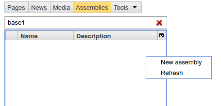

    New `base` assembly

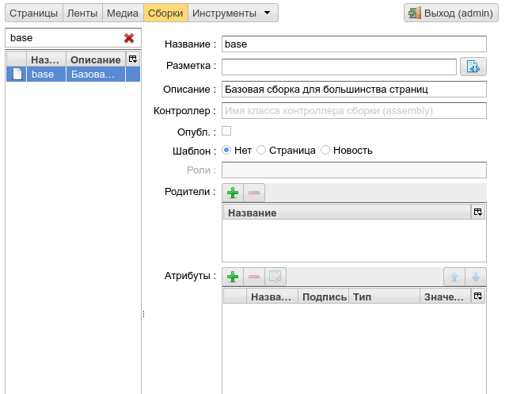

    New `base` assembly

Creating attributes common for all pages.

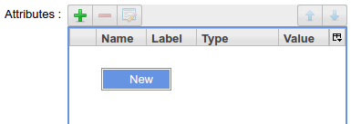

    Create a new attribute for `base`

Add the new attribute `title` to the base assembly:

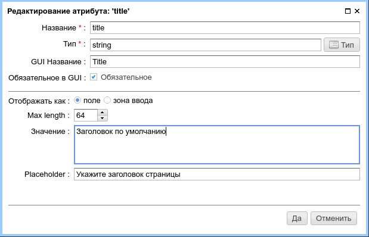

Then add the `footer` attribute. The footer is a :ref:`fileref <am_fileref>` attribute
and we need to create a corresponding file `/site/httl/file.httl`
in :ref:`media repository <mmgr>` and set it as `footer`'s value.
The `file.httl` contains the following markup:

.. code-block:: html

    <b>Simple page footer</b>

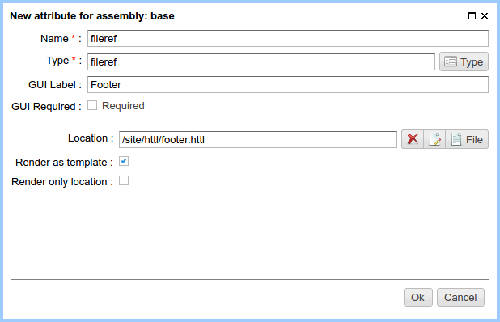

The final overview of `base` assembly:

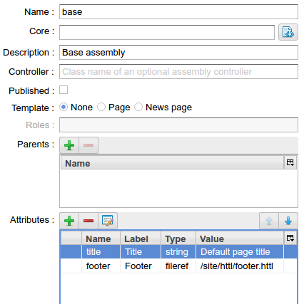

Then create a new page template: "Simple page":

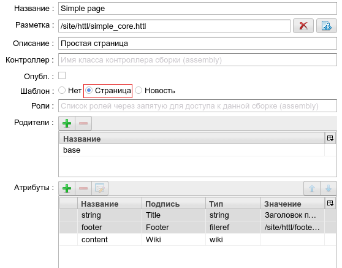

    :term:`Template <template>`: "Simple page"

Then create the :ref:`HTTL markup <httl>` for the "Simple page" template: `/site/httl/simple_core.httl`
in the :ref:`media repository <mmgr>`.

.. code-block:: html

    <html>
    <head>
      <title>${asm('title')}</title>
    </head>
    $!{asm('wiki')}
    <footer>
      $!{asm('footer')}
    </footer>
    </html>

Here we can see the output of attribute values `title`, `content`, `footer`.

After the basic :term:`assembly <assembly>` and page :term:`template` are defined,
site editors can create page instances with :ref:`page management UI <pmgr>`
based on the template created above:

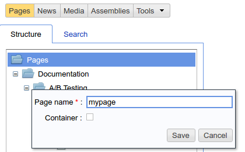

Choose a page template:

.. figure:: img/step8.png

    Template selection button

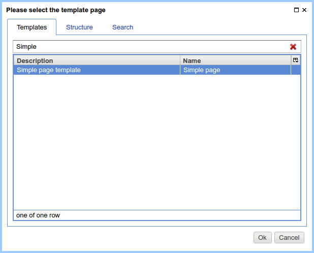

When the page has been created, an interface of a page content editor would look like this:

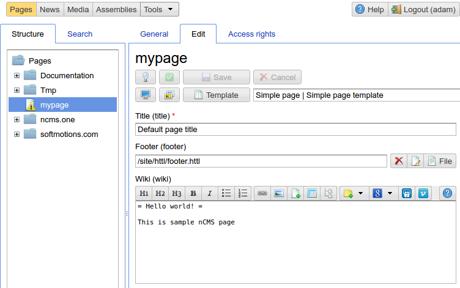

    Content of `mypage`

The |IPreview| button displays the result of our work:

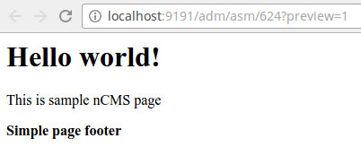

    Created page `mypage`

Platform architecture
---------------------

ηCMS platform based on `Java servlet API 3.1`.
It uses `IoC` container `Google Guice <https://github.com/google/guice>`_.
Data persistence layer based on `MyBatis <http://www.mybatis.org/mybatis-3/>`_ library.

:ref:`New ηCMS project <newproject>` structure allows developers both to expand
the functionality of the ηCMS platform and to create custom project modules.
More details can be found in the section :ref:`extending`.

Additional definitions
----------------------

.. glossary::

    home page
    main page
        Home (start) page for a particular virtual host and language.
        To create a home page we need :ref:`front page marker <am_mainpage>` attribute
        in the page assembly.

    asm inheritance tree
        Assemblies can be inherited from each other.
        Here is a plain similarity to a class inheritance in
        object-oriented programming languages. But in our case each assembly
        should be treated as an object storing the data (attributes),
        and inheritance of assembles - as an inheritance of data objects.

    navigation tree
        If `Container` mode is enabled for a page
        it can have embedded pages (sub-pages).
        Sub-pages can be containers for other pages and so on.
        By combining pages in this way the site editor creates
        a site's `navigation tree`.

        .. note::

            Beside the nesting relationship, pages can inherit
            from each other, thus forming a `Inheritance tree`.
            Do not confuse `assemblies inheritance` with `Navigation tree`.
            :ref:`attributes_access`

    page type
        Here are the following types of pages:

        * Standard page
        * News feed
        * :term:`Assembly <assembly>` - a page-prototype for other pages
          (parent in :term:`Inheritance tree <asm inheritance tree>`).

    page GUID
         Unique 32-byte identifier of the page,
         used to access pages by the address: `http://hostname/<guid>`.

    page alias
        Alternative page name which can be used for accessing the page.
        For example, the page with the :term:`guid <page GUID>` is equal to `b3ac2985453bf87b6851e07bcf4cfadc`
        available on address `http://<hostname>/b3ac2985453bf87b6851e07bcf4cfadc`.
        However, if :ref:`alias <am_alias>` is presented in page’s assembly
        this page can be also accessible on `http://<hostname>/mypage`.
        Slash (`\/`) chars are allowed in page alias, for example, page with alias `/foo/bar`
        will be available at `http://<hostname>/foo/bar`.

    glob
    glob pattern
        Format of simple matching patterns.

        * The symbol `\*` denotes zero or some characters in a line of the desired data.
        * The symbol  `\?` matches any single character of the desired data.

        `refer to a Glob notation for more details <https://en.wikipedia.org/wiki/Glob_(programming)>`_

    mediawiki
        The popular wiki pages markup language. Mediawiki markup is used in
        `wikipedia.org <https://www.wikipedia.org/>`_. You can create ηCMS pages
        with mediawiki content blocks using :ref:`wiki attribute <am_wiki>`.

