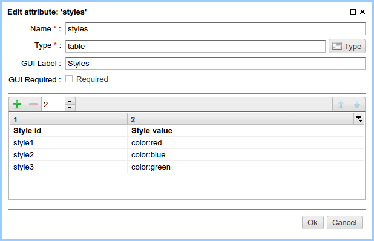

.. _tstyles:

Use of table attributes in a page markup
========================================

Sometimes we need to use a predefined tabular data within a page.

**Example:**

* Editable styles or a page data.
* Linking of the configured JS handlers of events with various items of the
  page, for example, a binding of metrics to monitor an activity of users.

The :ref:`table <am_table>` attribute helps solving these tasks quite easy.

A simple example: pages with links with a different style each and with the ability to
change the styles without editing the page markup.

To do this add the :ref:`table <am_table>` attribute filled with
the data required to define the styles:

In the markup we use a data defined before:

.. code-block:: html

    <html>
    <body>
      <h1>${asm('title')}</h1>

      #set(Table styles = asm('styles'))
      <ul>
       <li><a href="#" style="$!{styles.find('style1')}">style1</li>
       <li><a href="#" style="$!{styles.find('style2')}">style2</li>
       <li><a href="#" style="$!{styles.find('style3')}">style3</li>
      </ul>
    </body>
    </html>

The result:

.. image:: img/tstyles_img2.png
