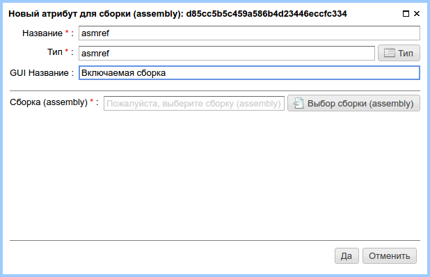
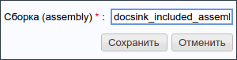
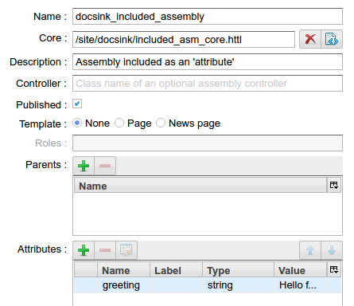
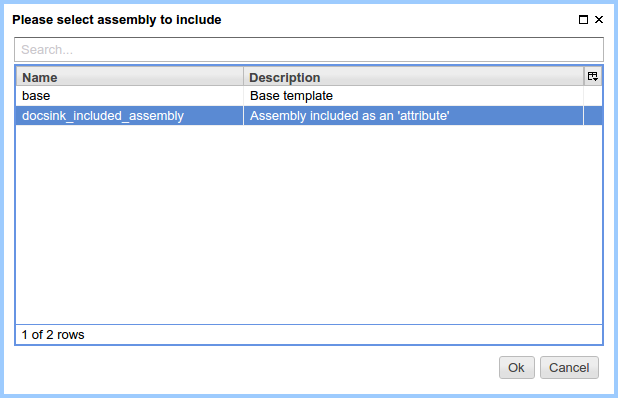
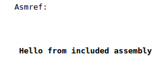

.. _am_asmref:

Insert the assembly (asmref)
============================

This attribute provides the ability to include :term:`assemblies <assembly>` to each other.
Included assembly will be rendered in the context of other assembly,
it needs to have a valid :term:`core markup <core>` to be properly rendered.
Without a :term:`core` the included assembly cannot be presented as a page or page part.

.. warning::

    For an assembly, that will be included, the :term:`core markup <core>` should be specified.
    Otherwise, this attribute will not be displayed, and the ηCMS will report an error.

Attribute options
-----------------

    Attribute options

This attribute requires a mandatory specification of an included assembly.

Edit mode
---------

In the page content edit mode, this attribute is displayed
in the same way as in options pane.

Example
-------

In this example we will create an :term:`assembly <assembly>` `docsink_included_assembly`:

Let's create a simple text attribute `greeting` with the value of `Hello from included assembly`:

For this assembly we create a markup file `/site/docsink/included_asm_core.httl` with the following content:

.. code-block:: html

    

       <strong>${asm('greeting')}</strong>
    

Then create an assembly, in which the content `docsink_included_assembly` is included with a core markup::

    Asmref:

    $!{asm('asmref')}

In the `assembly managemennt UI <amgr>` we create an attribute with the name `asmref` and
the type `asmref`:

By clicking `Select assembly`, we choose the assembly to include:

When we open the page we get:

