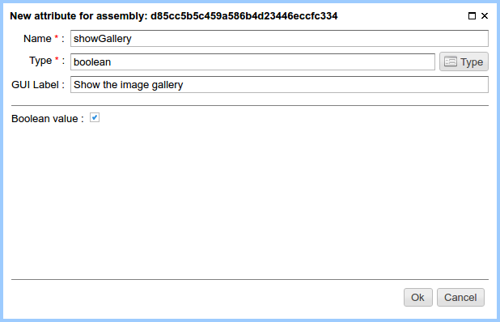

.. _am_boolean:

Switch (yes/no)
===============

It's a simple switch that can be
in one of two states: ``Yes`` or ``No``.

This attribute is displayed as a checkbox.

Attribute options
-----------------

    The default value of the attribute

Using in the markup
-------------------

Value type: `java.lang.Boolean`

**Example**::

    #if(asm('showGallery').toBoolean)
        ...
    #end

