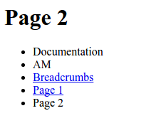

.. _am_breadcrumbs:

Breadcrumbs
===========

This attribute contains the path in the navigation tree
starting from the current page to the main page saved in
:ref:`com.softmotions.ncms.mhttl.Tree`.
This attribute has no visual representation in the :ref:`page management UI <pmgr>`.

To enable breadcrumbs, add the corresponding `breadcrumbs`
attribute to one of the following assemblies:

* To the main page
* Or to the current page template
* Or to the current page
* Or to one of the parent pages of the current page

:ref:`Refer to page attributes search algorithm <attributes_access>`.

For example let's create the following hierarchy of pages::

    Documentation/
        └── AM/
            └── Breadcrumbs/  <-- Here is a breadcrumbs attribute
                └── Page 1/
                    └── Page 2/

If in the context of the page `Breadcrumbs` the `breadcrumbs` attribute is added,
then, in accordance with the :ref:`attribute search algorithm <attributes_access>`,
it will be available in the context of :term:`page <page>` `Breadcrumbs`, `Page 1`, `Page 2`.
On every page we can use the following snippet showing the current position
of the page in the navigation tree as a simple list:

.. code-block:: html

    #set(Tree breadcrumbs = asmAny("breadcrumbs"))
    

        <ul class="breadcrumbs">
            #foreach(Tree b in breadcrumbs)
                #if(b.link == null)
                <li>${b.name}</li>
                #else
                <li><a href="$!{b.link}">${b.name}</a></li>
                #end
            #end
        </ul>
    

For the `Page 2` it will be displayed as:

Please Note that links to pages in the breadcrumbs are displayed
in the fulfillment of each of the following conditions:

* The page is not the currently displayed
* The page has a markup and published for all users of the website

