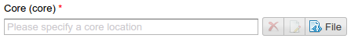

.. _am_core:

Selecting page markup (core)
============================

This attribute allows to set the :term:`markup <core>`
for a page in the :ref:`page management UI <pmgr>` explicitly.

Usually a markup of typical :term:`pages <page>` is explicitly defined in :term:`templates <template>`
of these pages and is set in the :ref:`assembly management UI <amgr>`.
However, while editing the page it can be necessary to set a markup
different from others created under the current template.
In this case the attribute allows to explicitly select the page markup file.
This attribute has no options.

In the page management UI it looks like this:

