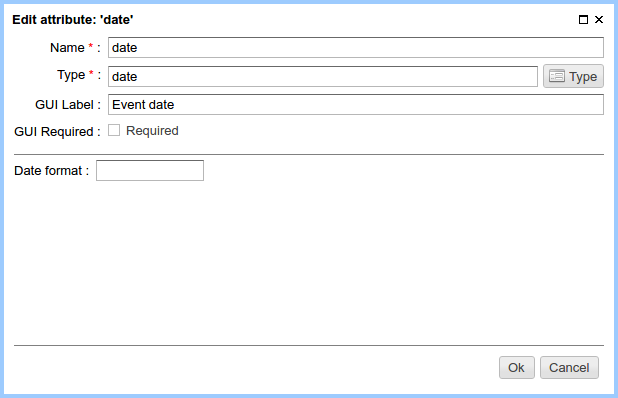
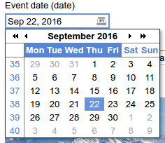

.. _am_date:

Date
====

Date/time input field. This attribute contains a timezone independent data
and stored it as a string in ISO format, ex.: ``2007-12-03T10:15:30``.

Attribute options
-----------------

    Attribute options

For attributes of this type, you can specify the format of the date.

===== ===========
Кey   Description
===== ===========
y     year
M     month
d     day of month
D     day of year
E     weekday
h     hour in 12-hour format
H     hour in 24-hour format
m     min
s     second
===== ===========

Edit mode
---------

In the :ref:`page management UI <pmgr>`, this attribute is displayed
as a selection box with a calendar.

    Attribute in the page management UI

Using in the markup
-------------------

**Value type:** `java.time.LocalDateTime`

