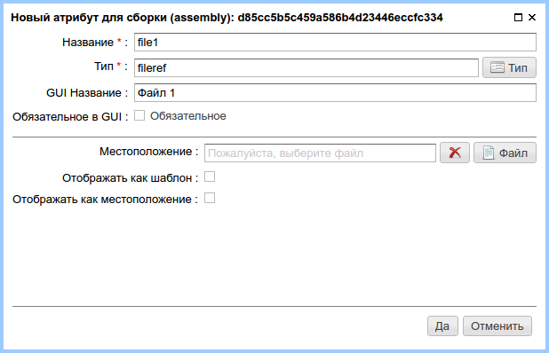
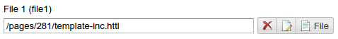

.. _am_fileref:

Link to a file (fileref)
========================

Attribute options
-----------------

    Attribute options

================================== =============
Option                             Description
================================== =============
**Location**                       Location of the file in the ηCMS media repository.
**Render as a template**           If this option is enabled, the file content will
                                   be interpreted as :ref:`HTTL <httl>` template and
                                   inserted as attribute value.                                 
**Render only location**           If the switch is on, a file path will be a value of this attribute.
                                   Otherwise it will be a file content or file content processed as a template
                                   depending on `Render as a template` option.
================================== =============

Edit mode
---------

    Path to the file in the ηCMS media repository

Using in the markup
-------------------

**Type of the attribute value:** `java.lang.String`

For example, activate the checkbox `Render as a template`,
and create the file `template-inc.httl` containing:

.. code-block:: html

    

      #set(String name = "Template")
      <b>Hello from ${name}</b>
    

Choose that file to set `filref` attribute and modify the page :term:`core`::

    FileRef: $!{asm('file1')}

As a result, we get the following page:

.. image:: img/fileref_img3.png

