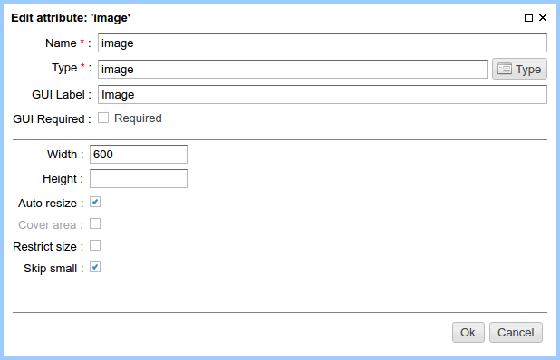
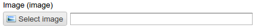
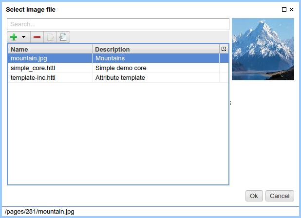
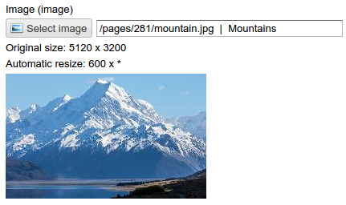

.. _am_image:

Image
=====

Attribute to specify an image file and display it on the page.
ηCMS supports automatic image resizing according to attribute parameters.

Attribute options
-----------------

    Attribute options

=============================== ==================
Option                          Description
=============================== ==================
**Width**                       The desirable width of the image on the page.
**Height**                      The desirable height of the image on the page.
**Auto-scaling**                Enable/disable automatic scaling of the image
                                according to width (and/or) height.
**Cover area**                  The intelligent scale mode provides the picture scaling
                                will fill the specified area with preserving of an aspect ratio.
**Restrict size**               If this flag is enabled, the specified image will be checked
                                to match the specified width and height.
**Skip small**                  Do not scale an image, if its size is smaller than specified
                                dimension. This mode is useful to avoid grain on resized image.
=============================== ==================

Edit mode
---------

    Attribute on the edit page panel

By clicking the image selection button ηCMS
offers to select an image file:

    Selecting an image file

    Attribute view after the image is selected

Using in the markup
-------------------

**Type of an attribute value:** :ref:`com.softmotions.ncms.mhttl.Image`

Example of the insertion of scaled image as a part of ``:

.. code-block:: html

    #set(Image img = asm('image'))
    </img>

or:

.. code-block:: html

    </img>

.. _com.softmotions.ncms.mhttl.Image:

com.softmotions.ncms.mhttl.Image
--------------------------------

.. js:attribute:: Long Image.id

    Identifier of the media file in the ηCMS repository

.. js:function:: String getLink()

    Returns a path to the properly scaled image.

    **Image in HTTL markup**::

    

