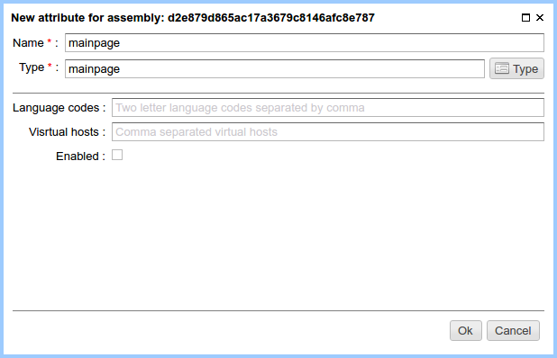

.. _am_mainpage:

Main page marker
================

This attribute marks the ηCMS page as the :term:`main (home) <main page>`
for the specified set of virtual hosts and languages.

.. note::

    This attribute can not be inherited and should be explicitly
    specified to the page instance in the :ref:`assemblies management UI<amgr>`.

Attribute options
-----------------

    Main page marker options

**Language Codes:** List (separated by commas) `of two-letter language codes <https://en.wikipedia.org/wiki/ISO_639-1>`_
of browser (useragent), to show this page. The **\*** symbol is allowed and means any language.

**Virtual Hosts:** The list of virtual hosts (comma-separated) to show this page.
Allowed symbol **\*** means any virtual host.

**robots.txt:** `Special instructions for search robots <https://en.wikipedia.org/wiki/Robots_exclusion_standard>`_,
which will be available as `robots.txt` resource at the root directory of the site.

**Enabled (checkbox):** It shows if this attribute is active.
 The rules for languages and virtual hosts will be applied when clients access to ηCMS.
