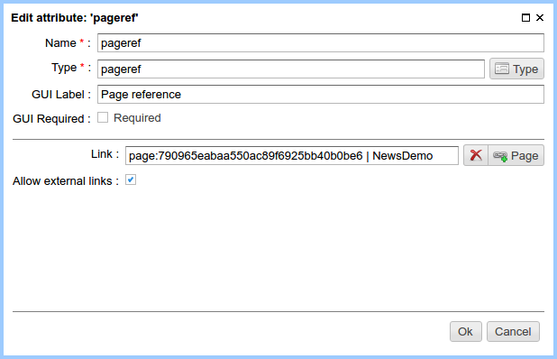
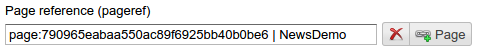

.. _am_pageref:

Page link (pageref)
===================

Attribute options
-----------------

    Attribute options

=============================== =============
Option                          Description
=============================== =============
**Link**                        The  default value of the attribute (link)
**Allow external links**        Switch allows to set external links.
                                If it is off, the edit links dialog
                                in the :ref:`page management UI <pmgr>` allows to specify only
                                links to ηCMS pages.
=============================== =============

Edit mode
---------

    Attribute on the :ref:`page editor pane <pmgr>`

Press the link button to select a target page for a link,
edit link title or enter an external link.

.. figure:: img/pageref_img3.png

    Link selection dialog

Using in the markup
-------------------

**Type of attribute value:** :ref:`com.softmotions.ncms.mhttl.RichRef`

Properties of `RichRef`:

==================== =============
Property             Description
==================== =============
**link**             Link URL
**name**             Link Name
**toHtmlLink()**     Create an html link
==================== =============

Generating links using the `toHtmlLink()` method::

    #set(RichRef link = asm('pageref'))
    $!{link.toHtmlLink(['class':'active'])}

This example creates a `<a>` link to the selected page
with an additional attribute `class ="active"`.

Alternative example::

    #set(RichRef link = asm('pageref'))
    <a href="$!{link.link}" class="active">$!{link.name}</a>

`com.softmotions.ncms.mhttl.RichRef` objects can be used
with :js:func:`linkHtml` method to create html links

An example of a link creation::

    $!{linkHtml(asm('pageref'), ['class':'active'])}

