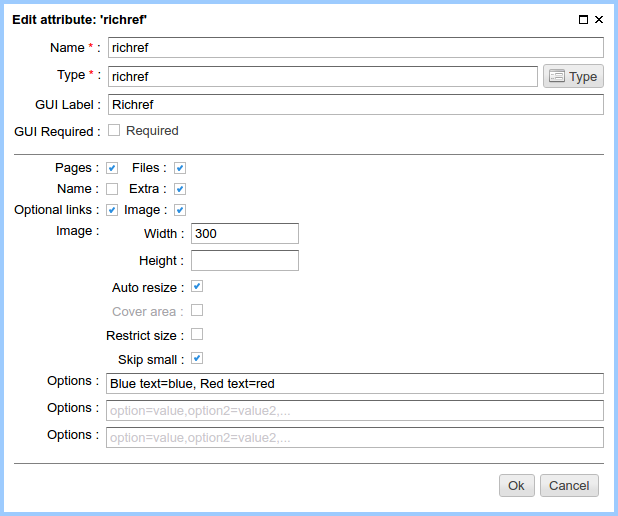
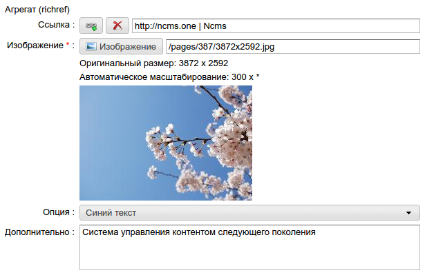
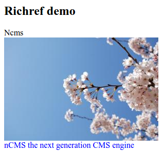

.. _am_richref:

Richref
=======

Using a `richref` a website editor can insert links to a page,
along with additional information: text, description, image, additional styles.

.. _am_richref_options:

Attribute options
-----------------

Here are the main options of this attribute (from left to right and top to bottom).

**Pages (checkbox):** Allows to insert a link to both internal ηCMS pages
and external web resources.

**Files (checkbox):** Allows to insert links to files stored
in the ηCMS media repository.

**Name (checkbox):** Allows to specify an additional single-line
text with a link; for cases while a link (together with the name) was not specified.

**Extra (checkbox):** Allows to specify an additional multi-line text with a link.

**Optional links (checkbox):** If this option is enabled, a link to the resource will be optional.

**Image (checkbox):** Allows to use an image. If this option is enabled, the image view parameters are
available. Options are fully consistent to attribute options :ref:`am_image`.

**Options:** Three sets of options in the form of pairs: `key` => `values`.
Options should be set in the text field in the following format::

    key=value[,key=value, ...]

In the example below, the first set of options is filled::

    Blue text=blue, Red text=red

The data of these options can be used for displaying links. Here the `key` option (blue text, red text)
are displayed in the GUI page editor, and the value of the option (blue, red) are available
in the httl markup.

Edit mode
---------

    Richref in the :ref:`page management UI <pmgr>`

The richref options are displayed as drop-down lists.

Using in the markup
-------------------

In the context of httl markup the value of this attribute
is an object of type :ref:`com.softmotions.ncms.mhttl.RichRef`,
containing all the data entered by the website editor
for this attribute.

The data for this attribute is displayed
as an image with the link inside block
having a caption and description:

.. code-block:: html

    <html>
    <body>
      <h2>Richref demo</h2>

      #set(RichRef rr = asm('richref'))
      

        
${rr.name}

        <a href="$!{rr.link}">
          </img>
        </a>
        

          ${rr.description}
        

      

    </body>
    </html>

In a web browser it will be shown as:

.. _com.softmotions.ncms.mhttl.RichRef:

com.softmotions.ncms.mhttl.RichRef
----------------------------------

All ``RichRef`` object properties are optional and can be ``null``.

.. js:attribute:: Image RichRef.image

    Image :ref:`com.softmotions.ncms.mhttl.Image`, associated with richref.

.. js:attribute:: String RichRef.description

    Additional multi-line text. Refer to attribute option:. **additional (checkbox):**.

.. js:attribute:: String RichRef.link

    HTTP link specified in attribute.

.. js:attribute:: String RichRef.name

    String name specified in the link or by individual
    ``Name`` field, if  the **name (checkbox)** option is enabled.

.. js:attribute:: String RichRef.style

    The value of the style from the first set of options selected by the site editor.

.. js:attribute:: String RichRef.style2

    The value of the style from the second set of options selected by the site editor.

.. js:attribute:: String RichRef.style3

    The value of the style from the third set of options selected by the site editor.

.. js:function:: String RichRef.toHtmlLink(@Nullable Map<String, ?> amap)

    This method generates the code of HTML link `<a>`  if the link (`link`) is specified for `richref`.
    In addition, you can specify a list of extra attributes to be added to `<a>` for example::

    $!{richref.toHtmlLink(['class':'active'])}

