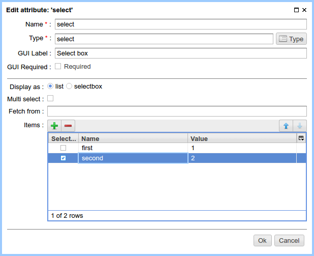
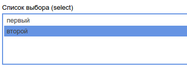

.. _am_selectbox:

Select box
==========

This attribute is used to define the set of name value pairs
and display them in website pages

Attribute options
-----------------

    Options of a select box

Display as
**********

* **list** -- in the :ref:`page management UI <pmgr>` select box will be displayed as a plain
              list of possible values allowing to select multiple values (holding `Control` key)

* **selectbox** -- in the :ref:`page management UI <pmgr>` select box will be displayed
                   as a drop-down list, allowing to select only one pair.

Multi select
************

Used only for *list* display mode allowing to choose multiple values.

Items
*****

The data table, where select box key value pairs are stored.

Edit mode
---------

    Select box in `list` display mode

Using in the markup
-------------------

In the context of :ref:`HTTL <HTTL>` markup the value of `selectbox` attribute
will be a collection of objects of type :ref:`com.softmotions.ncms.mhttl.SelectNode`,
where every element has the following properties:

* **key** - item name (java.lang.String),
* **value** - value value (java.lang.String),
* **selected** - whether this item is selected (boolean).

**Example**::

    <select>
    #foreach(SelectNode node in asm('select'))
        <option #if(node.selected) selected #end
                value="${node.value}">
                ${node.key}
        </option>
    #end
    </select>

.. _com.softmotions.ncms.mhttl.SelectNode:

com.softmotions.ncms.mhttl.SelectNode
-------------------------------------

.. js:attribute:: String SelectNode.key

    Select box element name (title)

.. js:attribute:: String SelectNode.value

    Select box element value

.. js:attribute:: boolean SelectNode.selected

    If ``true`` the current option is selected (active)

