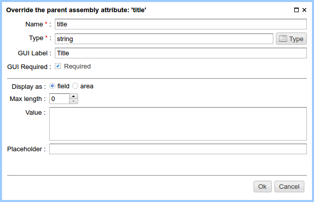

.. _am_string:

String
======

String is the most widely used attribute type.
This attribute allows to set an arbitrary text data as value
and display it in the context of the page.

Attribute options
-----------------

    String attribute options

Display as
**********

* **Field**  - in the :ref:`page management UI <pmgr>` this attribute is displayed as a single-line input field.
* **Input**  - in the :ref:`page management UI <pmgr>` this attribute is displayed as a broad,  multi-line,
  convenient for bulk text input.

Max length
**********

Maximum number of characters for attribute value. Zero means no restrictions.

The default value of the attribute
**********************************

The value of this attribute by default, unless otherwise not specified by a page editor.

Placeholder
***********

Placeholder for the item in the :ref:`pages management UI <pmgr>`.

Using in the markup
-------------------

**Attribute value type:** `java.lang.String`

Output of an attribute value with escaped html markup::

    ${asm('attribute name')} or ${'attribute name'.asm}

The output of the attribuite value allowing an html markup::

    $!{asm('attribute name')} or $!{'attribute name'.asm}

