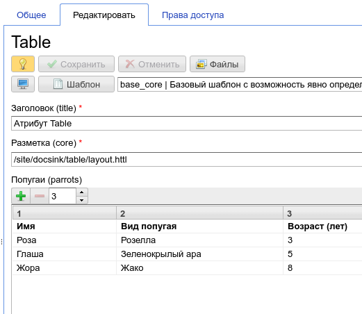
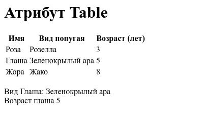

.. _am_table:

Table
=====

This attribute allows to specify an arbitrary tabular data
in the context of :term:`assembly <assembly>`.

    Example of a table in the :ref:`page management UI <pmgr>`

In the this example we could use the following markup:

.. code-block:: html

    <html>
    <body>
    <h1>${asm('title')}</h1>

    $!{asm('parrots').asTable.toHtml()}
    #set(Table parrots = asm('parrots'))

     Glasha parrot kind: ${parrots.find('Glasha')}
     Glasha age: ${parrots.find('Glasha', 2)}

    </body>
    </html>

And we get:

In this markup the expression `$!{asm('parrots').asTable.toHtml()}`  outputs a table as html.
Then, `${parrots.find('Glasha')` outputs the second column of the row, where the value of the first
column is equal to the passed attribute `Glasha`.

:ref:`tstyles`.

Table attribute UI
------------------

Table toolbar:

=============================== ============
          Element UI            Description
=============================== ============
.. Image:: img/table_img4.png   Adds a new row to the table

.. Image:: img/table_img5.png   Removes selected rows

.. Image:: img/table_img6.png   Specifies the number of columns in the table
=============================== ============

.. _com.softmotions.ncms.mhttl.Table:

com.softmotions.ncms.mhttl.Table
--------------------------------

.. js:function:: String Table.find(firstColVal, [String def])

    Search the row in a table with the first column value equals to `firstColVal`.
    If the row is found **the second column** value
    of the row is returned.

    :param String def: The value if the row is not found; by default ``null``.

.. js:function:: String Table.find2(firstColVal, [String def])

    Search the row in a table with the first column value equals to `firstColVal`.
    If the row is found **the third column** value
    of the row is returned.

    :param String def: The value if the row is not found; by default ``null``.

.. js:function:: String Table.find2(firstColVal, [String def])

    Search the row in a table with the first column value equals to `firstColVal`.
    If the row is found **the forth column** value
    of the row is returned.

    :param String def: The value if the row is not found; by default ``null``.

.. js:function:: String Table.find(String firstColVal, [int colIndex], [String def])

    Search the row in a table with the first column value equals to `firstColVal`.
    If the row is found it returns the value of the cell in the row with a `colIndex` index.

    :param int firstColVal: Column index, where the value is found. By default, ``1``
                            (Second column by indexing from ``0``).
    :param String def: The value returned if the row is not found, by default ``null``.

.. js:function:: String Table.toHtml([Map<String,?> params]):

    Returns the current table as the `html` markup.

    **Example** the table with css class `wide` but without headers::

        ${asm('table').toHtml(['noHeader':true, 'tableAttrs':'class="wide"'])}

    The optional method params may contain the following pairs:

    * `NoEscape => Boolean | String` - don't escape of table cells values.
      By default `false`.
    * `NoHeader => Boolean | String` do not display the first row as a table header.
      By default `false`.
    * `TableAttrs => String` Additional table attributes.

    :param Map<String,?> params: Optional settings of the html table generation.

