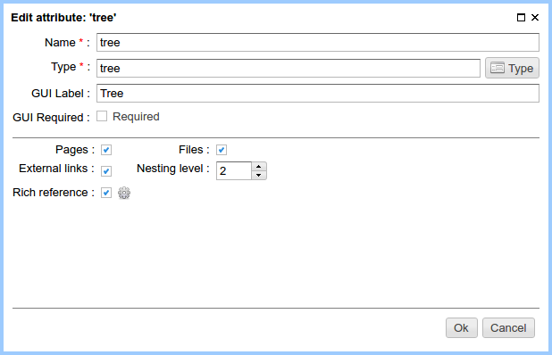
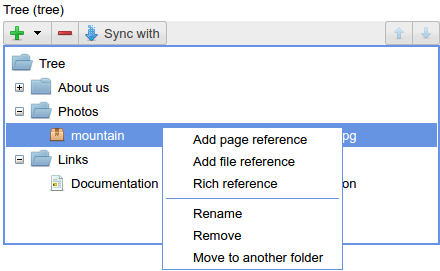
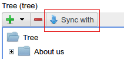
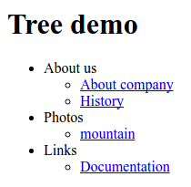

.. _am_tree:

Tree
====

This attribute is useful for creating a hierarchical
data structures in a website, for example, to create a menu.

Tree nodes can be:

* A folder (directory)
* :ref:`Link to the ηCMS <am_pageref>` page or to an external resource
* :ref:`Link to the file in the media repository <am_fileref>`
* :ref:`Richref <am_richref>`

Attribute options
-----------------

**Pages (checkbox):** Allows to add links to ηCMS pages.

**Files (checkbox):** Allows to add links to files stored in the ηCMS :ref:`media repository <mmgr>`.

**External links (checkbox):** Allows to specify external links.

**Nesting level (spinner):** This item sets the maximum nesting level in the tree.
If the nesting level is ``1``, the tree will be a flat, with only one level.

**Rich reference (checkbox):** Allows to add :ref:`richref <am_richref>` items to the tree.
By clicking |IG| user goes to :ref:`options of richref configuration <am_richref_options>` for
tree items.

Edit mode
---------

Here is an example of a simple menu structure,
which can be displayed on the page.

    Tree in the :ref:`page management UI <pmgr>`

Synchronisation with a tree attribute of another page
^^^^^^^^^^^^^^^^^^^^^^^^^^^^^^^^^^^^^^^^^^^^^^^^^^^^^

Quite often there is a need to have the same attribute value
on multiple pages simultaneously.
You can use the synchronization of a page attribute value
with the attribute of the same name and type, but on the other page.
Clicking the `synchronise` button, ηCMS provides a way to choose
the page where the synchronization will be performed.

.. note::

    Page where we synchronize attribute values
    should have an attribute of type `tree` with the same name.

After enabling synchronization mode, the attribute cannot be edited.
All changes should be done for the `ancestor` attribute,
all changes to the `accessor` are automatically copied into
the `descendant` attribute.

Using in the markup
-------------------

In the context of httl markup the value of this attribute
is an object of the type :ref:`com.softmotions.ncms.mhttl.Tree`,
containing all the data entered by the website editor.

In this example we display a two-level tree of links:

.. code-block:: html

    <html>
      <body>
        <h1>Tree demo</h1>
        <ul>
        <!-- 1st level -->
        #foreach(Tree n1 in asm('tree'))
          <li>
            ${n1.name}
            <ul>
              <!-- 2nd level -->
              #foreach(Tree n2 in n1)
               <li>$!{n2.toHtmlLink}</li>
              #end
            </ul>
          </li>
        #end
        </ul>
      </body>
    </html>

On the page it will be shown as:

.. _com.softmotions.ncms.mhttl.Tree:

com.softmotions.ncms.mhttl.Tree
-------------------------------

All properties of Tree object are  **optional**.
Tree is a recursive structure where descendants of tree are stored
in the `children` property.

.. js:attribute:: Long Tree.id

    Object identifier associated with the current
    tree item. For example, it may be
    an identifier of file in a media-repository if
    the tree item is a link to the file. Or
    page identifier in the navigation hierarchy
    while displaying :ref:`breadcrumbs <am_breadcrumbs>`.

.. js:attribute:: String Tree.name

    The name of the current item.

.. js:attribute:: String Tree.extra

    Additional string associated with a tree item.

.. js:attribute:: String Tree.link

    If the tree item is a link
    to a page (web resource) or to a file, this attribute
    stores HTTP link to a resource.

.. js:attribute:: RichRef Tree.richRef

    This attribute is not `null` in case
    if a tree item is :ref:`richref <com.softmotions.ncms.mhttl.RichRef>`.

.. js:attribute:: Map<String,Object> Tree.attributes

    Additional attributes associated with the tree item.

.. js:attribute:: List<Tree> Tree.children

    The descendants of the current tree item.
    In the :ref:`httl <HTTL>` code the iterations over tree object
    means an iteration through its direct descendants.

    .. code-block:: text

        #foreach(Tree n1 in asm('tree'))
            ...
        #end

