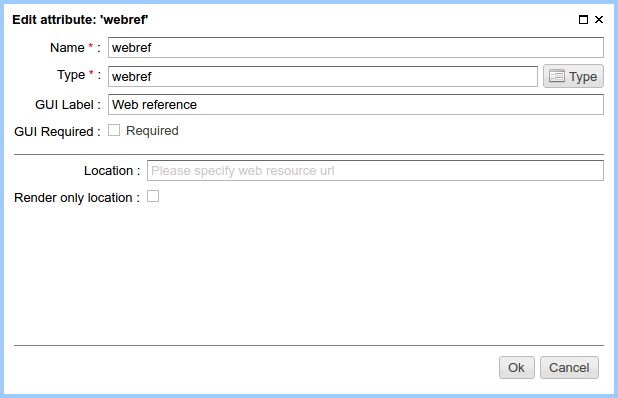
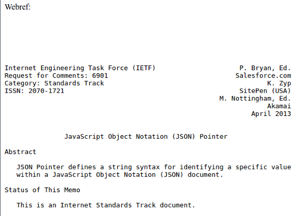

.. _am_webref:

Web resource (webref)
=====================

This attribute allows to include a content of remote
resource to a page using `http`, `https`, `ftp` protocols.

Attribute options
-----------------

    Attribute options

================================== =============
Option                             Description
================================== =============
**Location**                       Default remote resource URL.
**Render only location**           While the switch is turned on, the attribute value
                                   is the address (URL) of the resource.
                                   Otherwise, the attribute value is a textual content of a resource.
================================== =============

Edit mode
---------

.. figure:: img/webref_img2.png

    Web resource URL on the :ref:`page management UI <pmgr>`

In this example, a page address
https://tools.ietf.org/rfc/rfc6901.txt was specified as the resource

Using in the markup
-------------------

**Type of attribute value:** `java.lang.String`.

Including a resource text to the html page::

    Webref:

    <pre>
        $!{asm('webref')}
    </pre>

Using the mentioned address of a resource, we get:

Limitations
-----------

* In the |ncmsversion| the maximum remote content size is limited to `1Mb`.
* For security reasons, a loading of local files and the classpath elements is disabled.
* When loading http resources the caching is in use. The maximum size of documents
  to be stored in the cache: `128Kb`. Maximum number of cached documents: `512`.
* Timeout for connection to the remote resource: `10 sec`.

