.. _am_wiki:

Wiki markup (wiki)
==================

Rich content as wiki markup.
The value of attribute is a html code obtained
as a result of a wiki markup parsing.

.. note::

    The best way to embed stylized content (rich content)
    into your page is to use a wiki or markdown.

In |ncmsversion| the following formats of a
wiki markup are supported:

* `mediawiki <https://www.mediawiki.org/wiki/Help:Formatting/ru>`_
* `markdown <https://daringfireball.net/projects/markdown/syntax>`_

Attribute options
-----------------

Here you can select a markup type `mediawiki` or `markdown`.

Edit mode
---------

Wiki markup editor consists of a markup textarea and control buttons.
Control buttons help you to make many routine tasks easier:

.. figure:: img/wiki_img1.png

    Wiki markup editor

Below there is a description of the basic controls of wiki markup editor
for `mediawiki <https://www.mediawiki.org/wiki/Help:Formatting/ru>`_

.. image:: img/wiki_img2.png
.. image:: img/wiki_img3.png
.. image:: img/wiki_img4.png

The headers of the first, second and third level, similar to
`<h1>`, `<h2>`, `<h3>` tags in html.

.. image:: img/wiki_img5.png
    :align: left

**Bold text**

.. image:: img/wiki_img6.png
    :align: left

*Text in italics*

|

----

.. image:: img/wiki_img7.png
    :align: left

**Insert bulleted list**

Mediawiki markup of a bulleted list::

    * First
    * second
    ** The first of the second
    * The third

|

----

.. image:: img/wiki_img8.png
    :align: left

**Inserting a numbered list**

Mediawiki markup of a numbered list::

    # First
    # Second
    ## The first of the second
    # The third

|

----

.. image:: img/wiki_img9.png
    :align: left

**Link to ηCMS page:**

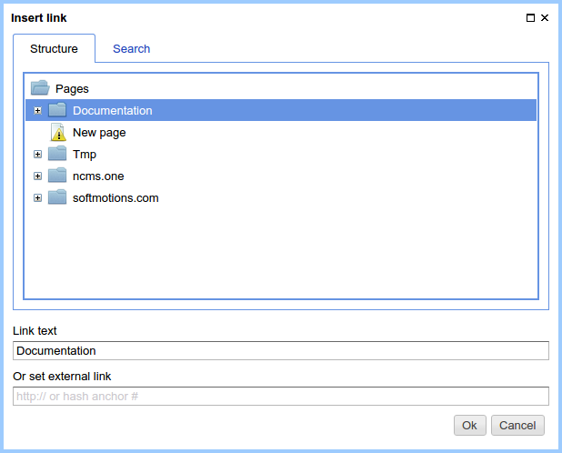

    Page link selection.

As a result, a link to the page appears in the body of the mediawiki editor::

    [[Page:b3ac2985453bf87b6851e07bcf4cfadc|Documentation]]

Where `b3ac2985453bf87b6851e07bcf4cfadc` is the unique :term:`page GUID`, `Documentation` is the link text.

|

----

**Image, link**

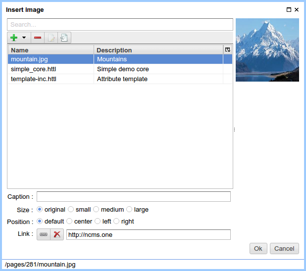

    Inserting an image/image with link.

**Parameters of an image insertion**

**Caption** - caption beneath the image. You have to
stylize html tags for the image and caption:

.. code-block:: html

    

    

        
        
Mountains

    

    

Determine the display of the following styles:

Styles for the image with the caption:

* ``div.thumb.tleft, div.thumb.tcenter, div.thumb.tright``
* ``.thumbinner``
* ``.thumbimage``
* ``.framecaption``

Styles for images without captions:

* ``img.location-left, img.location-center, img.location-right``

**Image size**

* **original** -- the original size of the image without scaling
* **small** -- width of the image is ``200px``
* **medium** -- width of the image is ``400px``
* **large** -- width of the image is ``600px``

.. note::

    When choosing an image size which differs from the original,
    the image is scaled and stored on the ηCMS server.

**Location of Image**

* **default** - the positioning styles are not applied.
* **center** - an image will be in the center.
    When you insert a centered image with the caption the `thumb tcenter` css classes
    are applied for `div` container with an image. In the absence of a caption,
    the `location-center` css class is applied.
* **left** - the image is on the left side.
    For an image with the caption the `thumb tleft` css classes
    are applied for `div` container with an image. In the absence of a caption,
    the `location-left` css class is applied.
* **right** - the image is on the right side.
    For an image with the caption the `thumb tright` css classes
    are applied for `div` container with an image. In the absence of a caption,
    the `location-right` css class is applied.

**Link**

If this field is filled, the clicking on the image opens the selected
resource. If the image link is undefined, the click
on the image opens image in its original size.

|

----

**File, link** - inserting a link to a file.

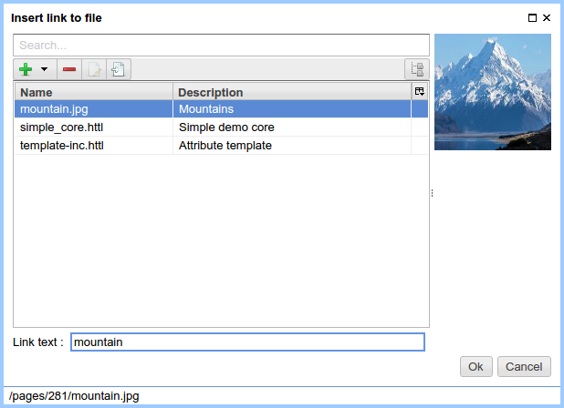

    File selection dialog

After selecting the file the link to the file is inserted to the wiki markup, for example::

    [[Media:/381/mountain.jpg|Mountains]]

At the same time an ordinary html `<a>` links will be properly displayed on a page

.. note::

    The file linked with the page is impossible to remove,
    while its link is in the wiki markup.

|

----

.. image:: img/wiki_img12.png
    :align: left

**Inserting tables**

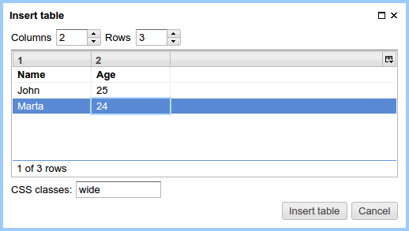

    Table data dialog

For the example above the button `Insert table` will insert the following markup::

    {| class='wide'
    |-
    ! Name
    ! Age
    |-
    | John
    | 25
    |-
    | Marta
    | 24
    |}

In this example, the table is converted to the following HTML code:

.. code-block:: html

    

        

            <table class="wide">
                <tr>
                    <th>Name</th>
                    <th>Age</th>
                </tr>
                <tr>
                    <td>John</td>
                    <td>25</td>
                </tr>
                <tr>
                    <td>Marta</td>
                    <td>24</td>
                </tr>
            </table>
        

    

|

----

.. image:: img/wiki_img13.png
    :align: left

**Insert tree** -- design of some sites requires a hierarchical tree within the pages.

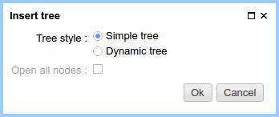

    Tree options

Current options provide the following demo markup:

.. code-block:: html

    <tree>
    -Root
    -- Descendant 1
    --- Descendant nesting level 3
    -- Descendant nesting level 2
    </tree>

It is converted to HTML with a hierarchical structure based on lists ( `<ul>`, `<li>`):

.. code-block:: html

    <ul class='tree'>
        <li class='open node'> Root
            <ul>
                <li class='open node'> Descendant 1
                    <ul>
                        <li class='file'> Descendant of the nesting level 3</li>
                    </ul>
                </li>
                <li class='file'> Descendant of the nesting level 2</li>
            </ul>
        </li>
    </ul>

.. note::

    For proper display of the tree on website pages, a site designer
    should define `.tree` css class for suchlike `<ul class='tree'>` elements

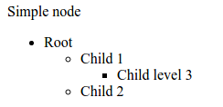

    The tree without stylization

|

----

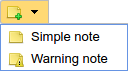

**Note Insert** -- allows inserting the container for notes/warnings to the page.

Wiki markup for warning:

.. code-block:: html

    <note style="warning">Note</note>

HTML warning markup, which can be stylized by a site designer:

.. code-block:: html

    
Note

|

----

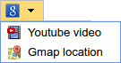

**Insert Youtube video**

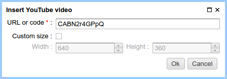

Wiki markup to insert youtube video:

.. code-block:: html

    <youtube videoId="CABN2r4GPpQ"/>

As a result, in the context of the page we get youtube video:

.. image:: img/wiki_img26.png
    :target: https://www.youtube.com/watch?v=CABN2r4GPpQ

----

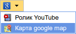

**Insert the Google Map**

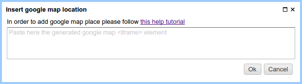

    Google map insertion dialog.

For example, you can insert `iframe` copied from Google map:

.. code-block:: html

    <iframe src="https://www.google.com/maps/embed?pb=!1m14!1m12!1m3!1d2296.7406541371915!2d83.05385026852065!3d54.85480466667143!2m3!1f0!2f0!3f0!3m2!1i1024!2i768!4f13.1!5e0!3m2!1sru!2sru!4v1474967528616"
             width="600"
             height="450"
             frameborder="0"
             style="border:0"
             allowfullscreen>
    </iframe>

We get the map on the page:

.. image:: img/wiki_img30.png

|

----

.. image:: img/wiki_img16.png
    :align: left

**SlideShare Presentation**

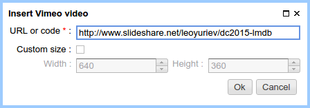

    Inserting a SlideShare presentation.

In this example, we enter the Internet address
of the presentation: http://www.slideshare.net/leoyuriev/dc2015-lmdb
to the dialog and, as a result, we get the following wiki markup:

.. code-block:: html

    <slideshare code="49593515"/>

On the page we get an embedded presentation:

.. image:: img/wiki_img32.png

|

----

.. image:: img/wiki_img17.png
    :align: left

**Vimeo video**

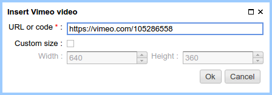

    Vimeo video insert

Wiki markup for vimeo video:

.. code-block:: html

    <vimeo code="105286558"/>

As a result, in the context of the page we get vimeo video:

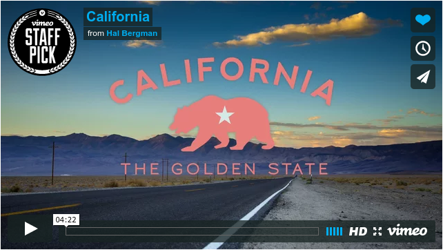

