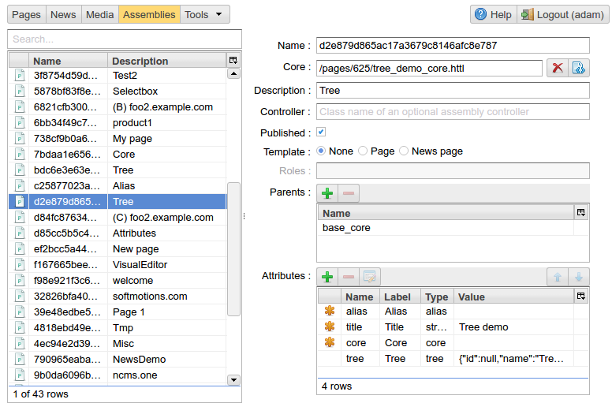
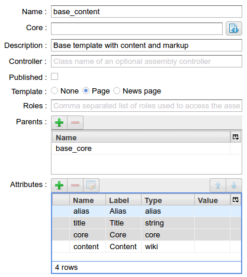
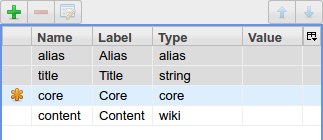
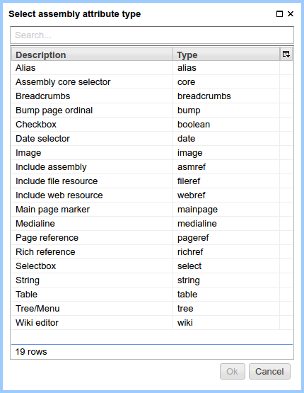

.. _amgr:

Assembly Management
===================

In this interface, the administrator can setup a structure of ηCMS :term:`assemblies <assembly>` (pages),
define page templates and edit existing assemblies. Using this interface you can define a structure of site pages.
Any users having `admin` or `admin.asm` permissions have access to this UI.

    Overview of the assembly control interface

Search form
-----------

In the search form on the left, you can select:

* :term:`assembly <assembly>` with attributes,
* :term:`template` for a site page or news,
* :term:`copy of the page <page>`.

Every item in the assembly list is marked by an image showing its type:

.. image:: img/amgr_other.png
    :align: left

A simple assembly with attributes, which is not a :term:`template <template>` or a page instance.
Assemblies of this type may be present in the inheritance hierarchy of assemblies,
providing their attributes to heirs.

.. image:: img/amgr_template.png
    :align: left

Named :term:`template <template>` to create pages.

.. image:: img/amgr_page.png
    :align: left

A page instance which is defined as an assembly with
a unique name in :term:`GUID format <page GUID>`,
and :term:`markup <core>` attached.

.. image:: img/amgr_news.png
    :align: left

A copy of the :ref:`news feed (events) <news>`.

Assembly management
-------------------

    Page template: "Page with the content and the ability to specify the markup"

**Name** -- the name of the assembly. For page instances it will be :term:`unique GUID <page GUID>`.

**Markup** -- :ref:`HTTL <httl>` markup file for a page.

**Description** -- a brief description of an assembly. This description
is shown in the :term:`template <template>` selection dialog while choosing template for a page. It
also used in a search index helping to find this assembly.

**Controller** -- name of a java class that implements the `com.softmotions.ncms.asm.render.AsmController`
interface. It is called when page is served. The controller can perform
additional actions, for example change a HTTP response.

**Published** -- Page publication status. If this switch is on, the page
will be displayed for site users otherwise ηCMS will send HTTP 404 response code.
This switch is actual only for page instances (not for templates or base assemblies).

**Template** -- If its value set to the `Page` and :term:`markup <core>` is defined,
 the assembly can be used as template for new website pages. A value in the `Description` field
 will be treated as template name. The `News` option value means that this assembly will be a template
 for the news feed pages.

**Roles** -- comma-separated list of user roles which have access to the template defined with this assembly.
Any user who has at least one of declared roles can create pages based on this template.
If this list is empty, any user is allowed to create pages based on this template.
This option has effect only if the **template** field is
set to either `Page` or `News`.

**Parents** -- parent assemblies for the current assembly. It allows the current assembly
to inherit the attributes of the parent assembly(es).

**Attributes** -- attributes available in the assembly, including its own attributes and
inherited attributes.

    The list of attributes attached to the page

**Possible operations on attributes:**

.. image:: img/amgr_img3.png
    :align: left

Available attributes for user:

   The :term:`attribute <attribute>` type selection dialog

:ref:`Description of permissible assembly attributes <am>`

After choosing the attribute, ηCMS allows to customize attribute parameters.

.. image:: img/amgr_img4.png
    :align: left

Deleting the selected attribute.
Only attributes defined in the current assembly can be removed.
Attributes of the base assemblies in the inheritance chain can't be deleted.

Opening attribute options for editing. It is possible to edit only attributes
defined in the current assembly, except attributes in the base assemblies
in the inheritance chain. If the attribute of the base (parent) assembly is opened for editing,
ηCMS creates a copy of the attribute for the current page, and marks it by |img_star| icon.
In this context an attribute can override attribute with the same name in the parent assembly,
similar to the overriding of methods in object-oriented programming languages.
Inherited attributes of basic assemblies are displayed on a gray background: |img_grey|
and can not be removed or rearranged.

Moving the selected attribute **up**. In this case, the order of attributes
can be changed in :ref:`Edit page content interface <pmgr>`.

.. image:: img/amgr_img11.png
    :align: left

Moving the selected attribute **down**. In this case, the order of attributes
can be changed in :ref:`Edit page content interface <pmgr>`.

.. |img_star| image:: img/amgr_img7.png

