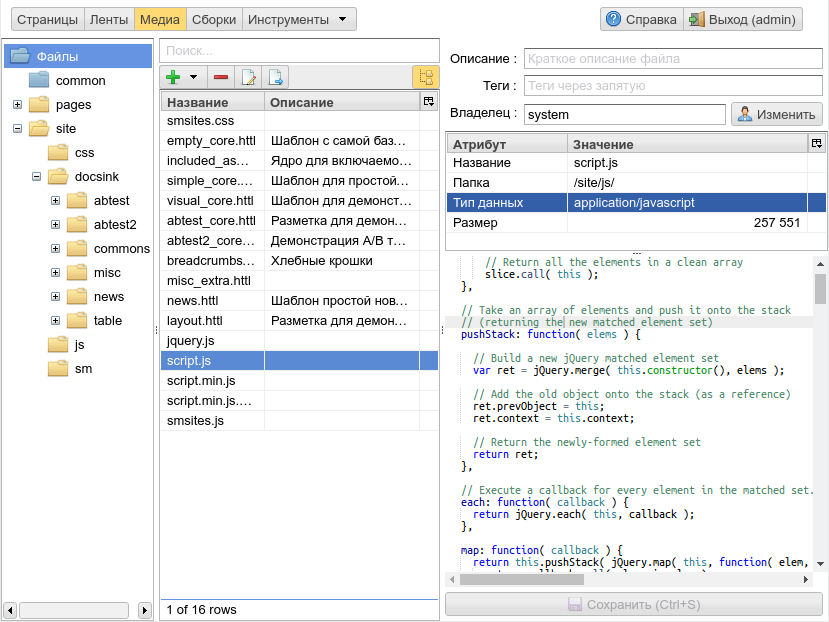
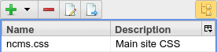
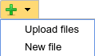

.. _mmgr:

File management in ηCMS (media repository)
==========================================

    Overview of the ηCMS media file management interface

On the left, the user can select the current directory in the media repository.
In the center - the list of files in the selected directory and its subdirectories (depending on
current viewing options). On the right - the file information, main file properties
and editing interface for text files, or images preview panel.
All ηCMS users have an access to this interface.

Media repository folders notation
---------------------------------

The catalog is *system* and used to serve static website resources.

A regular user's catalog.

Every file or catalog can be changed by owner, creator or user with admin rights.

Access to media repository files
--------------------------------

* All files within the system directories `/page` or `/site` (configuration option
  :ref:`asm/site-files-root <conf>`) are available for external users via the HTTP protocol,
  until the security rules of the ηCMS server configuration (`shiro.ini`) don't include
  additional restrictions.
* ηCMS users can change the contents of the file or delete it when at least
  one of the following conditions is respected:

  * The user is the owner of the file (user created this file)
  * The user has administrator permissions (`admin` role)

File operations and options of search and display
-------------------------------------------------

    List of files in the selected directory

Double click on the file name or its description (`F2` hotkey) allows renaming
the file or change its description.
|

Button `New file` creates a new empty file. Also it can be done by `Alt+Enter` hotkey.
`Upload files` allows to select local files on the disk and send them to the current ηCMS directory.
Files can be added to the repository by dragging them from the desktop to the files list.

.. image:: img/mmgr_img6.png
    :align: left

Deleting the selected file in the list. The file can also be removed by `Delete` hotkey.

.. note::

    ηCMS allows to delete only files that are not used in links located on the website pages.

.. image:: img/mmgr_img7.png
    :align: left

Open the editor for text files. `F4` key opens the selected text file in the editor.

.. image:: img/mmgr_img8.png
    :align: left

Move selected files to another folder.

.. image:: img/mmgr_img9.png
    :align: left

The switch of the recursive viewing mode. If this mode is enabled, the file list displays
files in the current directory and in all of its child subdirectories.

When recursive view mode is disabled the file list shows only files
within the current directory.

.. _mmgr_hotkeys:

Hot keys
--------

The active UI element is the currently focused item

========================== ==================== ========================================
 Active UI item             Shortcut             Action
========================== ==================== ========================================
Folder tree                 `Delete`             Remove directory
Folder tree                 `F2`                 Rename directory
Folder tree                 `F6`                 Move directory to another directory
Folder tree                 `Alt+Insert`         Create a new directory in the current selected directory
List files                  `Alt+Insert`         Create an empty text file
List files                  `Delete`             Remove selected file/files
List files                  `F2`                 Rename the selected file or change its description
List files                  `F4`                 Edit selected file
List files                  `F6`                 Transfer the selected file / files to another directory
========================== ==================== ========================================
