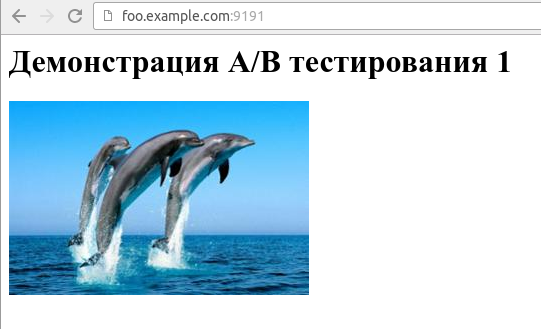
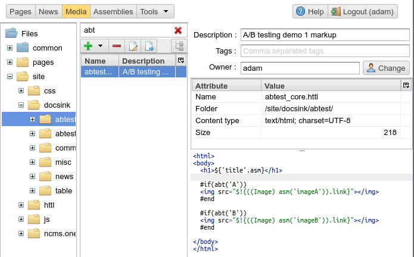
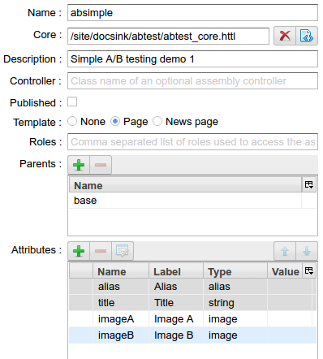
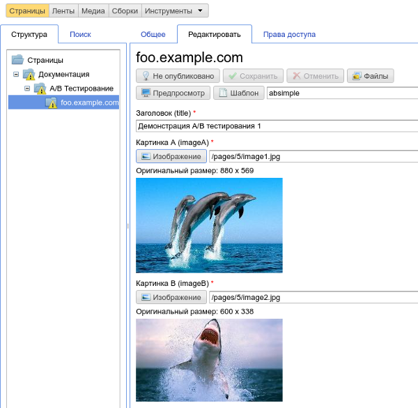
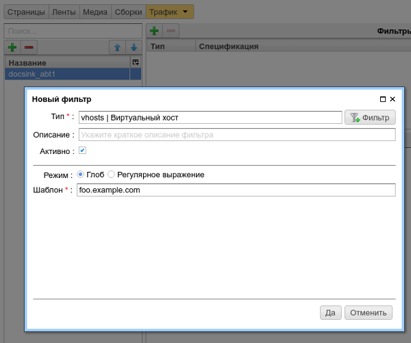
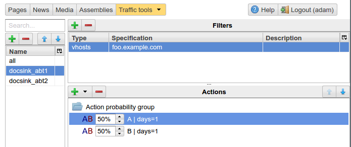
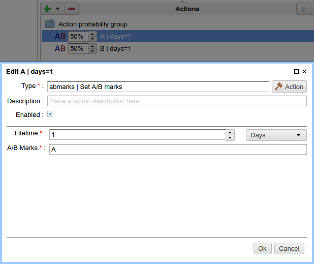
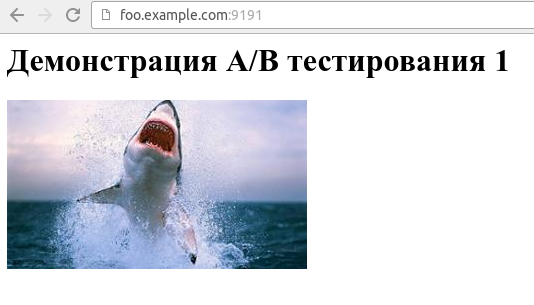

.. _abt_sample1:

Example of A/B testing
======================

This example demonstrates the creation of a simple website and the use of `A/B` testing
to site users.

With a probability of 50% to 50% the website shows users two pictures: `shark` and `dolphins`.
`A/B` mode is selected on first access to the site page and remembered for one day by default.
Let's assume the website is located in a virtual domain: `foo.example.com`.

An example page of the site in `\A` mode:

    Web site page mode `\A`

Then create a file `abtest_core.httl` in the :ref:`media management UI <mmgr>`
it will be the :term:`core <core>` of `foo.example.com` home page:

.. code-block:: html

    <html>
    <body>
      <h1>${'title'.asm}</h1>

      #if(abt('A'))
      </img>
      #end

      #if(abt('B'))
      </img>
      #end
    </body>
    </html>

    File `abtest_core.htt` in the :ref:`media management UI <mmgr>`

The following three assembly :term:`attributes <attribute>`: `title`, `imageA`, `imageB` are
included to the `html` markup. Here the `abt` httl function is used to determine
the current `AB` mode. In this example the result of ``abt('A')``  will be `true`
if `\A` mode is active and a `imageA` will be displayed,
accordingly the `imageB` will be displayed for `\B` mode.

Then create a page template (assembly) for this markup called `absimple`
and define attributes of the assembly as shown below:

    Create page template

Create a page based on the template and load
the required images to the page repository:

    Creating an instance of the page

Select the created page in the :ref:`assembly management UI <amgr>`
and add the `mainpage` attribute, says ηCMS that
this page is the `foo.example.com` home page:

.. figure:: img/screen12.png
    :align: center

    Home page for `foo.example.com` domain

At this stage, the creation of the site is completed.
While opening the website in the page preview, we see dolphins and shark simultaneously,
because within the administrator preview mode all `A/B` options are activated.
After publishing of the site, the pictures will not be displayed, because
there are no rules for choosing `A/B` options for public users.
This is what we are going to do on the following steps of the example.

.. figure:: img/screen5.png
    :align: center

    Preview of the site in the admin zone, all the rules enabled

Further, using `MTT` console we will define a traffic-rule to activate `A/B` modes
for the `foo.example.com`. We call the rule `docsing_abt1` and set that
the rule action is activated only for the virtual host `foo.example.com`,
as shown below:

    Activation of the rule for `foo.example.com`

It remains to determine parameters enabling particular `A/B` modes.
To do this, add a `probability group` to the rule
where with a probability of 50/50 the different `A/B` modes will be activated:

    Configuration of the probabilities of `A/B` modes

Here is the screen of `\A` mode definition:

    Editing `A/B` mode

It is worth noting that in the `A/B` field possible modes can be enlisted in arbitrary order,
for example, `A, B, C, ...` or `Mode1, Mode2, ...`. ηCMS imposes no restrictions
for the number of options for split testing and names of these options. Of course,
they must be agreed with httl templates.

As a result, we have a website with a simple `A/B` testing:

    Website in `B` mode for external user
