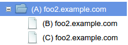
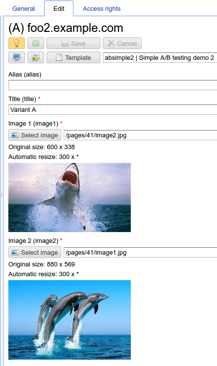
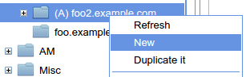
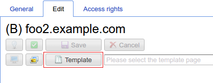
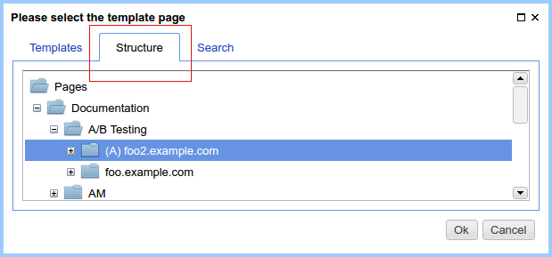
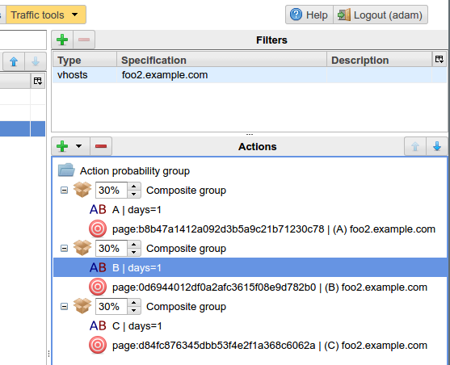

.. _abt_sample2:

Пример A/B тестирования через наследование страниц
==================================================

:ref:`В рассмотренном примере A/B тестирования <abt_sample1>` есть
существенный недостаток: в том случае, если для каждого `A/B` варианта
меняются сразу несколько атрибутов и вариантов больше двух, в `сборке` приходится
зарегистрировать сразу несколько вариантов одних и тех же атрибутов. Это неудобно.

Реализовать варианты `A/B` тестирования можно через наследование страниц.
Для любого из `A/B` вариантов создается базовая страница, страницы для других
вариантов наследуются от базовой.

    Структура наследования страниц для `A/B/C` тестирования

Продемонстрируем этот пример более подробно.

Создание базовой страницы
-------------------------

Разметка базовой страницы:

.. code-block:: html

    <html>
    <body>

      <h2>${asm('title')}</h2>

      </img>
        
      </img>

    </body>
    </html>

    Структура базовой страницы в режиме редактирования

Создание дочерних страниц
-------------------------

Создадим две страницы для вариантов `B` и `C` и в качестве родительской страницы укажем
базовую для варианта `A`.

* Правой кнопкой мыши `Создать`:

* Запускаем диалог выбора шаблона страницы:

* Выбираем вкладку `Структура` и родительскую страницу `(A) foo.example.com`:

* Меняем в дочерней странице контент в соответствии с вариантом `B`. Заголовок `title` и
  два изображения.

Аналогично поступаем с вариантом `С`.

Такой подход к созданию разных вариантов страниц при `A/B` тестировании,
существенно гибче использования разных атрибутов для каждого варианта и
он очень прост в реализации для относительно сложных изменений в каждом варианте.

Настройка MTT правил для страниц
--------------------------------

Пусть требуется равновероятно распределить переходы между страницами A, B, C.
Тогда конфигурация правил роутинга может быть такой:

    Пример равновероятного распределения трафика между вариантами страниц A, B, C

