.. _tracking_pixels:

Tracking pixels example (web beacon)
====================================

.. contents::

Main abilities of the tracking pixels control system
----------------------------------------------------

* Support for a large set of TP sources (Tracking Pixel).
* TP information is stored in the client `cookies` with a long time to live.
* Ability to use references to hidden images or JS code snippets as a TP.

Demo
----

Let's illustrate the abilities of tracking pixels on a simple example of a site
and its interaction with an abstract advertising service ``globalboard``:

To do this, create two pages of our website offering some products.
The first ``welcome`` page is the main page and includes a link to
the page ``product1`` containing the description of a product.

Let the products offered by the website, are advertised at some ad service ``globalboard``.
During the advertising campaign, customers registered in the ``globalboard``
can open the main page of the site. Then with a certain probability
interested customers can go to the page ``product1``.
For the site owner and for ``globalboard`` service  it is a successful `conversion`
- confirmation of the success navigation to our site.
``Globalboard`` owners would like to know conversion details,
including details of involved users.

The interaction described above can be implemented using the ηCMS tracking pixel (TP) module.
On the technical side the following actions occur when users visit our website:

1. ``globalboard`` redirects the client to the ``welcome`` page of our website at
   the following address: ``http: //mysite.com/welcome utm_source = global_board&client_id = 1332``.
2. If a client has passed with a request parameter ``utm_source = global_board``, the website
   stores this information including ``client_id = 1332``.
3. Opening the page ``product1`` is a sign of a successful conversion.
4. If the client came from a ``globalboard`` and moved to the page ``product1``,
   the system creates a hidden link to the picture with the address ``http://globalboard.com/feedback user_id = 1332``, informing ``globalboard`` about this event.
5. So long as the event occurred, the appropriate pixel tracking, stored on our website,
   is removed and repeating opening of the page ``product1`` by the client
   doesn't create a repeated conversion event.

Let's simulate this situation on ηCMS step by step.

Create Welcome page
*******************

If it was not done before, in the :ref:`assemblies UI <amgr>`
create a new :term:`template <template>` called `base_content` with the ability to explicitly
set :term:`page alias`, :term:`markup <core>` and the main content in the :term:`mediawiki` format:

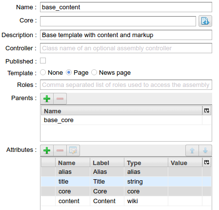

    The configuration of the `base content` template in the `Assemblies` interface

Further, using the :ref:`pages UI <pmgr>` we create a `welcome`
page based on the `base_content` template.

Click the button `File` to create a page's :term:`HTTL` markup:

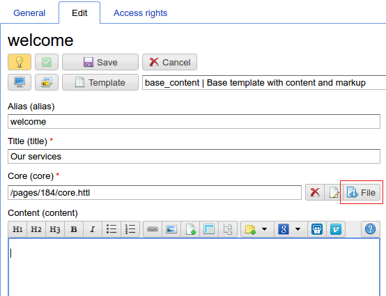

Create the file `core.http` as local page file:

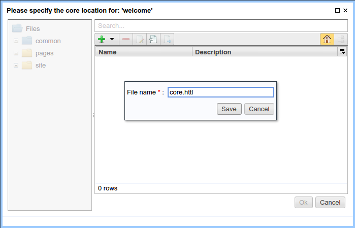

Open the editor for `core.httl`:

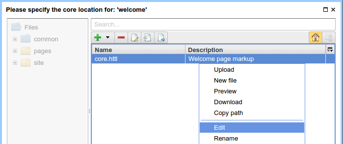

Markup of `core.httl` for the ``welcome`` page looks as follows:

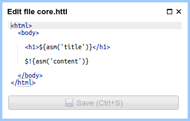

Create product1 page
********************

Similarly, create a ``product1`` page with the following markup:

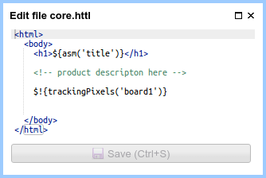

    `core.httl` markup for ``product1`` page

In the `core.httl` for ``product1`` you can see the call of HTTP function::

    $!{trackingPixels('board1')}

Calling `trackingPixels` will cause generation of tracking pixels as hidden image links
or scripts calling the service `board1` (it will be defined below).
Note: you can pass a :term:`glob pattern <glob>` as a first argument for `trackingPixels`
to select services, as well as additional parameters to tune generation of TP links.
For example, to enable TP links to all known services you can use::

      $!{trackingPixels('*')} or $!{trackingPixels()}

To insert extra parameters to the TP links use the following form::

     $!{trackingPixels('board1', ['action':'show'])}

     Then for the link template containing {action} placeholder
     the value will be substituted by show:

     Template:    http://globalboard.com/feedback?user_id={user_id}&action={action}
     Result: http://globalboard.com/feedback?user_id=1332&action=show

Linking welcome and product1
****************************

In other words, we define in the :term:`mediawiki` markup
of the ``welcome`` page the link to the ``product1`` page.

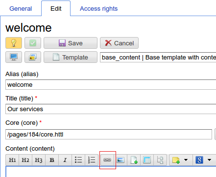

    Create a reference to ``product1``

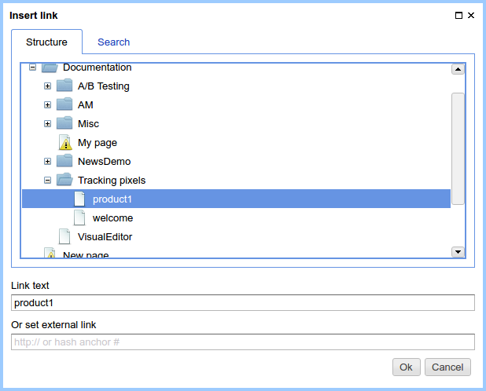

    Create a reference to ``product1``

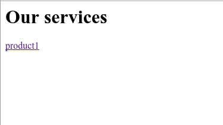

    Welcome page with a reference to ``product1``

Enable pixel tracking for all pages of the site
***********************************************

Go to the `Traffic` admin UI and create a new rule with the name `all`
for all pages of the site. Then choose the action called `Track traffic sources`
and activate it by the checkbox `Activate tracking pixels`:

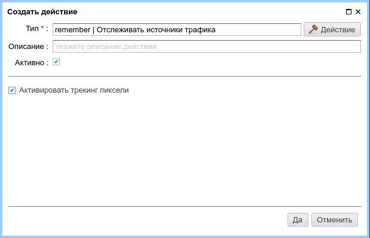

As a result we have the following view of the configuration of the rule `all`
for all public pages of the site:

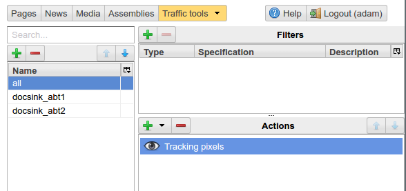

.. note::

    Tracking pixels processing takes some server resources while showing pages.
    Therefore, to enable the tracking pixels it is required to explicitly create
    a rule matching the pages for which the tracking pixels is required.

Determine the tracking pixel configuration for the globalboard service
**********************************************************************

Go to the `Tracking pixels` section:

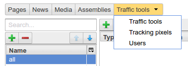

Add a new tracking pixel `board1` having the following properties:

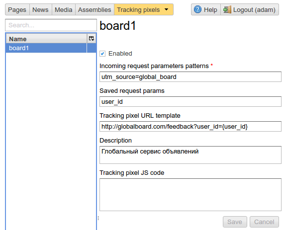

    The configuration of the tracking pixel `board1`

* `utm_source = global_board` -- a template of HTTP GET query parameters to detect source of
  client's conversion. It may contain parameters and :term:`glob` parameters templates.
  For example::

    utm_source={abc\,def},foo=bar

  means that for requests with `utm_source = abc` or `utm_source = def` and
  the parameter value `foo = bar`, the tracking pixel will be saved and
  may be further used. In the options list within the curly braces the `comma(,)`
  must be escaped with the backslash '\\'.

* Additional GET request parameters are stored in the field `Stored parameters`.
  Parameters will be saved for the future use to generate pixel URL or script.
  Typical example of this is a remote service customer identifier.

* `URL template for pixels tracking` defines the format of pixel address
  and parameters of the query to be saved which can be included
  to the callback pixel address. Also in this template you can include
  additional parameters sent to HTTL method: `$!{trackingPixels(...)}`.

Testing the tracking pixels
***************************

Now everything is ready to start working of tracking pixels for ``globalboard``.

To do this, go to the ``welcome`` page with additional GET parameters,
emulating a call of the ``globalboard`` service.

The following parameters are defined:

* utm_source=global_board
* user_id=1332

.. figure:: img/tp_img18.png
    :align: center

By clicking the link `product1` user navigates to the
page containing the description of the product,
where in the context of the page placed the hidden URL which notifies the service ``globalboard``
on a conversion:

.. code-block:: html

    <html>
      <body>
        <h1>Page for product 1</h1>
        <!-- product description here -->
        
      </body>
    </html>

