.. _news:

News feeds management
=====================

Site pages based on a :term:`template <template>`, may have one or more news (events) feeds.
Let's call them the **base pages**. News feed is the set of pages of a given type,
associated with the `base page`.

.. note::

    News feed can be considered as a simple website news, blog posts, the goods list of a shop, etc.
    Different pages may have independent news feeds, which can be displayed in the context of those pages.

Example of the news feed for the site page
------------------------------------------

This simple example demonstrates the adding of a news feed to a
web page and the process of news creation.

The following steps are to be done in order to create a news feed:

1. Creating the `base page` we are going to associate with a news feed.
2. Creating the :term:`template <template>` for news feed pages (news).
3. Creating instances of pages of news feed in the context of the base page (using template created at the step 2).

Creating the base page
**********************

Creating the :term:`template <template>` named `docsink_newsdemo`
which will be a template for the base page instance.

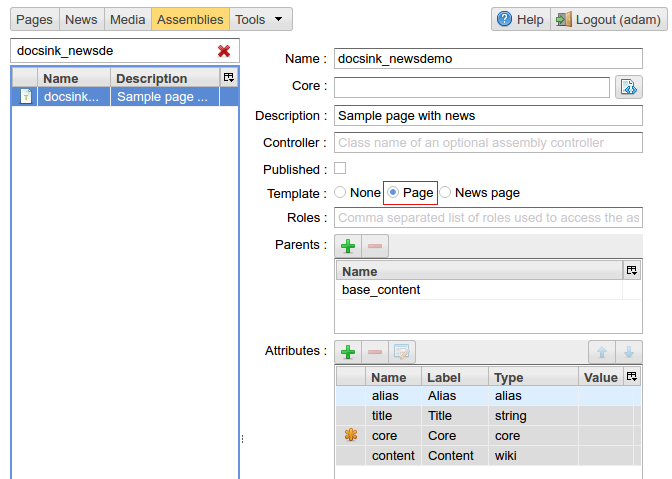

    Creating a template for the base page

As we can see the template `docsink_newsdemo` is inherited from the `base_content` assembly
where we can set the following attributes:

* `alias` - Page alias -- an alternative url on which the page is available.
* `core` - Page markup which can be explicitly set in the :ref:`page management UI <pmgr>`.
* `title` - Page title.
* `content` - The main content of the page defined with the mediawiki markup.

We call the home page `NewsDemo` and fill all the required attributes:

.. figure:: img/news_img4.png

    Content of the base page editing interface

File `core.httl` is a markup for the base page, and at this step
contains the following httl code:

.. code-block:: html

    <html>
    <head>
      <title>${'title'.asm}</title>
    </head>
    <body>
      $!{'content'.asm}
    </body>
    </html>

Creating a template for news feed items
***************************************

A news page is a site page based on a particular template with activated `News page` option.
Any template can be used to create news pages if its `Template` option is set to `News page`
in the :ref:`assemblies management UI <amgr>`.
**One limitation:** the name of the news page template should
begin from the name of the base page template
till the first underscore `\_` (Of course if the underscore is contained in the name of the base page template).
As shown in the screenshot below, the name of template for news pages is `docksink_news_simple`.
At the same time, the name of the `base page` template is `docsink_newsdemo`.
There is `docsink_` common prefix in their names. This simple convention allows ηCMS
to associate news pages with the base page.

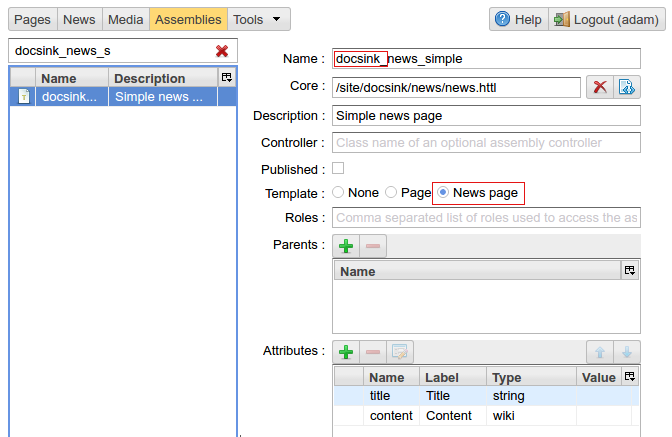

    Template for a news page for `docksink_newsdemo`

Creating instances of news pages
********************************

In order to create a news page we need to choose the base page to which it will be attached:

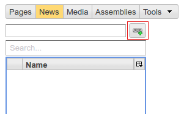

    Selecting the base page

After pressing the button to select the base page for a news feed
the ηCMS opens the dialog with the latest `base pages` used by current user.
Now this list is empty:

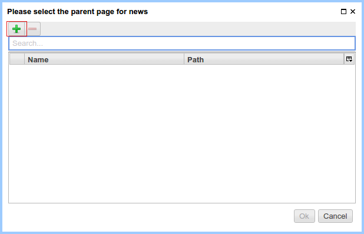

    The last base pages user worked with

Click on the |IADD| and choose the base page `NewsDemo`:

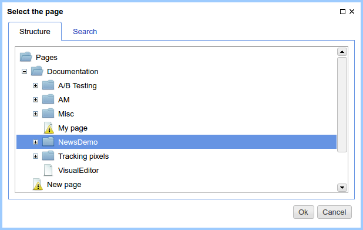

    Adding `NewDemo` to the list of basic pages, click `Yes`

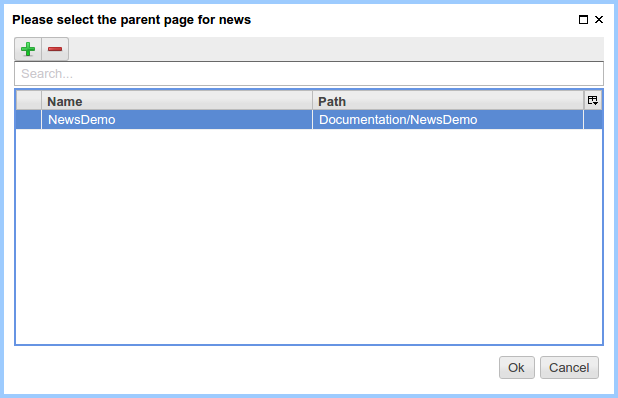

    The current list of base user pages

.. |IADD| image:: img/add.png
    :align: bottom

Creating news page for the selected base page
*********************************************

Right-click to activate the context menu and click `Create`, as shown in
the screenshot below:

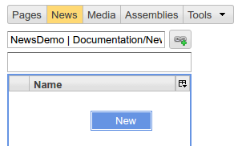

Fill in the name of news item

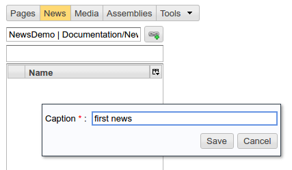

Choose the news and set the template for the news pages:

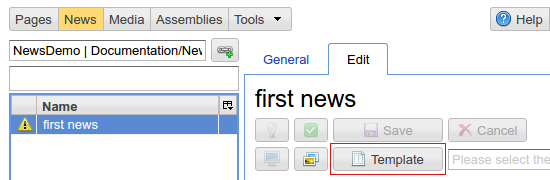

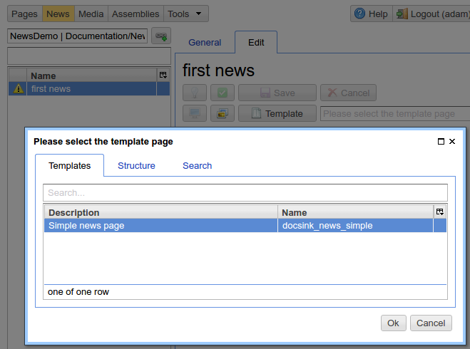

Next, fill the contents of news publication and set the publication status:

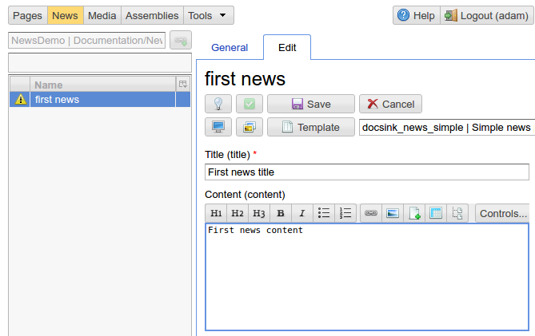

Setup the base page to display the list of news
***********************************************

Let's go to edit the base page content
and modify the markup of the page
to display a list of linked news:

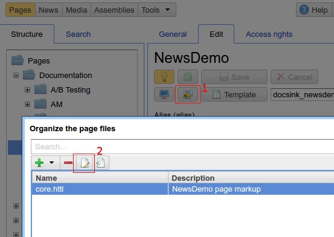

In the edit box, modify the
markup to display the news list.

Getting the news list::

    #foreach(Asm n in asmNavChilds("news.page"))

Generating a link to every news item:

.. code-block:: html

    <li><a href="$!{n.link}">${n.hname}</a></li>

.. code-block:: html

    <html>
    <head>
      <title>${'title'.asm}</title>
    </head>
    <body>

      $!{'content'.asm}

      <h2>News</h2>
      <ul>
      #foreach(Asm n in asmNavChilds("news.page"))
        <li><a href="$!{n.link}">${n.hname}</a></li>
      #end
      </ul>
    </body>
    </html>

As a result we get a page containing news:

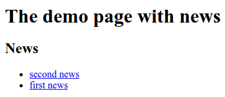
