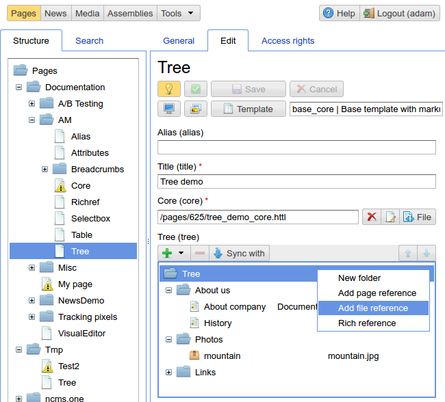
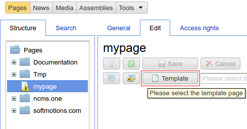
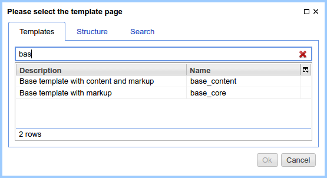
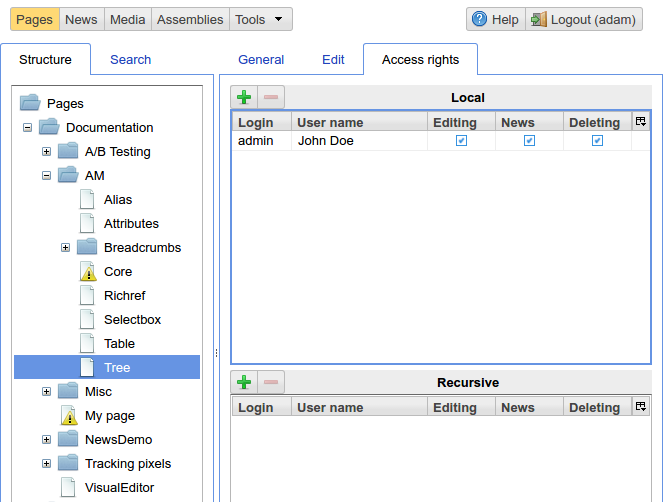
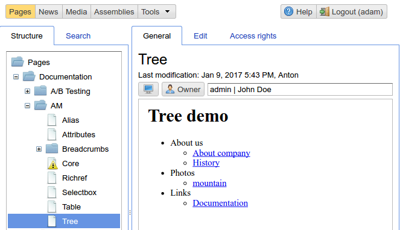
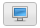

.. _pmgr:

Page content management
=======================

This interface is used to edit ηCMS pages in non visual mode.
All registered ηCMS users have an access to it.

Users having `admin` or `admin.structure` access permissions
can edit any ηCMS page.

    Overview of the page content management interface

On the left side there is a navigation tree for all ηCMS pages.
On the right side: the panes for page content preview, content editing and page access permissions management.

Edit page content panel (Edit)
------------------------------

Every page in ηCMS should have a :term:`template` which can be chosen
by `Template` button on the editing panel:

Then the user can select an available page template,
in accordance with user's access rights:

After selecting a template the :term:`assembly` of the current page will be inherited from the template assembly,
and attributes defined in a template will be available for editing in the context of the page.

.. note::

    In some cases, it's handy to use existing page instances as a template for new pages
    To use the page as a template, open `Structure` or `Search` tab in the template selection dialog.

The content of the `Edit` pane is shown in accordance with :term:`attributes <attribute>` used on the page
and their settings. The screenshot below displays the following editable
attributes :ref:`alias <am_alias>`, :ref:`header (title) <am_string>`, :ref:`tree <am_tree>`.

    Edit page content panel

Page permissions control panel (access permissions)
---------------------------------------------------

By default, the page owner and administrator can edit, delete or :ref:`manage news feeds <news>`
associated with pages. The tab allows user to delegate the following permissions to other ηCMS users:

* editing
* removing
* news feed management

    Control panel of access permissions to the page

At the same time, the permissions can be assigned either for a particular page or
as `recursive permissions` for all `child` pages, if the page is a container (folder).
Recursive access permissions can be overridden by child pages.

General Panel
-------------

In this section you can see the page in the preview mode, and
the current status of the page:

* Whether the page was published,
* Is the page :term:`main <main page>`

    `General` panel for the selected page

Preview of the page in a new window/tab of the browser

Change the page owner button.
Page owner can by changed only by the current owner or administrator.

.. _pmgr_hotkeys:

Hot keys
--------

The active UI element is the currently focused item

========================== ==================== ========================================
  Active UI item           Shortcut             Action
========================== ==================== ========================================
The page tree              `Delete`             Deleting a page
The page tree              `Alt+Insert`         Creating a new page
The page tree              `F2`                 Changing the name/type of a page
The page tree              `F6`                 Move a page to a different directory
========================== ==================== ========================================
