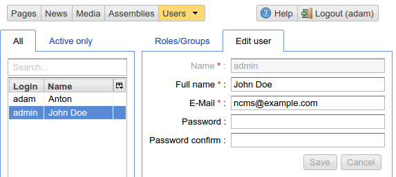
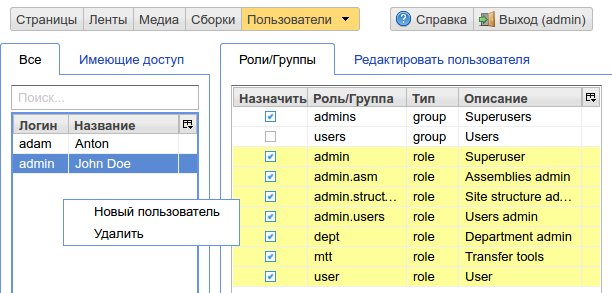

.. _umgr:

User Management
===============

This UI is accessible to users having `admin` or `admin.users` roles.

User management interface
-------------------------

    User management

    Set of user's roles

Configuration
-------------

By default ηCMS maintains a user database in an XML file.

.. note::

    ηCMS can use any user database which implements the
    `com.softmotions.web.security.WSUserDatabase` interface.

The following user database configuration parameters are used:

.. code-block:: xml

    <security>
        <!-- Location of the ηCMS user database in an XML file.
             placeTo: Optional location to which the initial user database file will be copied
                       from its original location. -->
        <xml-user-database placeTo="{home}/.myapp/mayapp-users.xml">
             <!-- The classpath of the read-only ηCMS user database resource file.
                  If the placeTo attribute is defined, the database file
                  will be initially copied to the specified location -->
            conf/mayapp-users.xml
        </xml-user-database>
        <!-- The algorithm for generating password hashes       
             Possible values are:
                - sha256
                - bcrypt
                - empty string or no element: passwords are not encrypted
        -->
        <password-hash-algorithm>sha256</password-hash-algorithm>
        ...
    </security>

Users database sample data
--------------------------

.. code-block:: xml

    <?xml version="1.0" encoding="UTF-8" standalone="no"?>
    <database>
        <!-- List of available user roles -->
        <role description="Superuser"
              name="admin"/>
        <role description="User"
              name="user"/>
        <role description="Assemblies admin"
              name="admin.asm"/>
        <role description="Users admin"
              name="admin.users"/>
        <role description="Site structure admin"
              name="admin.structure"/>
        <role description="Department admin"
              name="dept"/>
        <role description="Transfer tools"
              name="mtt"/>

        <!-- Role groups to be assigned to users ->
        <group description="Superusers"
               name="admins"
               roles="admin,admin.asm,admin.users,
                      user,admin.structure,dept,mtt">
        </group>
        <group description="Users"
               name="users"
               roles="user">
        </group>

        <!-- Users -->
        <user email="ncms@ncms.one"
              fullName="John Doe"
              groups="admins"
              name="admin"
              password="{sha256}161cc9f549cc310f8f208bae4de ...">
        </user>
        <user email="adamansky@softmotions.com"
              ullName="Anton"
              groups="admins,users"
              name="adam"
              password="{sha256}169cc9f549cc322c8f208baee2 ..."/>
    </database>
