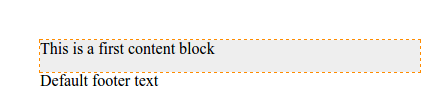
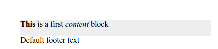

.. _visual:

The visual editor of pages
==========================

Sometimes you need to manage a lot of text data blocks within a page.
If each data block is defined as a single assembly :term:`attribute`, it may make the
:ref:`page management UI <pmgr>` to be too heavy and bloated. Also for many users it can be
more convenient to edit a page content using a visual editor.

In ηCMS we have an ability to create and manage visually editable content blocks.
In order to do it, add the HTML block (eg, `
`) to the markup accompanied
with `ncms-block` attribute, its value should be a unique identifier of a block.

.. code-block:: html

    

        The contents of the block by default.
    

After that, a site editor can edit a stylized HTML text in the defined blocks,
using  `Medium Editor <https://yabwe.github.io/medium-editor/>`_.

Example
-------

Let's create a page called `VisualEditor`, based on the template with the ability
to explicitly specify the :term:`markup <core>` in the :ref:`content editing UI <pmgr>`
In order to do that the page template must contain
the attribute with type :ref:`core <am_core>`.
Then add the following markup:

.. code-block:: html

    <html>
      <head>
        <title>${asm('title')}</title>
      </head>
      <body style="width:50%;padding:2em;">
        

            This is a first content block
        

        <footer>
            

              Default footer text
            

        </footer>
      </body>
    </html>

There are two visual blocks: the `main` and the `footer`.
The `main` block is highlighted with gray for clarity.

In the page preview pane we get:

When the mouse pointer is over the block, it is highlighted with a frame.
You can click on the block to activate edit mode where you can change its content
and the block text:

.. image:: img/visual_img2.png

As a result we get a simple and intuitive way to edit
page data blocks directly in the page preview pane:

