.. _arch:

.. contents::

Введение в ηCMS
===============

Основные понятия
----------------

Страница в ηCMS - это совокупность **данных** и **HTML разметки**.
Совокупность данных страницы можно представить в виде набора :term:`атрибутов <атрибут>`,
где каждый атрибут представляет пару: `имя атрибута` и `значение атрибута`.
Для читателей, знакомых с принципами `ООП <https://en.wikipedia.org/wiki/Object-oriented_programming>`_, страницу можно рассматривать,
как объект некоторого класса с набором атрибутов и хранимых в них данными.

.. image:: img/ncms_arch1.png

Введем несколько понятий, которые помогут нам разобраться в ηCMS и в дальнейшем будут использоваться в
документации.

.. glossary::

    атрибут
    attribute
        Атрибут - это именованный блок данных, принадлежащий :term:`сборке <сборка>`.
        Это может быть как простая строка, так и более сложный объект, например, ссылка на другую страницу или файл,
        список, дерево и т.п.
        На атрибут можно сослаться по имени атрибута.
        Данные атрибута имеют свое представление в HTML коде страницы.
        :ref:`Описание возможных атрибутов. <am>`

    сборка
    assembly
        Сборка - это поименованное множество :term:`атрибутов <атрибут>`. Атрибуты используются
        для отображения информации в контексте страниц ηCMS. Иными словами, сборка - это
        набор атрибутов, и на этот набор можно сослаться по имени сборки.

    HTTL
        HTTL - это язык разметки (http://httl.github.io), с помощью которого определяется :term:`разметка <ядро>` страниц ηCMS.
        HTTL достаточно сильно похож на популярный язык шаблонов
        Apache Velocity. :ref:`Руководство по HTTL разметке в ηCMS. <httl>`

    ядро
    core
        Ядро сборки - это :term:`HTTL` разметка для представления данных, хранимых в :term:`сборке <сборка>` в виде HTML
        страницы. Ядро является :term:`атрибутом <атрибут>` сборки, который интерпретируется ηCMS
        для создания конечного кода HTML страницы.

    шаблон
    template
        Шаблон страницы - это :term:`сборка`, которая является базовой (родительской в смысле наследования) для
        :term:`страницы <страница>`, отображаемой клиентам сайта. Шаблон определяет множество страниц с
        одинаковой структурой, но с разным содержанием.

    страница
    page
        Страница - это :term:`сборка`, которая связана со своим :term:`ядром <ядро>`.
        В ядро страницы (в HTML разметку) включаются данные атрибутов сборки, и
        в результате страница отображается клиенту веб сайта.

`Сборки` могут наследоваться друг от друга, переопределять значения атрибутов родительских сборок,
добавлять новые `атрибуты`. `Сборки` поддерживают множественное наследование. Здесь можно
провести прямую аналогию с наследование классов, но вместо классов
мы рассматриваем объекты классов в виде `сборок (assemblies)`.

Демострация некоторых возможностей ηCMS
---------------------------------------

..  youtube:: -j9na4Q_ED0
    :width: 100%

Пример
------

Проиллюстрируем сказанное выше на примере -- сделаем простой веб сайт.
Если вы хотите самостоятельно выполнить шаги, которые будут описаны ниже, вам
необходимо :ref:`создать новый проект <newproject>`.

Перейдем в интерфейс администратора:  `http://localhost:<port>/adm/`

Пусть большинство страниц нашего сайта имеют следующие общие свойства:

* Заголовок страницы (title)
* Подвал страницы (footer)

Положим, что `title` - это строка, которая находится в разметке внутри тега `head`:

.. code-block:: html

    <head>
        <title>The page title here</title>
    </head>

А `footer` это часть HTML разметки, которая хранится в отдельном файле
медиа-репозитория ηCMS.

Выделим из упомянутого большинства страницы, отображающие
один блок контента, и объединим их в единый :term:`шаблон` (множество) под названием `Простая страница`.

Страницы шаблона `Простая страница` содержат атрибуты `title (заголовок)` и `footer (подвал)`,
разделяемые большинством страниц сайта, а также дополнительные атрибуты и свойства:

* Содержимое (content)
* И разметку страницы (:term:`core`)

Редактор сайта, используя графический интерфейс ηCMS, может создать экземпляр
страницы с именем `mypage`, типом `Простая страница` и уникальным содержимым этой
страницы (:ref:`wiki атрибутом <am_wiki>`).

.. figure:: img/ncms_arch2.png
    :align: center

    Иерархия наследования сборок для страницы `mypage` типа `Простая страница` (Simple page template)

При обращении к странице `mypage` ηCMS получит файл разметки для шаблона `Простая страница`,
подставит в контекст этой :term:`HTTL` разметки множество атрибутов, относящихся к экземпляру
:term:`сборки <сборка>` `mypage`, и в завершении сгенерирует HTML ответ клиенту. В этом процессе
описана простая, но мощная идея, лежащая в основе ηCMS.

Давайте реализуем описанную выше структуру в графическом интерфейсе ηCMS.

В :ref:`интерфейсе управления сборками <amgr>` создаем сборку с именем `base`.

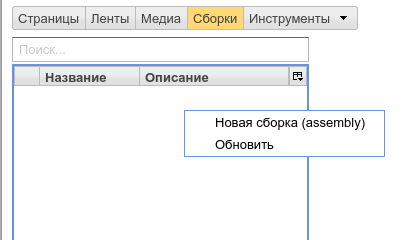

    Новая `base` сборка

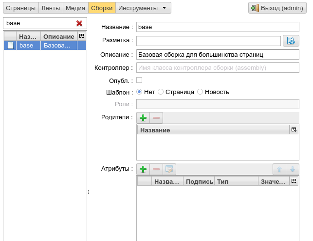

    Новая `base` сборка

Создаем общие для всех страниц атрибуты.

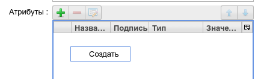

    Создание нового атрибута для `base`

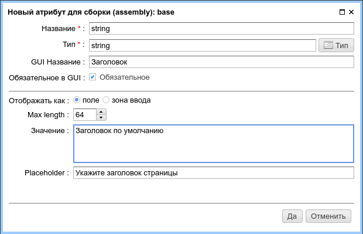

    Создание нового атрибута `title` для `base`

Аналогичным образом добавляем атрибут `footer`.

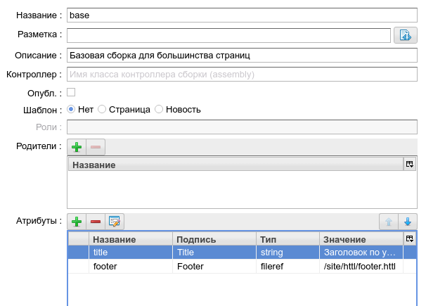

Создаем новый тип страниц: "Простая страница"

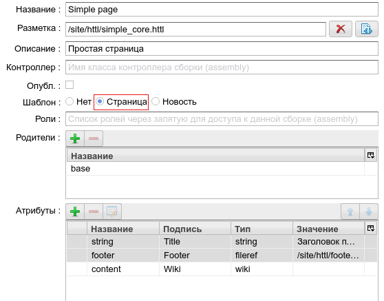

    :term:`Шаблон <шаблон>` "простая страница"

В :ref:`интерфейсе управления медиа контентом <mmgr>` создадим файл
разметки для типа "Простая страница": `/site/httl/simple_core.httl`.

.. code-block:: html

    <html>
    <head>
      <title>${asm('title')}</title>
    </head>
    $!{asm('content')}
    <footer>
      $!{asm('footer')}
    </footer>
    </html>

Здесь мы видим вывод значений атрибутов `title`, `content`, `footer`.
:ref:`Руководство по HTTL разметке в ηCMS. <httl>`

После того, как определены базовые :term:`сборки <сборка>` и :term:`шаблон` страницы,
в :ref:`интерфейсе управления страницами <pmgr>` редакторы сайта
могут создать экземпляры страниц на основе определенного выше шаблона:

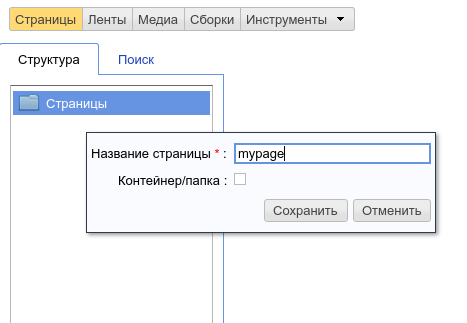

Выбираем шаблон страницы:

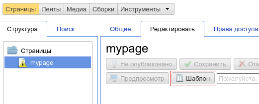

    Кнопка выбора шаблона

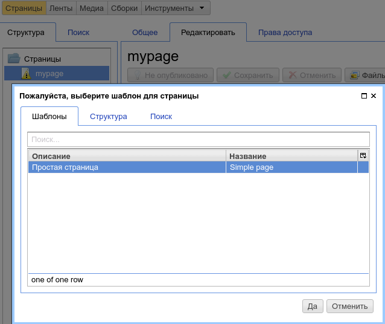

После создания страницы активируется интерфейс редактора
содержимого страницы:

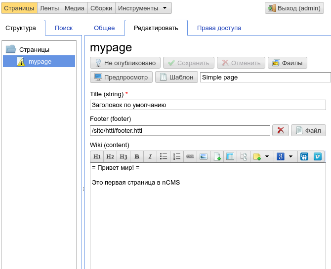

    Интерфейс редактора содержимого страницы

Нажав на кнопку `Предпросмотр` получаем результат нашей работы:

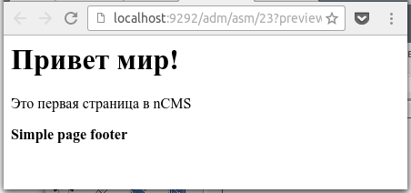

    Отображение созданной страницы `mypage`

Архитектура платформы
---------------------

Платформа ηCMS является веб приложением на базе `Java servlet API 3.1`.
В приложении используется `IoC` контейнер `Google Guice <https://github.com/google/guice>`_.
Для связи с СУБД используется SQL библиотека `MyBatis <http://www.mybatis.org/mybatis-3/>`_.

Структура :ref:`нового проекта ηCMS <newproject>` построена так, чтобы разработчик
имел возможность как расширять функционал самой платформы ηCMS в контексте проекта,
так и создавать специфичные для проекта модули. Более подробно можно ознакомиться
в разделе :ref:`extending`.

Дополнительные определения
--------------------------

.. glossary::

    главная страница
    main page
        Домашняя (начальная) страница для определенного виртуального
        хоста и языка. Для создания главной страницы используется атрибут
        :ref:`маркер главной страницы <am_mainpage>`, добавляемый в сборку страницы.

    иерархия наследования страницы
    asm inheritance tree
        Сборки могут наследоваться друг от друга.
        Здесь используется семантика, аналогичная наследованию классов
        о объектно-ориентированных языках программирования. Но в
        данном случае сборку нужно рассматривать как объект,
        хранящий данные (атрибуты), а наследование - как наследование
        данных объектов.

    дерево навигации
    navigation tree
        Если при создании страницы ее тип был указан как `Контейнер`, то эта
        страница может иметь вложенные в нее подстраницы. Данная страница
        будет являться родительской для вложенных страниц. Вложенные страницы
        также могут являться контейнерами для других страниц. Комбинируя страницы
        подобным образом, редактор сайта создает `дерево навигации` сайта.

        .. note::

            Кроме отношения вложенности, страницы могут наследоваться друг
            от друга, тем самым образуя `дерево наследования`. Не следует путать
            наследование сборок с `деревом навигации`. :ref:`attributes_access`

    тип страницы
    page type
        Допустимы следующие типы страниц:

        * Обычная страница
        * Страница ленты (новостная страница)
        * :term:`Сборка <сборка>` - страница, которая является
          прототипом (родителем в дереве наследования) для других страниц.

    GUID страницы
    page GUID
         Уникальный 32-х символьный идентификатор страницы,
         используемый для доступа к странице по адресу: `http://hostname/<guid>`.

    псевдоним страницы
    page alias
        Альтернативное уникальное имя страницы, по которому она может быть
        отображена. Например, страница с :term:`guid <GUID страницы>` равным `b3ac2985453bf87b6851e07bcf4cfadc`
        доступна по адресу `http://<hostname>/b3ac2985453bf87b6851e07bcf4cfadc`.
        Однако, если в контексте страницы зарегистрирован атрибут с типом :ref:`alias <am_alias>`
        и значением `mypage`, то данная страница будет доступна по адресу: `http://<hostname>/mypage`.
        Допускается использовать `/` в названии псевдонима, например, для псевдонима `/foo/bar`  страница может быть
        доступна по адресу `http://<hostname>/foo/bar`.

    glob шаблон
    glob
        Нотация шаблона поиска, где можно задавать
        простейшие правила сответствия шаблона и данных.

        * Символ `\*` обозначает ноль или несколько символов в строке искомых данных.
        * Символ `\?` соответствует одному любому символу искомых данных.

        `Подробнее о Glob нотации <https://en.wikipedia.org/wiki/Glob_(programming)>`_

    mediawiki
        Популярный язык разметки wiki страниц. Например, в mediawiki разметке
        описаны страницы сайта `wikipedia.org <https://www.wikipedia.org/>`_.
        Mediawiki разметка может быть использована для создания страниц ηCMS
        при помощи :ref:`wiki атрибута <am_wiki>`.

