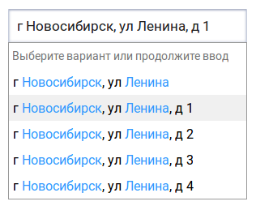

.. _dadata:

Сервис подсказок DaData.ru
==========================

Сервис подсказок от DaData.ru позволяет быстро вводить адреса, ФИО и e-mail, реквизиты компаний и банков.

Подготовка
----------

Первое, что потребуется - зарегистрироваться на сайте `<http://dadata.ru>`_ и получить API-KEY в личном кабинете.

Для удобства использования API-KEY положим в конфигурацию ηCMS, для этого в xml-конфиг добавим:

.. code-block:: xml

    <dadata-api-key>
        [ключ, выданный сервисом]
    </dadata-api-key>

Далее, нам потребуется jQuery-плагин и css-стили к нему. Скачать их можно `здесь <http://www.jsdelivr.com/projects/jquery.suggestions>`_
в виде файлов для включения в файловую структуру сайта или использовать напрямую с CDN. Вне зависимости от способа, их
необходимо подключить на странице с формой.

Использование
-------------

Минимальный js-код, который включает подсказки для поля ввода адреса, целиком выглядит следующим образом:

.. code-block:: js

    (function ($) {
        $("#address").suggestions({
            serviceUrl: "https://suggestions.dadata.ru/suggestions/api/4_1/rs",
            token: "$!{config('dadata-api-key')}",
            type: "ADDRESS"
        });
    })(jQuery);

где:

* `serviceUrl` - URL сервиса подсказок;
* `token` - API-KEY для работы с сервисом. Здесь - загружен из конфигурации;
* `type` - тип подсказок.

Для работы подсказок необходимо, чтобы к полям формы можно было обратиться через jQuery-селектор. В данном примере будет использоваться id.

В результате, при вводе адреса в поле будет появляться выпадающий список:

Комплексный пример
------------------

Пусть форма с вводом адреса содержит следующие поля:

.. code-block:: html

    <form>
        ...
        <input id="region" type="text" placeholder="Регион"/>
        <input id="city" type="text" placeholder="Город"/>
        <input id="street" type="text" placeholder="Улица"/>
        <input id="house" type="text" placeholder="Номер дома"/>
        ...
    </form>

В код страницы добавляем следующий скрипт:

.. code-block:: js

    (function ($) {
        var serviceUrl = "https://suggestions.dadata.ru/suggestions/api/4_1/rs",
                token = "$!{config('dadata-api-key')}",
                type = "ADDRESS";

        var $region = $("#region"),
                $city = $("#city"),
                $street = $("#street"),
                $house = $("#house");

        // регион
        $region.suggestions({
            serviceUrl: serviceUrl,
            token: token,
            type: type,
            hint: false,
            bounds: "region",
            formatSelected: function (suggestion) {
                // 'Респ Марий Эл' -> 'республика Марий Эл'; 'Новосибирская обл' -> 'Новосибирская область'
                var re = new RegExp('(\\s|^)' + suggestion.data.region_type + '(\\s|$)', 'g');
                return suggestion.data.region_with_type
                .replace(re, ' ' + suggestion.data.region_type_full + ' ').trim();
            }
        });

        // город
        $city.suggestions({
            serviceUrl: serviceUrl,
            token: token,
            type: type,
            hint: false,
            bounds: "city",
            formatSelected: function (suggestion) {
                return suggestion.data.city;
            },
            constraints: $region
        });

        // улица
        $street.suggestions({
            serviceUrl: serviceUrl,
            token: token,
            type: type,
            hint: false,
            bounds: "street",
            formatSelected: function (suggestion) {
                return suggestion.data.street;
            },
            constraints: $city
        });

        // дом
        $house.suggestions({
            serviceUrl: serviceUrl,
            token: token,
            type: type,
            hint: false,
            bounds: "house",
            formatSelected: function (suggestion) {
                return suggestion.data.house;
            },
            constraints: $street
        });
    })(jQuery);

Данный пример реализует так называемые "гранулярные подсказки", то есть адрес, разбитый на составные части.

**Использованые в примере параметры/коллбеки:**

`hint`
    Текстовая подсказка, которая появляется поверх вариантов выбора. `false` - отключает подсказку. По умолчанию -
    "Выберите вариант или продолжите ввод".

`bounds`
    Ограничивает поиск среди полей адреса: `region` - для региона, `city` - для города и т.д.

`constraints`
    Принудительное ограничение области поиска. Используется для связывания значений отдельных полей ввода - город
    зависит от региона, улица от города, дом от улицы.

`formatSelected`
    Функция, возвращающая строку для вставки в поле ввода при выборе подсказки. В примере для поля "регион" возвращается
    полное наименование региона, для остальных полей - значение без префикса. Если не переопределять - выдает значение
    из подсказки. Обычно это значение с префиксом, например, "ул Ленина" для улицы.

Особенности использования подсказок
-----------------------------------

Если логика работы страницы предполагает, что к моменту подключения подсказок в полях ввода будут содержаться непустые
значения (например, данные из БД), то после непосредственного включения подсказок необходимо вызвать метод `fixData`:

.. code-block:: js

    $house.suggestions().fixData(); // fixData необходимо вызывать для последнего поля в цепочке гранулярных. Здесь - поле house

    $("#address").suggestions().fixData(); // Аналогично, если поле единственное

.. warning::
	Вызов метода `fixData` может изменить значения полей ввода, например, если эти данные были сохранены до
	начала использования сервиса подсказок.

Есть несколько путей решения этой проблемы:

1. Не вызывать метод `fixData` до момента, пока пользователь не начнет редактировать значения этих полей;

2. Сравнить значения полей до и после вызова `fixData`, при необходимости оповестить пользователя;

3. Предварительно прогнать все данные через сервис "`Стандартизация <https://dadata.ru/api/clean/>`_" от DaData.ru.

Документация
------------

За более подробным описанием алгоритма работы, параметрами/коллбеками/методами/стилями jQuery-плагина, а также примерами
обращайтесь к `официальной документации <https://dadata.ru/help/suggestions>`_.
