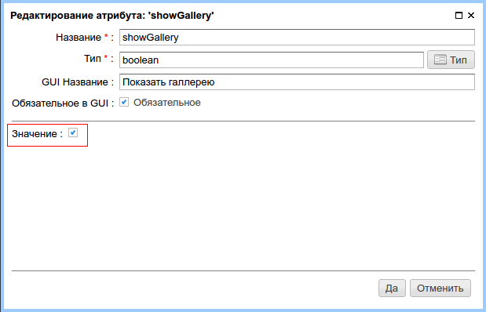

.. _am_boolean:

Переключатель (да/нет)
======================

Это простой переключатель, который может быть
в одном из двух положений: ``да/нет``.

Атрибут а разделе редактирования контента страницы отображается, как
checkbox переключатель.

Опции атрибута
--------------

    Значение атрибута по умолчанию

Использование в разметке
------------------------

Тип значения: `java.lang.Boolean`

**Пример**::

    #if(asm('showGallery').toBoolean)
        ...
    #end

