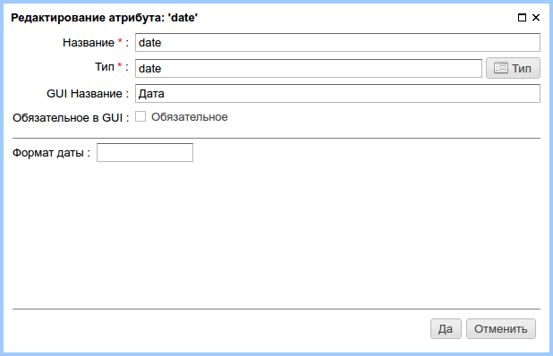
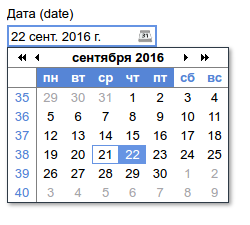

.. _am_date:

Дата (date)
===========

Поле ввода даты с точностью до секунд.
Сохраняемая дата не зависит от часового пояса и содержит
дату в виде строки ISO формата, как например: ``2007-12-03T10:15:30``.

Опции атрибута
--------------

    Опции атрибута

Для атрибутов этого типа можно задать формат заполнения даты.

===== ===========
Ключ   Описание
===== ===========
y 	год
M 	месяц
d 	день месяца
D 	день года
E 	день недели
h 	час в 12-часовом формате
H 	час в 24-часовом формате
m 	минута
s 	секунда
===== ===========

Режим редактирования
--------------------

В режиме редактирования страницы этот атрибут
отображается, как поле выбора даты с календарем.

    Атрибут в разделе редактирования контента страницы

Использование в разметке
------------------------

**Тип значения:** `java.time.LocalDateTime`

