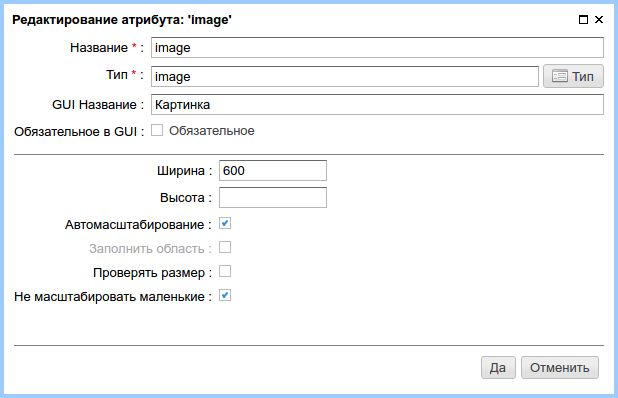
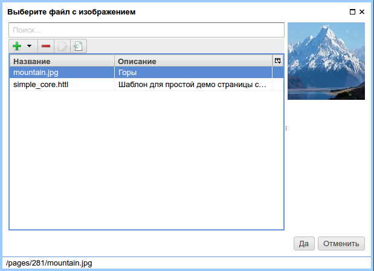

.. _am_image:

Картинка (image)
================

Атрибут с помощью которого можно задать файл изображения и отобразить его в контексте
страницы сайта. nCMS поддерживает автоматическое масштабирование изображения в зависимости
от параметров атрибута.

Опции атрибута
--------------

    Опции атрибута

=============================== =========
Опция                           Описание
=============================== =========
**Ширина**                      Желаемая ширина изображения при отображении изображения.
**Высота**                      Желаемая высота изображения при отображении изображения.
**Автомасштабирование**         Включить/выключить автоматическое масштабирование изображение
                                в соответствии с шириной (и/или) высотой.
**Заполнить область**           Интеллектуальный режим масштабирования при котором картинка масштабируется
                                так, чтобы заполнилась указанная область с сохранением соотношения сторон изображения.
**Проверять размер**            Если включен этот флаг, то загружаемое пользователем изображение будет проверяться
                                на соответствии указанной ширине и высоте.
**Не масштабировать маленькие** Не производить масштабирование изображений актуальный размер
                                которых меньше указанных ограничений. Этот режим полезен для
                                того, чтобы избежать появления зернистости при увеличении
                                маленьких изображений.
=============================== =========

Режим редактирования
--------------------

.. figure:: img/img2.png

    Атрибут на панели редактирования страницы

При нажатии на кнопку выбора изображения nCMS
предлагает выбрать файл изображения:

    Выбор файла изображения

.. figure:: img/img4.png

    Атрибут после выбора изображения

Использование в разметке
------------------------

**Тип значения атрибута:** `com.softmotions.ncms.mhttl.Image`

Пример вставки отмаштабируемой картинки в качестве элемента ``:

.. code-block:: html

    #set(Image img = asm('image'))
    </img>

или:

.. code-block:: html

    </img>

