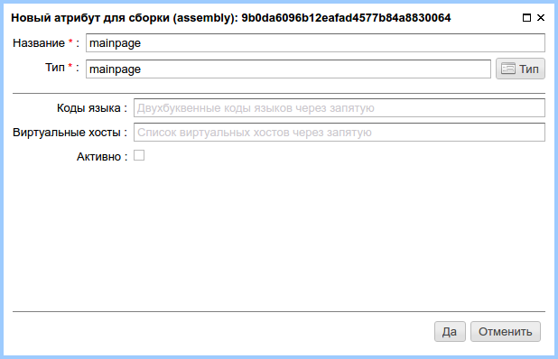

.. _am_mainpage:

Маркер главной страницы (mainpage)
==================================

Этот атрибут помечает страницу в ηCMS, как главную (домашнюю)
для заданного набора виртуальных хостов и языков.

.. note::

    Этот атрибут не наследуется и должен быть явно привязан к странице
    в интерфейсе редактора сборок.

Опции атрибута
--------------

    Опции маркера главной страницы

**Коды языка:** Список (через запятую) `двухбуквенных кодов языка <https://en.wikipedia.org/wiki/ISO_639-1>`_
браузера (useragent), для которых будет отображаться данная страница. Допускается символ **\***,
который обозначает любой язык.

**Виртуальные хосты:** Список виртуальных хостов (через запятую), для которых будет показана эта страница.
Допускается символ **\***, который обозначает любой виртуальный хост.

**robots.txt:** `Специальные инструкции для поисковых роботов <https://en.wikipedia.org/wiki/Robots_exclusion_standard>`_,
которые будут доступны в виде ресурса `robots.txt` в корневом каталоге сайта.

**Активно (checkbox):** Является ли данный атрибут активным. В этом случае правила для языков и
виртуальных хостов будут использоваться при обращении клиентов к ηCMS.

