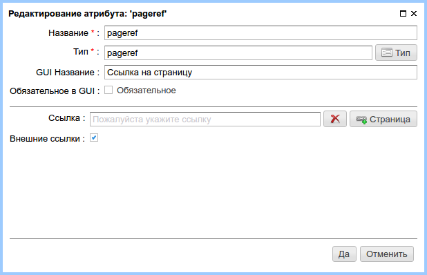
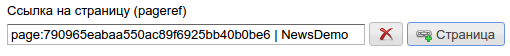

.. _am_pageref:

Ссылка на страницу (pageref)
============================

Опции атрибута
--------------

    Опции атрибута

=============================== =========
Опция                           Описание
=============================== =========
**Ссылка**                      Значение данного атрибута по умолчанию(ссылка)
**Внешние ссылки**              Переключатель, позволяющий задавать внешние ссылки.
                                В случае, если переключатель отключен, диалог редактирования
                                ссылки в разделе управления содержимым страницы позволяет задавать только
                                ссылки на страницы под управлением ηCMS.
=============================== =========

Режим редактирования
--------------------

.. figure:: img/pageref_img2.png

    Атрибут на панели редактирования страницы

При нажатии на кнопку выбора ссылки ηCMS
предлагает выбрать страницу для ссылки, название ссылки
или ввести внешнюю ссылку.

.. figure:: img/pageref_img3.png

    Диалог выбора ссылки

    Атрибут, инициализированный ссылкой.

Использование в разметке
------------------------

**Тип значения атрибута:** :ref:`com.softmotions.ncms.mhttl.RichRef`

Доступны следующие свойства `RichRef`:

=================   ========
Свойство            Описание
=================   ========
**link**            URL ссылки
**name**            Название ссылки
**toHtmlLink()**    Метод, генерирующий html ссылку
=================   ========

Генерация ссылки с помощью метода `toHtmlLink()`::

    #set(RichRef link = asm('pageref'))
    $!{link.toHtmlLink(['class':'active'])}

В этом примере создается `<a>` ссылка на выбранную страницу с
дополнительным атрибутом `class="active"`.

Альтернативный пример::

    #set(RichRef link = asm('pageref'))
    <a href="$!{link.link}" class="active">$!{link.name}</a>

Объекты класса `com.softmotions.ncms.mhttl.RichRef`
могут использоваться в шаблонах с HTTL методом: :js:func:`linkHtml`

Пример создания ссылки::

    $!{linkHtml(asm('pageref'), ['class':'active'])}

