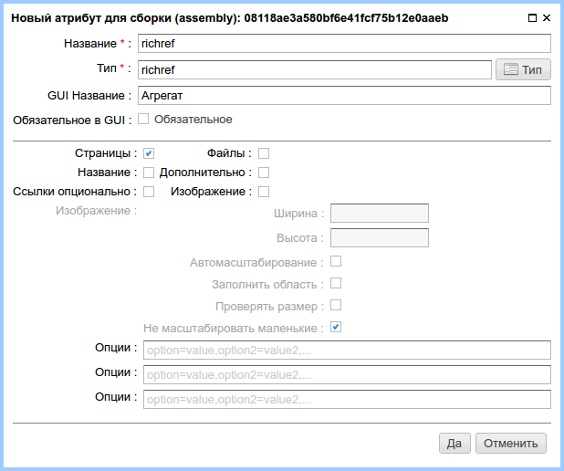

.. _am_richref:

Агрегат (richref)
=================

С помощью `агрегата` редактор сайта имеет возможность
вставлять в контекст страниц ссылки вместе с дополнительной
информацией, сопровождающей ссылку:
текстом, описанием, изображением, дополнительными стилями.

Опции атрибута
--------------

Перечислим основные опции этого атрибута слева направо и сверху вниз.

**Страницы (checkbox)** Позволяет вставлять ссылки как на внутренние nCMS страницы
так и на внешние веб ресурсы.

**Файлы (checkbox)** Опция предоставляет возможность вставлять ссылки на файлы, хранимые
в медиарепозитории nCMS.

**Название (checkbox)** Возможность задать дополнительный однострочный
текст вместе с ссылкой в том случае, если ссылка (вместе с названием) не быда задана.

**Дополнительно (checkbox)** Возможность задать дополнительный многострочный текст вместе с ссылкой.

**Ссылки опционально (checkbox)** Если эта опция включена, ссылка на ресурс будет необязательной.

**Изображение (checkbox)** Возможность использовать изображение. При включении данной опции становятся
доступны параметры отображения изображения. Опции полностью соответствуют опциям атрибута :ref:`am_image`

**Опции** три множества опций в виде пар: `ключ` => `значение`
опции задаются в свободной форме, в текстовом поле и в следующем формате::

    ключ=значение[,ключ=значение, ...]

В приведенном примере, заполнено первое множество опций::

    Синий текст=blue, Красный текст=red

Данные этих опции можно использовать при отображении ссылки. При этом `ключ` опции (синий текст, красный текст)
будет отображаться в GUI редактора страницы, а значение опции (blue, red) будут доступны в httl разметке.

Режим редактирования
--------------------

.. figure:: img/img2.png

    Агрегат в режиме редактирования страницы.

В режиме редактирования, опции агрегата отображаются в виде выпадающих списков выбора.

Использование в разметке
------------------------

В контексте httl разметки, значением данного атрибута
является объект типа `com.softmotions.ncms.mhttl.RichRef`
в котором содержатся все введенные редактором сайта данные атрибута.

В контексте приведенных данных атрибута отобразим
этот атрибут как ссылку в виде изображения
внутри блока который имеет заголовок и описание:

.. code-block:: html

    <html>
    <body>
      <h2>Richref demo</h2>

      #set(RichRef rr = asm('richref'))
      

        
${rr.name}

        <a href="$!{rr.link}">
          </img>
        </a>
        

          ${rr.description}
        

      

    </body>
    </html>

Что в веб браузере будет отображено как:

.. figure:: img/img3.png

