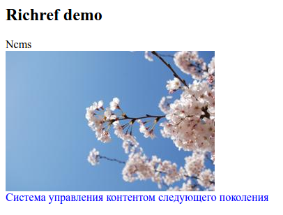

.. _am_richref:

Агрегат (richref)
=================

С помощью `агрегата` редактор сайта имеет возможность
вставлять в контекст страниц ссылки вместе с дополнительной
информацией, сопровождающей ссылку:
текстом, описанием, изображением, дополнительными стилями.

.. _am_richref_options:

Опции атрибута
--------------

.. figure:: img/richref_img1.png

Перечислим основные опции этого атрибута (слева направо и сверху вниз).

**Страницы (checkbox):** Позволяет вставлять ссылки как на внутренние ηCMS страницы,
так и на внешние веб ресурсы.

**Файлы (checkbox):** Опция предоставляет возможность вставлять ссылки на файлы, хранимые
в медиарепозитории ηCMS.

**Название (checkbox):** Возможность задать дополнительный однострочный
текст вместе со ссылкой в том случае, если ссылка (вместе с названием) не быда задана.

**Дополнительно (checkbox):** Возможность задать дополнительный многострочный текст вместе с ссылкой.

**Ссылки опционально (checkbox):** Если эта опция включена, ссылка на ресурс будет необязательной.

**Изображение (checkbox):** Возможность использовать изображение. При включении данной опции становятся
доступны параметры отображения изображения. Опции полностью соответствуют опциям атрибута :ref:`am_image`.

**Опции:** Три множества опций в виде пар: `ключ` => `значение`.
Опции задаются в свободной форме, в текстовом поле и в следующем формате::

    ключ=значение[,ключ=значение, ...]

В приведенном примере заполнено первое множество опций::

    Синий текст=blue, Красный текст=red

Данные этих опции можно использовать при отображении ссылки. При этом `ключ` опции (синий текст, красный текст)
будет отображаться в GUI редактора страницы, а значение опции (blue, red) будут доступны в httl разметке.

Режим редактирования
--------------------

.. figure:: img/richref_img2.png

    Агрегат в режиме редактирования страницы

В режиме редактирования опции агрегата отображаются в виде выпадающих списков выбора.

Использование в разметке
------------------------

В контексте httl разметки значением данного атрибута
является объект типа :ref:`com.softmotions.ncms.mhttl.RichRef`,
в котором содержатся все введенные редактором сайта данные
для этого атрибута.

Данные этого атрибута отобразим, как ссылку в виде изображения
внутри блока, который имеет заголовок и описание:

.. code-block:: html

    <html>
    <body>
      <h2>Richref demo</h2>

      #set(RichRef rr = asm('richref'))
      

        
${rr.name}

        <a href="$!{rr.link}">
          </img>
        </a>
        

          ${rr.description}
        

      

    </body>
    </html>

Что в веб браузере будет отображено как:

.. _com.softmotions.ncms.mhttl.RichRef:

com.softmotions.ncms.mhttl.RichRef
----------------------------------

Все атрибуты RichRef являются опциональными.

.. js:attribute:: Image RichRef.image

    Изображение :ref:`com.softmotions.ncms.mhttl.Image`, связанное с richref.

.. js:attribute:: String RichRef.description

   Дополнительный многострочный комментарий. См. опцию атрибута: **дополнительно (checkbox)**.

.. js:attribute:: String RichRef.link

    HTTP ссылка, заданная в данном атрибуте.

.. js:attribute:: String RichRef.name

    Строковое имя, заданное в ссылке или отдельным
    полем ``Название``, если включена опция **название (checkbox)**.

.. js:attribute:: String RichRef.style

    Значение стиля из первого множества опций, выбранного редактором сайта, если
    соответствующее множество опций было задано в опциях атрибута.

.. js:attribute:: String RichRef.style2

    Значение стиля из второго множества опций, выбранного редактором сайта, если
    соответствующее множество опций было задано в опциях атрибута.

.. js:attribute:: String RichRef.style3

    Значение стиля из третьего множества опций, выбранного редактором сайта, если
    соответствующее множество опций было задано в опциях атрибута.

.. js:function:: String RichRef.toHtmlLink(@Nullable Map<String, ?> amap)

    Этот метод генерирует код HTML ссылки `<a>` атрибута
    в том случае, если для `richref` задана ссылка (`link`).
    При этом, дополнительно можно указать список атрибутов,
    которые будут дабавлены в `<a>`, как например::

    $!{richref.toHtmlLink(['class':'active'])}

