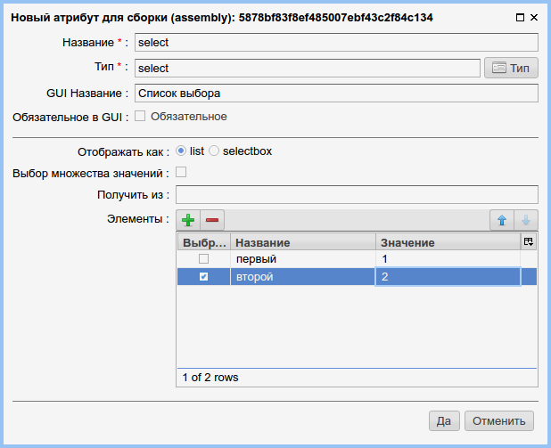

.. _am_selectbox:

Список выбора (select)
======================

Этот атрибут позволяет использовать списки выбора (selectbox)
в интерфейсе редактирования содержания страницы и отображать
данный списков на страницах сайта.

Опции атрибута
--------------

    Опции списка выбора

Отображать как
**************

* **list** -- в разделе редактирования контента атрибут будет представлен в виде раскрытого
    списка выбора, в котором можно выбрать сразу несколько  значений, одновременно нажав
    клавишу `Ctrl` и выбрав элементы указателем мыши.
* **selectbox** -- в разделе редактирования контента этот атрибут будет представлен
    в виде выпадающего списка, с возможностью выбрать один элемент.

Выбор множества значений
************************

Эта опция может быть включена при режиме отображения *list*
и позволяет выбрать одновременно несколько элементов списка.

Элементы
********

Таблица в которой могут быть заданы возможные элементы списка, где для каждого
элемента необходимо задать его название, которое будет отображено  и `значение` привязанное к
элементу знаение, которое может быть использовано в логике приложения.

Режим редактирования
--------------------

.. figure:: img/img2.png

    Список выбора с опцией `list`  в режиме редктирования страницы

Использование в разметке
------------------------

В контексте httl разметки, значениеем данного атрибута
является коллекция элементов типа `com.softmotions.ncms.mhttl.SelectNode`
где для каждого элемента определены следующие своства:

* **key** Название элемента (java.lang.String)
* **value** Значение, привязанное к элементу (java.lang.String)
* **selected** Является ли данный элемент выбранным (boolean)

**Пример**::

    <select>
    #foreach(SelectNode node in asm('select'))
        <option #if(node.selected) selected #end
                value="${node.value}">
                ${node.key}
        </option>
    #end
    </select>

