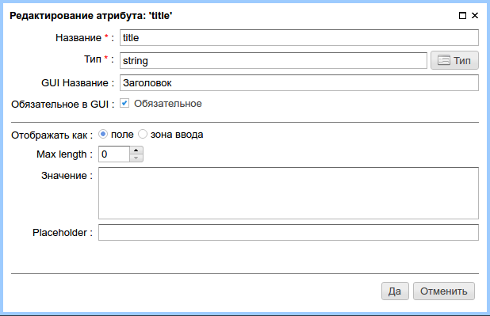

.. _am_string:

Строка (string)
===============

Строка это самый широко используемый тип атрибута.
Этот атрибут позволяет задать произвольные текстовые данные
и отобразить их в контексте страниц.

Опции атрибута
--------------

    Опиции строкового атрибута

Отображать как
**************

* **поле** -- в разделе редактирования контента атрибут будет представлен в виде однострочного поля ввода
* **зона ввода** -- атрибут будет отображен в зоне редактирования контента страницы как широкое, многострочное поле
  удобное для ввода объемного текста.

Макс. длина
***********

Максимальное количество символов, для значения атрибута. Ноль означает отсутствие данного ограничения.

Значение атрибута по умолчанию
******************************

Значение данного атрибута по умолчанию если иное значение не задано редактором
страницы.

Placeholder
***********

Placeholder в поле ввода атрибута зоне редактирования контента страницы, который поясняет
использование данного атрибута.

Использование в разметке
------------------------

В HTTL разметке значение атрибута имеет тип `java.lang.String`

Безопасный вывод значения атрибута в html::

    ${asm('название атрибута')} или ${'название атрибута'.asm}

Вывод значения атрибута, допускающего html  разметку::

    $!{asm('название атрибута')} или $!{'название атрибута'.asm}

