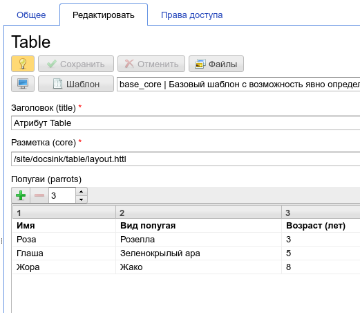
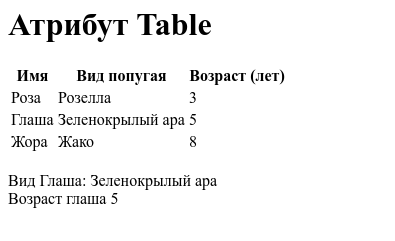

.. _am_table:

Таблица (table)
===============

Этот атрибут позволяет задать произвольные табличные данные
в контексте :term:`сборки <сборка>`.

    Пример таблицы в контексте интерфейса редактирования данных страницы

В контексте данного примера мы можем указать следующую разметку:

.. code-block:: html

    <html>
    <body>
    <h1>${asm('title')}</h1>

    $!{asm('parrots').asTable.toHtml()}

    #set(Table parrots = asm('parrots'))

     Вид Глаша: ${parrots.find('Глаша')}
     Возраст глаша ${parrots.find('Глаша', 2)}
    </body>
    </html>

И получаем:

В указанной разметке, выражение `$!{asm('parrots').asTable.toHtml()}` мы выводит таблицу в виде html.
Далее, с помошью `${parrots.find('Глаша')` мы выводим вторую колонку строки для которой значение первой
колонки равно переданному атрибуту `Глаша`

UI атрибута Table
-----------------

Панель инструментов таблицы:

============================  ============
          Элемент UI            Значение
============================  ============
.. image:: img/sample4.png       Добавляет новую строку в таблицу

.. image:: img/sample5.png       Удаляет выбранные строки

.. image:: img/sample6.png       Задает количество колонок в таблице
============================  ============

API com.softmotions.ncms.mhttl .Table
-------------------------------------

.. js:function:: String find(firstColVal, [String def])

    Поиск строки в таблице со значением
    первой колонки строки равным `firstColVal`.
    В случае если строка найдена будет возвращено
    значение **второй колонки** искомой строки.

    :param String def: Значение которое будет возвращено если строка не найдена, по умолчанию ``null``

.. js:function:: String find2(firstColVal, [String def])

    Поиск строки в таблице со значением
    первой колонки строки равным `firstColVal`.
    В случае если строка найдена будет возвращено
    значение **третьей колонки** искомой строки.

    :param String def: Значение которое будет возвращено если строка не найдена, по умолчанию ``null``

.. js:function:: String find2(firstColVal, [String def])

    Поиск строки в таблице со значением
    первой колонки строки равным `firstColVal`.
    В случае если строка найдена будет возвращено
    значение **четвертой колонки** искомой строки.

    :param String def: Значение которое будет возвращено если строка не найдена, по умолчанию ``null``

.. js:function:: String find(String firstColVal, [int colIndex], [String def])

    Поиск строки в таблице со значением
    первой колонки строки равным `firstColVal`.
    В случае если строка найдена будет возвращено
    значение колонки с индексом `colIndex` искомой строки.

    :param int firstColVal: Индекс колонки, значение которой будет возвращего. По умолчанию ``1``
                            (вторая колонка при индексации от ``0``)
    :param String def: Значение которое будет возвращено если строка не найдена, по умолчанию ``null``

.. js:function:: String toHtml([Map<String,?> params]):

    Возвращает текущую таблицу в виде `html` разметки.

    **Пример** таблица без заголовков и с css классом `wide`::

        ${asm('table').toHtml(['noHeader':true, 'tableAttrs': 'class="wide"'])}

    В опциональных параметрах настройки генерации html таблицы `params`
    могут содержаться следующие пары:

    * `noEscape => Boolean|String`  - не осуществлять html эскейпинг значений ячеек таблицы.
      По умолчанию `false`
    * `noHeader => Boolean|String` Не отображать в первую строку в качестве заголовка таблицы.
      По умолчанию `false`
    * `tableAttrs => String` Дополнительные атрибуты таблицы

    :param Map<String,?> params: Опциональные параметры настройки генерации html таблицы.

