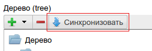

.. _am_tree:

Дерево (tree)
=============

Этот атрибут удобно использовать для создания иерархических
структур данных в веб сайте, например для создания меню.

Элементом дерева могут быть:

* Папка (каталог)
* :ref:`Ссылка на страницу nCMS <am_pageref>` или внешний ресурс
* :ref:`Ссылка на файл в медиарепозитории <am_fileref>`
* :ref:`Агрегат <am_richref>`

Опции атрибута
--------------

.. figure:: img/img1.png

**Страницы (checkbox)** Этот флаг позволять добавлять в дерево ссылки на страницы nCMS

**Файлы (checkbox)** Возможность добавлять в дерево ссылки на файлы, хранимые в медиарепозитории nCMS

**Внешние ссылки (checkbox)** Возможность указывать внешние ссылки (ссылки на другие веб ресурсы)

**Уровень вложенности (spinner)** Этот элемент задает максимальный уровень вложенности в дереве,
если уровень вложенности равен ``1`` то дерево будет представлено в виде плоского списка без какой-либо
вложенности.

**Агрегат (checkbox)** Позволяет в дерево добавлять элементы типа :ref:`richref <am_richref>`.
При клике на |IG| пользователь переходит в :ref:`опции настройки агрегата <am_richref_options>` для
элементов дерева.

.. |IG| image:: img/img2.png
    :align: bottom

Режим редактирования
--------------------

Ниже приведен пример структуры простого меню,
которое можно отобразить на странице.

.. figure:: img/img3.png

    Дерево в интерфейсе редактирования контента страницы

Синхронизация с tree атрибутом другой страницы
^^^^^^^^^^^^^^^^^^^^^^^^^^^^^^^^^^^^^^^^^^^^^^

Достаточно часто возникает необходимость иметь одно и тоже значение атрибута
на нескольких страницах одновременно.
Для этого можно воспользоваться режимом синхронизации значения атрибута страницы
с атрибутом того же типа и именем, но на другой странице.
Нажав на кнопку `Синхронизировать` nCMS предоставит возможность выбрать
страницу с которой будет осуществляться синхронизация.

.. note::

    Страница с которой осуществляется синхронизация значения
    атрибута, должна иметь атрибут типа `tree` с таким же именем.

После установления режима синхронизации, атрибут нельзя будет
редактировать и все изменения внесенные в атрибут страницы с которой
установлена синхронизация будут переноситься в этот атрибут.

Использование в разметке
------------------------

В контексте httl разметки, значением данного атрибута
является объект типа `com.softmotions.ncms.mhttl.Tree`
в котором содержатся все введенные редактором сайта данные
для этого атрибута.

