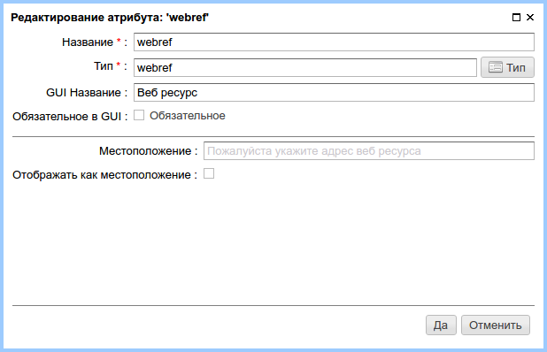
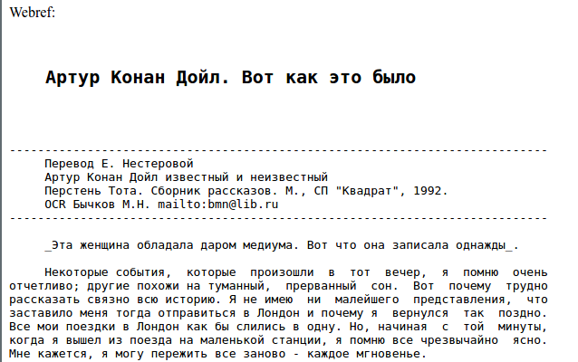

.. _am_webref:

Веб-ресурс (webref)
===================

Данный атрибут позволяет включать в страницу контент удаленного
ресурса по протоколам: `http`, `https`, `ftp`

    Опции атрибута

================================== =========
Опция                              Описание
================================== =========
**Местоположение**                 URL удаленного ресурса по умолчанию.
**Отображать как местоположение**  В случае если переключатель включен, значением атрибута
                                   будет адрес (URL) ресурса.
                                   В противном случае значением атрибута будет текстовое содержание ресурса.
================================== =========

Режим редактирования
--------------------

.. figure:: img/img2.png

    URL веб ресурса на панели редактирования страницы

В данном примере в качестве ресурса был указан
адрес страницы http://lib.ru/AKONANDOJL/doil1_5.txt

Использование в разметке
------------------------

**Тип значения атрибута:** `java.lang.String`

Включение текста ресурса в html страницу::

    Webref:

    $!{asm('webref')}

Используя упомянутый адрес ресурса в результате мы получаем:

Ограничения
-----------

* В |ncmsversion| максимальный размер загружаемого файла ограничен `1Mb`
* В целях безопасности отключена загрузка локальных файлов и элементов class path.
* При загрузке http ресурсов используется кэширование. Максимальный размер документов,
  которые могут быть сохранены в кэш: `128Kb`. Максимальное количество закешированных документов: `512`

