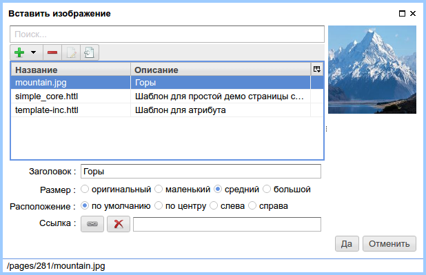
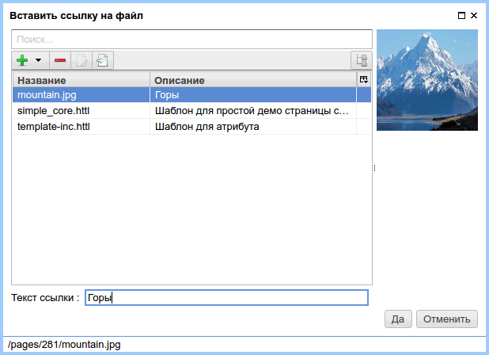

.. _am_wiki:

Wiki разметка (wiki)
====================

Rich контент в виде wiki разметки. Значением
атрибута является html код получаемый в результате
интерпретации wiki разметки. Обычно wiki разметка
является основным инструментом для создания контента
страниц.

.. note::

    Лучший способ вставлять в ваши страницы стилизованный контент (rich content) --
    использовать wiki разметку.

В |ncmsversion| поддерживаются следующие форматы
wiki разметки:

* `mediawiki <https://www.mediawiki.org/wiki/Help:Formatting/ru>`_

В ближайших версиях nCMS будет реализована поддержка `markdown <https://daringfireball.net/projects/markdown/syntax>`_

Опции атрибута
--------------

В |ncmsversion| в опциях атрибута возможно выбрать только `mediawiki <https://www.mediawiki.org/wiki/Help:Formatting/ru>`_
разметку.

Режим редактирования
--------------------

Интерфейс редактирования wiki разметки представлен текстовым
редактором разметки и элементами управления, которые облегчают
выполнение многих рутинных задач:

.. figure:: img/img1.png

    Интерфейс редактирования wiki разметки

Ниже описаны основные элементы управления wiki разметкой
при использовании языка разметки `mediawiki <https://www.mediawiki.org/wiki/Help:Formatting/ru>`_

Стилизация текста
*****************

.. image:: img/img2.png
.. image:: img/img3.png
.. image:: img/img4.png

Заголовки первого, второго и третьего уровня, аналогично
элементам `<h1>`, `<h2>`, `<h3>` в html.

.. image:: img/img5.png
    :align: left

Полужирный **текст**

.. image:: img/img6.png
    :align: left

Текст *курсивом*

Списки
******

.. image:: img/img7.png
    :align: left

Вставка ненумерованного списка

Mediawiki разметка ненумерованного списка::

    * Первый
    * Второй
    ** Первый у второго
    * Третий

.. image:: img/img8.png
    :align: left

Вставка нумерованного списка

Mediawiki разметка нумерованного списка::

    # Первый
    # Второй
    ## Первый у второго
    # Третий

Ссылки
******

.. image:: img/img9.png
    :align: left

**Ссылка на страницу nCMS:**

.. figure:: img/img18.png

    Диалог выбора страницы для ссылки.

В результате в теле mediawiki редактора появится ссылка на страницу::

    [[Page:2df428a0510a00127cf5de19acf88fdd|Extra attributes for page elements]]

Где `2df428a0510a00127cf5de19acf88fdd` это уникальный :term:`GUID страницы`.
А `Extra attributes for page elements` - текст ссылки.

.. image:: img/img10.png
    :align: left

**Изображение, ссылка**

    Вставка изображения/ссылки в виде изображения.

Параметры диалога вставки изображения
^^^^^^^^^^^^^^^^^^^^^^^^^^^^^^^^^^^^^

**Заголовок** -- подпись под изображением. Верстальщику сайта необходимо
корректно стилизовать html элементы составляющие изображение и подпись:

.. code-block:: html

    

    

        
        
Горы

    

    

Определить отображение следующих стилей:

Стили для изображения с подписью:

* ``div.thumb.tleft, div.thumb.tcenter, div.thumb.tright``
* ``.thumbinner``
* ``.thumbimage``
* ``.framecaption``

Стили для изображения без подписи:

* ``img.location-left, img.location-center, img.location-right``

**Размер изображения**

* **оригинальный** -- оригинальный размер изображения без масштабирования
* **маленький** -- ширина изображения ``100px``
* **средний** -- ширина изображения ``200px``
* **большой** -- ширина изображения ``300px``

.. note::

    При выборе размера изображения отличного от оригинального
    изображение масштабируется сохраняется на стороне сервера nCMS.

**Расположение изображения**

* **по умолчанию** -- в этом случае к изображению не применяются позиционирующие стили
* **по центру** -- изображение  по центру. При вставке изображения с подписью применяется стиль `thumb tcenter` для `div`
                контейнера, содержащего изображение и подпись. В случае отсутствия подписи к элементу
                изображения `img` применяется стиль `location-center`
* **слева** -- изображение слева. При вставке изображения с подписью применяется стиль `thumb tleft` для `div`
                контейнера, содержащего изображение и подпись. В случае отсутствия подписи к элементу
                изображения `img` применяется стиль `location-left`
* **справа** -- изображение справа. При вставке изображения с подписью применяется стиль `thumb tright` для `div`
                контейнера, содержащего изображение и подпись. В случае отсутствия подписи к элементу
                изображения `img` применяется стиль `location-right`

**Ссылка**

В случае, если это поле инициализировано, то при клике на изображение пользователь перейдет на выбранный
ресурс. В случае, если ссылка на изображение не определена, то при клике на изображение
пользователь перейдет на просмотр изображение с оригинальным размером.

.. image:: img/img11.png
    :align: left

**Файл, ссылка** -- вставка ссылки на файл, который можно открыть при нажатии на ссылку.

    Диалог выбора файла для ссылки

После выбора файла в wiki разметку вставится текст, как например::

    [[Media:/381/mountain.jpg|Горы]]

А на странице отобразится `<a>` html ссылка на файл

.. note::

    Файл на который ссылается страница нельзя будет удалить
    пока ссылка на него находится в wiki разметке

