.. _am_wiki:

Wiki разметка (wiki)
====================

Rich контент в виде wiki разметки. Значением
атрибута является html код, получаемый в результате
интерпретации wiki разметки. Обычно wiki разметка
является основным инструментом для создания контента
страниц.

.. note::

    Лучший способ вставлять в ваши страницы стилизованный контент (rich content) --
    использовать wiki разметку.

В |ncmsversion| поддерживаются следующие форматы
wiki разметки:

* `mediawiki <https://www.mediawiki.org/wiki/Help:Formatting/ru>`_
* `markdown <https://daringfireball.net/projects/markdown/syntax>`_

В ближайших версиях ηCMS будет реализована поддержка

Опции атрибута
--------------

В опциях атрибута вы можете выбрать тип разметки `mediawiki`
или `markdown`.

Режим редактирования
--------------------

Интерфейс редактирования wiki разметки представлен текстовым
редактором разметки и элементами управления, которые облегчают
выполнение многих рутинных задач:

.. figure:: img/wiki_img1.png

    Интерфейс редактирования wiki разметки

Ниже описаны основные элементы управления wiki разметкой
при использовании языка разметки `mediawiki <https://www.mediawiki.org/wiki/Help:Formatting/ru>`_

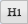
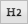
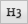

Заголовки первого, второго и третьего уровня, аналогично
элементам `<h1>`, `<h2>`, `<h3>` в html.

**Полужирный текст**

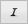

*Текст курсивом*

|

----

**Вставка ненумерованного списка**

Mediawiki разметка ненумерованного списка::

    * Первый
    * Второй
    ** Первый у второго
    * Третий

|

----

**Вставка нумерованного списка**

Mediawiki разметка нумерованного списка::

    # Первый
    # Второй
    ## Первый у второго
    # Третий

|

----

**Ссылка на страницу ηCMS:**

.. figure:: img/wiki_img18.png

    Диалог выбора страницы для ссылки.

В результате в теле mediawiki редактора появится ссылка на страницу::

    [[Page:2df428a0510a00127cf5de19acf88fdd|Extra attributes for page elements]]

Где `2df428a0510a00127cf5de19acf88fdd` это уникальный :term:`GUID страницы`.
А `Extra attributes for page elements` - текст ссылки.

|

----

.. image:: img/wiki_img10.png
    :align: left

**Изображение, ссылка**

.. figure:: img/wiki_img19.png

    Вставка изображения/ссылки в виде изображения.

**Параметры вставки изображения**

**Заголовок** -- подпись под изображением. Верстальщику сайта необходимо
корректно стилизовать html элементы, составляющие изображение и подпись:

.. code-block:: html

    

    

        
        
Горы

    

    

Определить отображение следующих стилей:

Стили для изображения с подписью:

* ``div.thumb.tleft, div.thumb.tcenter, div.thumb.tright``
* ``.thumbinner``
* ``.thumbimage``
* ``.framecaption``

Стили для изображения без подписи:

* ``img.location-left, img.location-center, img.location-right``

**Размер изображения**

* **оригинальный** -- оригинальный размер изображения без масштабирования
* **маленький** -- ширина изображения ``200px``
* **средний** -- ширина изображения ``400px``
* **большой** -- ширина изображения ``600px``

.. note::

    При выборе размера изображения, отличного от оригинального,
    изображение масштабируется и сохраняется на стороне сервера ηCMS.

**Расположение изображения**

* **по умолчанию** -- в этом случае к изображению не применяются позиционирующие стили.
* **по центру** -- изображение  по центру. При вставке изображения с подписью применяется стиль `thumb tcenter` для `div`
                контейнера, содержащего изображение и подпись. В случае отсутствия подписи к элементу
                изображения `img` применяется стиль `location-center`.
* **слева** -- изображение слева. При вставке изображения с подписью применяется стиль `thumb tleft` для `div`
                контейнера, содержащего изображение и подпись. В случае отсутствия подписи к элементу
                изображения `img` применяется стиль `location-left`.
* **справа** -- изображение справа. При вставке изображения с подписью применяется стиль `thumb tright` для `div`
                контейнера, содержащего изображение и подпись. В случае отсутствия подписи к элементу
                изображения `img` применяется стиль `location-right`.

**Ссылка**

В случае, если это поле инициализировано, то при клике на изображение пользователь перейдет на выбранный
ресурс. В случае, если ссылка на изображение не определена, то при клике на изображение
пользователь перейдет на его просмотр в оригинальном размере.

|

----

.. image:: img/wiki_img11.png
    :align: left

**Файл, ссылка** -- вставка ссылки на файл, который можно открыть при нажатии на ссылку.

.. figure:: img/wiki_img20.png

    Диалог выбора файла

После выбора файла в wiki разметку вставится спецификация ссылки на файл, например::

    [[Media:/381/mountain.jpg|Горы]]

А на странице отобразится `<a>` ссылка на файл

.. note::

    Файл, на который ссылается страница, нельзя будет удалить,
    пока ссылка на него находится в wiki разметке.

|

----

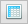

**Вставка таблицы**

.. figure:: img/wiki_img21.png

    Диалог заполнения таблицы

При нажатии на кнопку `Вставить таблицу`  в wiki редактор будет вставлена следующая разметка::

    {| class='wide'
    |-
    ! Имя
    ! Возраст
    |-
    | John
    | 25
    |-
    | Marta
    | 24
    |}

В данном примере эта таблица преобразуется в следующий HTML код:

.. code-block:: html

    

        

            <table class="wide">
                <tr>
                    <th>Имя</th>
                    <th>Возраст</th>
                </tr>
                <tr>
                    <td>John</td>
                    <td>25</td>
                </tr>
                <tr>
                    <td>Marta</td>
                    <td>24</td>
                </tr>
            </table>
        

    

|

----

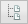

**Вставка дерева**  -- дизайн некоторых сайтов предполагает наличие иерархических, древовидных
элементов в контексте страниц.

.. figure:: img/wiki_img22.png

    Опции дерева

С текущими опциями мы получим следующую демонстрационную разметку:

.. code-block:: html

    <tree>
    - Корень
    -- Потомок 1
    --- Потомок уровня вложенности 3
    -- Потомок уровня вложенности 2
    </tree>

Которая преобразуется в HTML с иерархической структурой на базе списков (`<ul>`, `<li>`):

.. code-block:: html

    <ul class='tree'>
        <li class='open node'> Корень
            <ul>
                <li class='open node'> Потомок 1
                    <ul>
                        <li class='file'> Потомок уровня вложенности 3</li>
                    </ul>
                </li>
                <li class='file'> Потомок уровня вложенности 2</li>
            </ul>
        </li>
    </ul>

.. note::

    Для правильного отображения дерева в контексте сайта, дизайнер сайта должен
    стилизовать HTML код отображения дерева на основе `<ul class='tree'>` списков.

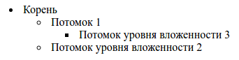

    Приведенное дерево без стилизации

|

----

.. image:: img/wiki_img14.png
    :align: left

**Вставка заметки** -- позволяет вставить на страницу контейнер для заметки/предупреждения.

Wiki разметка для предупреждения:

.. code-block:: html

    <note style="warning">Заметка</note>

HTML разметка предупреждения, которая может быть стилизована дизайнером сайта:

.. code-block:: html

    
Заметка

|

----

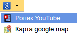

**Вставка ролика Youtube**

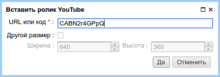

    Опции вставки ролика Youtube

Wiki разметка для вставки youtube ролика:

.. code-block:: html

    <youtube videoId="CABN2r4GPpQ"/>

В результате, в контексте страницы сайта мы получаем youtube ролик:

----

.. image:: img/wiki_img28.png
    :align: left

**Вставка карты Google Maps**

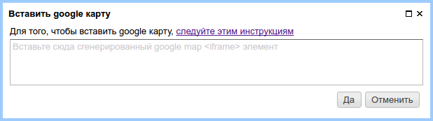

    Диалог подключения участка google карты.

Например, вставив в него скопированный из google maps `iframe`:

.. code-block:: html

    <iframe src="https://www.google.com/maps/embed?pb=!1m14!1m12!1m3!1d2296.7406541371915!2d83.05385026852065!3d54.85480466667143!2m3!1f0!2f0!3f0!3m2!1i1024!2i768!4f13.1!5e0!3m2!1sru!2sru!4v1474967528616"
             width="600"
             height="450"
             frameborder="0"
             style="border:0"
             allowfullscreen>
    </iframe>

Мы получим карту на странице:

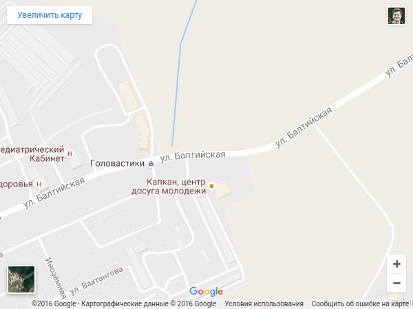

|

----

**Презентация SlideShare**

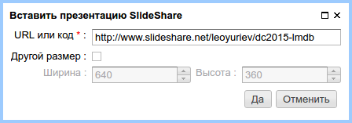

    Диалог подключения участка презентации SlideShare.

В данном примере введем в диалог интернет адрес презентации: http://www.slideshare.net/leoyuriev/dc2015-lmdb
и в результате при сохранении получим следующую wiki разметку:

.. code-block:: html

    <slideshare code="49593515"/>

А при отображении страницы получим встроенную презентацию:

.. image:: img/wiki_img32.png

|

----

**Видеоролик vimeo**

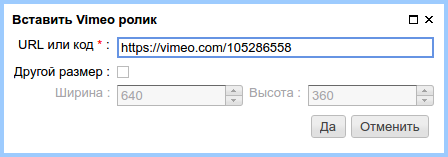

    Опции вставки ролика Vimeo

Wiki разметка для вставки vimeo ролика:

.. code-block:: html

    <vimeo code="105286558"/>

В результате, в контексте страницы сайта мы получаем vimeo ролик:

.. image:: img/wiki_img34.png
    :target: https://vimeo.com/105286558

