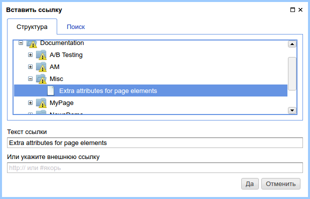

.. _am_wiki:

Wiki разметка (wiki)
====================

Rich контент в виде wiki разметки. Значением
атрибута является html код получаемый в результате
интерпретации wiki разметки. Обычно wiki разметка
является основным иструментом для создания контента
страниц.

.. note::

    Лучший способ вставлять в ваши страницы стилизованный контент (rich content) --
    использовать wiki разметку.

В |ncmsversion| воддерживаются следующие форматы
wiki разметки:

* `mediawiki <https://www.mediawiki.org/wiki/Help:Formatting/ru>`_

В ближайших версиях nCMS будет реализована поддержка `markdown <https://daringfireball.net/projects/markdown/syntax>`_

Опции атрибута
--------------

В |ncmsversion| в опциях атрибута возможно выбрать только `mediawiki <https://www.mediawiki.org/wiki/Help:Formatting/ru>`_
разметку.

Режим редактирования
--------------------

Интерфейс редактирования wiki разметки представлен текстовым
редактором разметки и элементами управления, которые облегчают
выполнение многих рутиных задач:

.. figure:: img/img1.png

    Интерфейс редактирования wiki разметки

Ниже описаны основные элементы управления wiki разметкой
при использовании языка разметки `mediawiki <https://www.mediawiki.org/wiki/Help:Formatting/ru>`_

Стилизация текста
*****************

.. image:: img/img2.png
.. image:: img/img3.png
.. image:: img/img4.png

Заголовки первого, второго и третьего уровня, аналогично
элементам `<h1>`, `<h2>`, `<h3>` в html.

.. image:: img/img5.png
    :align: left

Полужирный **текст**

.. image:: img/img6.png
    :align: left

Текст *курсивом*

Списки
******

.. image:: img/img7.png
    :align: left

Вставка ненумерованного списка

Mediawiki разметка ненумерованного списка::

    * Первый
    * Второй
    ** Первый у второго
    * Третий

.. image:: img/img8.png
    :align: left

Вставка нумерованного списка

Mediawiki разметка нумерованного списка::

    # Первый
    # Второй
    ## Первый у второго
    # Третий

Ссылки
******

.. image:: img/img9.png
    :align: left

Ссылка на страницу nCMS:

    Диалог выбора страницы для ссылки.

В результате в теле mediawiki редактора появится ссылка на страницу::

    [[Page:2df428a0510a00127cf5de19acf88fdd|Extra attributes for page elements]]

Где `2df428a0510a00127cf5de19acf88fdd` это уникальный :term:`GUID страницы`.
А `Extra attributes for page elements` - текст ссылки.

