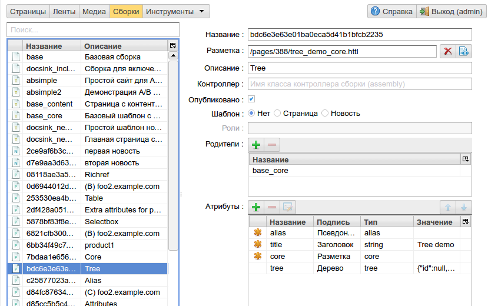
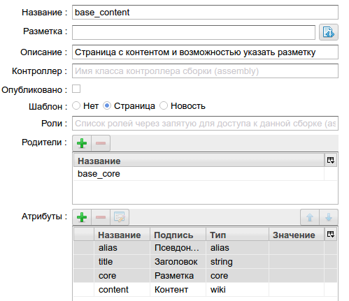

.. _amgr:

Управление сборками
===================

В этом интерфейсе администратор может задать структуру :term:`сборок <сборка>` (страниц) nCMS,
определить типы возможных страниц, и напрямую редактировать :term:`атрибуты <атрибут>`
любой сборки. С этого интерфейса начинается создание концепции и логической
структуры будущих страниц сайта.

Доступ к данному интерфейсу имеют пользователи с правами доступа
`admin` или `admin.asm`

    Общий вид интерфейса управления сборками

Форма поиска
------------

В форме поиска слева можно выбрать:

* :term:`сборку <сборка>` с атрибутами
* :term:`шаблон` страницы сайта или новости
* :term:`экземпляр страницы <страница>`

Иконка напротив каждого элемента в списке сборок обозначает тип сборки:

.. image:: img/amgr_other.png
    :align: left

Простая сборка с атрибутами, которая не является :term:`шаблоном <шаблон>` или экземпляром страницы.
Сборки данного типа могут присутствовать в иерархии наследования сборок,
предоставляя наследниками свои атрибуты.

.. image:: img/amgr_template.png
    :align: left

Именованный :term:`шаблон <шаблон>` для страниц сайта,
на основе которого создаются типовые страницы.

.. image:: img/amgr_page.png
    :align: left

Экземпляр страницы который является сборкой с уникальным
именем в :term:`GUID формате <GUID страницы>`, и для которого
определена :term:`разметка <ядро>`

.. image:: img/amgr_news.png
    :align: left

Экземпляр :ref:`ленты событий (новости) <news>`

Управление сборкой
------------------

    Шаблон страницы и именем: "Страница с контентом и возможностью указать разметку"

**Название** -- название сборки. Для экземпляров страниц это :term:`уникальный GUID <GUID страницы>`

**Разметка** -- :ref:`HTTL <httl>`  файл разметки страницы

**Описание** -- Краткое описание сборки. Значение данного поля отображается
в форме поиска страниц. А также используется при выборе :term:`шаблона <шаблон>` для страниц.

**Контроллер** -- Опциональное имя java класса, который реализует интерфейс `com.softmotions.ncms.asm.render.AsmController`
и вызывается при отображении страницы сайта. Контроллер может совершить
дополнительные действия при отображении страницы или изменть HTTP ответ.
Дополнительно смотрите раздел: :ref:`расширение nCMS <extending>`.

**Опубликовано** -- Флаг публикации страницы. В случае если он включен,
страница будет отображена клиентам сайта, если для страницы флаг снят,
nCMS ответит 404 HTTP кодом.

**Шаблон** -- режим работы сборки в режиме шаблона. Если выбрана `Страница`
и для сборки определена :term:`разметка <ядро>` то эта сборка будет
шаблоном для типовых страниц сайта. А именем шаблона: значение поля `Описание`.
Опция `Новость` определяет эту страницу как шаблона для элементов ленты
новостей.

**Роли** -- список ролей прав доступа через запятую. Наличие одной из ролей у
пользователя необходимо для создания страницы на основе данной сборки.
Сборка в этом случае должна быть в режиме шаблона (**Шаблон**). Если
данный список пуст, любой пользователь сможет создать страницу на основе
этой сборки.

**Родители** -- родительские сборки для этой сборки. Позволяет текущей сборке
наследовать атрибуты родительских сборок. По аналогии с множественным наследованием
классов в ООП.

**Атрибуты** -- доступные атрибуты в сборке, включая собственные атрибуты и
наследуемые атрибуты.

TODO
