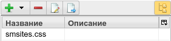
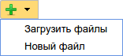
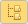

.. _mmgr:

Управление файлами в ηCMS (медиа репозиторий)
=============================================

.. figure:: img/mmgr_img1.png

    Общий вид интерфейса управления медиа файлами ηCMS

Слева пользователь может выбрать текущий каталог в медиарепозитории.
В центре - список файлов в выбранном каталоге и его подкаталогах (в зависимости от
текущих опций просмотра). Справа - информация о файле, основные свойства файла
и интерфейс редактирования для текстовых файлов или панель просмотра файла, как
изображения. Доступ к этому интерфейсу имеют все зарегистрированные пользователи
системы.

Обозначения для каталогов медиарепозитория
------------------------------------------

.. image:: img/mmgr_img2.png
    :align: left

Каталог является *системным* и служит для хостинга статических ресурсов веб сайтов.

.. image:: img/mmgr_img3.png
    :align: left

Каталог является *пользовательским*

Любой файл или каталог может быть изменен владельцем или
пользователем, обладающим административными правами.

Доступ к файлам медиарепозитория
--------------------------------

* Все файлы, которые находятся в каталогах `/page` и `/site` медиарепозитория ηCMS (опция конфигурации :ref:`asm/site-files-root <conf>`),
  доступны внешним пользователям по HTTP протоколу, если в правилах shiro конфигурации сервера ηCMS (`shiro.ini`) не указаны
  дополнительные ограничения.
* Зарегистрированный в ηCMS пользователь может изменить содержимое файла или удалить его, когда выполняется
  как минимум одно из следующих условий:

  * Пользователь является владельцем файла (пользователь создал этот файл)
  * Пользователь обладает правами администратора (роль `admin`)

Операции над файлами и опции поиска и отображения
-------------------------------------------------

    Список файлов в выбраном каталоге

Двойной клик по имени файла или его описанию позволяет переименовать
файл или изменить описание.

|

Кнопка создания нового пустого файла `Новый файл`. Пустой файл можно создать
комбинацией клавиш `Alt+Enter`. `Загрузить файлы` позволяет выбрать локальные
файлы на диске и отправить их в текущий каталог ηCMS. Файлы можно
добавить в репозиторий, перетащив их с рабочего стола в список файлов.

.. image:: img/mmgr_img6.png
    :align: left

Удаление выбранного файла в списке. Файл также можно удалить клавишей `Delete`.

.. note::

    ηCMS позволит удалить только те файлы, на которые отсутвуют ссылки со
    страниц сайта.

Запуск окна редактора для текстовых файлов. Запустить редактор на выбранном
файле можно с помошью клавишы `F4`.

Перенести выбранные файлы в другую папку.

Переключатель сквозного режима просмотра файлов в каталоге. В том
случае, если этот режим включен, в списке файлов будут отображены
файлы в текущем каталоге и во всех дочерних подкаталогах этого каталога.

При отключеном режиме сквозного просмотра будут отображены только файлы,
находящиеся в этом каталоге.

.. _mmgr_hotkeys:

Горячие клавиши (hot keys)
--------------------------

Активный элемент UI - это текущий, имеющий фокус элемент.

========================== ==================== ========================================
 Активный элемент UI        Комбинация клавиш               Действие
========================== ==================== ========================================
Дерево папок                `Delete`             Удалить каталог
Дерево папок                `F2`                 Переименовать каталог
Дерево папок                `F6`                 Перенести каталог в другой каталог
Дерево папок                `Alt+Insert`         Создать новый каталог в текущем выбранном каталоге
Список файлов               `Alt+Insert`         Создать пустой текстовый файл
Список файлов               `Delete`             Удалить выбранный файл/файлы
Список файлов               `F2`                 Переименовать выбранный файл или сменить его описание
Список файлов               `F4`                 Редактировать выбранный файл
Список файлов               `F6`                 Перенести выбранный файл/файлы в другой каталог
========================== ==================== ========================================

