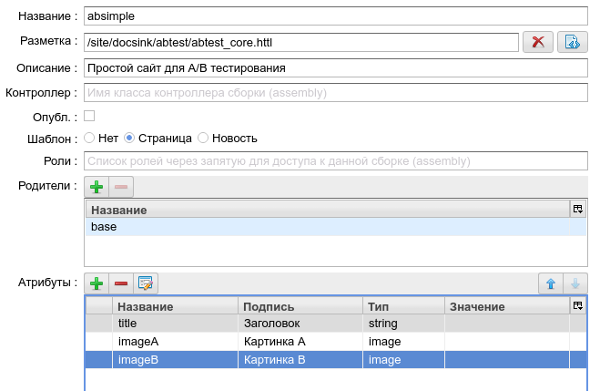
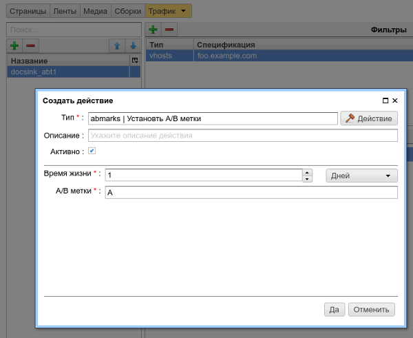

.. _abt_sample1:

Пример A/B тестирования
=======================

В данном примере будет продемонстрировано создание
простейшего веб сайта и применение `A/B` тестирования
к пользователям сайта.

С вероятностью 50% на 50% cайт показывает пользователям две картинки: `акула` и `дельфины`.
Выбор режима показа для пользователя происходит при первом обращении к сайту
и сохраняется 1 день. По истечении этого срока для пользователя произойдет повторный
выбор режима показа сайта. Веб-сайт находится в виртуальном домене: `foo.example.com`.

Пример страницы сайта в режиме `A`:

.. figure:: img/screen10.png
    :align: center

    Страница веб сайта в режиме `A`

Итак, в интерфейсе медиарепозитория создадим файл `abtest_core.htt`
главной страницы сайта:

.. code-block:: html

    <html>
    <body>
      <h1>${'title'.asm}</h1>

      #if(abt('A'))
      </img>
      #end

      #if(abt('B'))
      </img>
      #end
    </body>
    </html>

.. figure:: img/screen4.png
    :align: center

    Файл `abtest_core.htt` в интерфейсе медиарепозитория

В разметке в текст `html` включаются три :term:`атрибута <атрибут>` сборки: `title`, `imageA`, `imageB`,
при этом используется функция `abt` для определения текущего режима отображение страницы.
В данном простом примере в режиме `A` где (``abt('A') == true``) отображаем картинку `imageA`,
и, соответственно, `imageB` для режима `B`

Далее создаем шаблон страницы (сборку) для данной разметки с именем `absimple`
и определяем атрибуты сборки, как показано на снимке экрана ниже:

    Создание шаблона страницы

Создаем страницу на базе шаблона и загружаем
соответствующие картинки в репозиторий страницы:

.. figure:: img/screen3.png
    :align: center

    Создание экземпляра страницы

Выбираем созданную страницу в интерфейсе управления сборками
и добавляем атрибут `mainpage`, инструктирующий ηCMS о том, что
эта страница будет главной для домена `foo.example.com`:

.. figure:: img/screen12.png
   :align: center

   Определение главной страницы для домена `foo.example.com`

На этом этапе создание сайта закончено. Если открыть сайт из предпросмотра
в админ зоне, мы увидим одновременно дельфинов и акулу, поскольку
в режиме предпросмотра администратора активированы все `A/B` варианты.
Если этот сайт опубликовать, то картинки не будут отображены, поскольку для
публичных пользователей не включены правила выбора `A/B` вариантов.
Этим мы и займемся в следующих шагах примера.

.. figure:: img/screen5.png
    :align: center

    Предварительный просмотр сайта из админ-зоны, все правила включены

Далее, в `MTT` консоли определим трафик-правило для включения `A/B` режимов
для главной страницы `foo.example.com`. Назовем правило `docsing_abt1`
и укажем, что действия правила будут применены только для доменного имени `foo.example.com`,
как показано на скриншоте ниже:

.. figure:: img/screen6.png
    :align: center

    Активация правила только для `foo.example.com`

Осталось определить параметры включения `A/B` режимов.
Для этого добавим в действия правила `Вероятностную группу`, в
которой с вероятностью 50/50 будут активироваться различные `A/B` режимы:

.. figure:: img/screen8.png
    :align: center

    Конфигурация вероятностей включения `A/B` режимов

Ниже представлен экран редактирования `A/B` режима `A`:

    Экран редактирования `A/B` режима

Стоит отметить, что в поле `A/B метки` могут быть перечислены через запятую произвольные режимы,
которые будут включены, например, `A,B,C,...` либо `Mode1,Mode2,...`. ηCMS не накладывает ограничения
на количество вариантов `A/B` тестирования и на имена этих вариантов. Конечно, они должны быть
согласованы с httl кодом шаблонов веб сайтов.

В итоге мы получили сайт с простым `A/B` тестированием на уровне контента:

.. figure:: img/screen11.png
    :align: center

    Сайт в режиме `B` для внешнего пользователя

