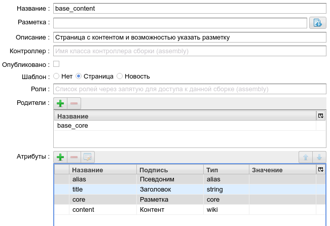
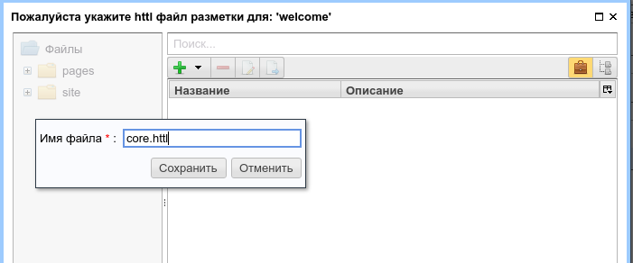

.. _tracking_pixels:

Пример использования трекинг пикселей
=====================================

.. contents::

Основные возможности системы управления трекинг пикселями
---------------------------------------------------------

* Поддержка большого множества источников ТП (Трекинг Пикселей).
* Информация о ТП сохраняется в `cookies`  клиента с длительным временем жизни.
* Возможность использовать в качестве ТП как ссылок на скрытые изображения, так и сниплетов JS кода.

Демонстрационный пример
-----------------------

Проиллюстрируем возможности трекинг пикселей на простом примере сайта
и взаимодействия его с абстрактным рекламным сервисом ``globalboard``:

Для этого создадим две страницы условного сайта, предлагающего некоторые
продукты. Первая ``welcome`` страница является главной страницей сайта
и содержит ссылку на страницу ``product1`` с описанием некоторого продукта.

Пусть продукты, предлагаемые данным сайтом, рекламируются на некотором условном сервисе
объявлений ``globalboard``. В ходе рекламной компании зарегистрированные в ``globalboard`` клиенты
могут попасть на главную страницу сайта и, с некоторой вероятностью,
заинтересованные клиенты могут перейти на страницу ``product1``,
что для владельца сайта и сервиса ``globalboard`` является успешной `конверсией`
- подтверждением успешности рекламной пересылки на наш сайт. Владельцы ``globalboard``
желают знать о таких конверсиях, в том числе, для какого пользователя она произошла.

Описанное выше взаимодействие можно реализовать с помощью трекинг пикселей (ТП).
С технической стороны при посещении нашего сайта происходят следующие действия:

1. ``globalboard`` перенаправляет клиента на ``welcome`` страницу нашего сайта по
   следующему адресу: ``http://mysite.com/welcome?utm_source=global_board&client_id=1332``.
2. Если клиент перешел с параметром запроса ``utm_source=global_board``, наш сайт
   запоминает эту информацию, в том числе, ``client_id=1332``.
3. Открытие страницы ``product1`` является признаком успешной конверсии.
4. Если клиент пришел из ``globalboard`` и перешел на страницу ``product1``,
   создается скрытая ссылка на картинку с адресом ``http://globalboard.com/feedback?user_id=1332``,
   информирующая ``globalboard``  о данном событии.
5. Поскольку событие наступило, соответствующий этому событию и сохраненный на нашем сайте трекинг пиксель
   удаляется, и повторные обращения этого клиента к странице ``product1`` не приведут к появлению
   событий о конверсии.

Давайте по шагам смоделируем эту ситуацию на ηCMS.

Создаем страницу welcome
************************

Если ранее этого не было сделано, то в интерфейсе `Сборки` создаем :term:`новый шаблон <сборка>` с именем `base_content`
для страниц, у которых в интерфейсе редактирования контента можно явно
задать :term:`псевдоним страницы`, :term:`разметку <ядро>` и основной контент
в формате :term:`mediawiki`:

    Конфигурация базового типа страниц  `base_content`  в итерфейсе `Сборки`

Далее в интерфейсе редактирования содержимого страниц (`Страницы`)
создаем страницу ``welcome`` на базе сбоки `base_content`.

Нажимаем кнопку `Файл` и в контексте данной страницы создаем :term:`HTTL` разметку:

.. figure:: img/tp_img4.png
    :align: center

Создаем файл `core.httl` в приватной зоне страницы:

Запускаем редактор `core.httl`:    

.. figure:: img/tp_img6.png
    :align: center

Разметка для `core.httl`  для ``welcome`` страницы выглядит следующим образом:  

.. figure:: img/tp_img8.png
    :align: center

    

Создаем страницу product1
*************************

Аналогичным образом создаем страницу ``product1`` со
следующей разметкой:

.. figure:: img/tp_img7.png
    :align: center

    Разметка для `core.httl`  для ``product1`` страницы

В `core.httl`  для ``product1`` можно заметить вызов HTTL функции::

    $!{trackingPixels('board1')}

Вызов `trackingPixels` включает генерацию трекинг пикселов в виде ссылок на изображения или JS
скриптов для сервиса `board1`, который мы определим ниже. Заметим, что в качестве аргумента для `trackingPixels`
можно передавать :term:`glob шаблон` для подключаемых сервисов, а также дополнительные
параметры генерации ТП ссылок. Например, для включения ТП ссылок всех
известных сервисов можно использовать::

      $!{trackingPixels('*')} или просто $!{trackingPixels()}

Для вставки дополнительной информации в адрес ТП ссылки используем следующую форму::

     $!{trackingPixels('board1', ['action':'show'])}

     Тогда для шаблона ссылки содержащего {action} placeholder
     будет подставлено значение show:

     Шаблон:    http://globalboard.com/feedback?user_id={user_id}&action={action}
     Результат: http://globalboard.com/feedback?user_id=1332&action=show

Связываем welcome и product1
****************************

Другими словами, определяем в :term:`mediawiki` разметке
страницы ``welcome`` ссылку на страницу  ``product1``.

.. figure:: img/tp_img9.png
    :align: center

    В ``welcome`` создаем ссылку на ``product1``

.. figure:: img/tp_img10.png
    :align: center

    В ``welcome`` создаем ссылку на ``product1``

.. figure:: img/tp_img11.png
    :align: center

    Страница ``welcome`` со ссылкой на ``product1``

Включаем отслеживание трекинг пикселей для всех страниц сайта
*************************************************************

Переходим в рабочую зону `Трафик` и создаем новое правило с именем `all`
для всех страниц сайта.

.. note::

     Отслеживание трекинг пикселей занимает некоторые ресурсы процессора сервера
     во время показа страниц сайта. Дополнительная нагрузка очень небольшая,
     но она есть. Поэтому для включения трекинг пикселей в интерфейсе `Трафик` необходимо
     создать правило для страниц или разделов сайта, где действительно
     необходима функциональность трекинг пикселей.

	 
Выбираем из набора действий действие с именем `Отслеживать источники трафика`
и отмечаем галку `Активировать трекинг пиксели`:

.. figure:: img/tp_img13.png
    :align: center

В результате имеем следующий вид конфигурации правила `all` для всех публичных страниц сайта:    

.. figure:: img/tp_img14.png
    :align: center

Определяем конфигурацию трекинг пикселей для сервиса globalboard
****************************************************************

Переходим в раздел `Трекинг пиксели`:

.. figure:: img/tp_img15.png
    :align: center

Добавляем новый трекинг пиксел `board1` со следующими своствами:

.. figure:: img/tp_img16.png
    :align: center

    Конфигурация трекинг пикселя `board1`

*  `utm_source=global_board` -- это шаблон параметров запроса, на основе
   которого определяется источник перехода клиента. Он может содержать
   несколько параметров и :term:`glob` шаблоны значений параметров.
   Например::

    utm_source={abc\,def},foo=bar

   означает, что для запросов с `utm_source=abc` или `utm_source=def` и
   значением параметра `foo=bar` трекинг пиксель будет сохранен и
   может быть в дальнейшем использован. В перечислении возможных
   вариантов параметра в фигурных скобках необходимо экранировать
   запятую с помошью обратного слеша `\\`.

* В поле `Сохраняемые параметры` указываются дополнительные
  GET параметры запроса, которые будут сохранены и в дальнейшем
  использованы для генерации URL пикселя или скрипта. Типичный
  пример использования это идентификатор клиента, в сервисе для
  которого определен трекинг пиксель.

* `Шаблон URL для трекинг пикселя` определяет формат адреса пикселя
  и сохраненные параметры запроса (`Сохраняемые параметры`),
  которые будут включены в адрес пикселя.
  В этот шаблон могут быть включены дополнительные параметры,
  переданные в HTTL метод: `$!{trackingPixels(...)}`.

Тестирование работы трекинг пикселей
************************************

Все готово для того, чтобы трекинг пиксели для ``globalboard`` заработали.

Для этого перейдем на страницу ``welcome`` с дополнительными GET параметрами,
эмулирующими обращение из сервиса ``globalboard``.

Следующие параметры определены:

* utm_source=global_board
* user_id=1332

.. figure:: img/tp_img18.png
    :align: center

    Переход на ``welcome`` из ``globalboard``

При нажатии на ссылку `product1` пользователь переходит на
страницу с описанием продукта, в контексте которой генерируются
скрытые URL трекинг пикселя, оповещающие сервис ``globalboard``
о конверсии:

.. code-block:: html

    <html>
      <body>
        <h1>Page for product 1</h1>
        <!-- product descripton here -->
        
      </body>
    </html>
