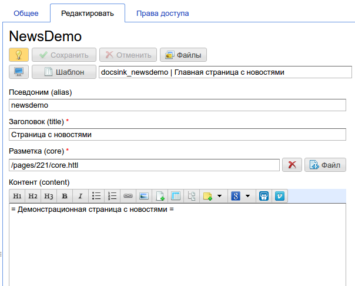
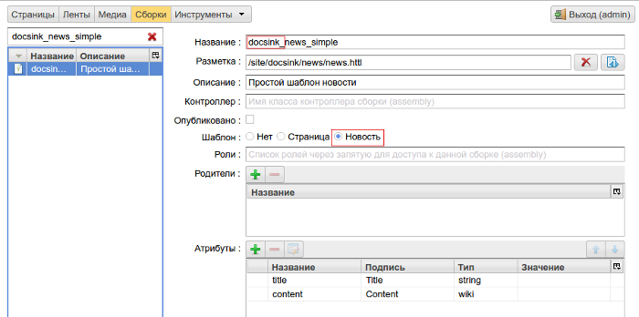
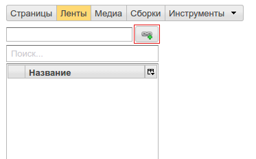
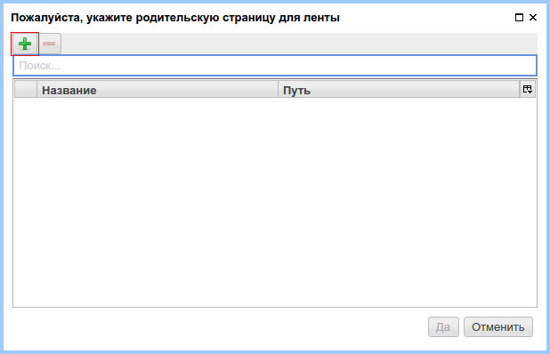
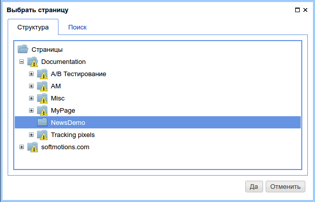
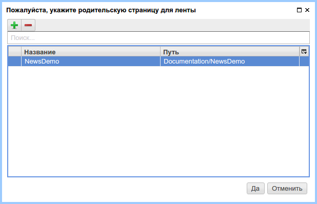
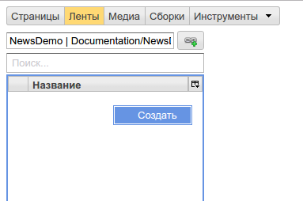
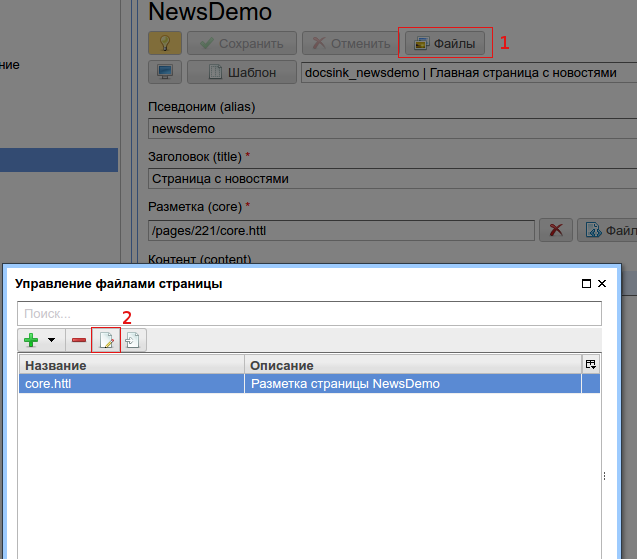
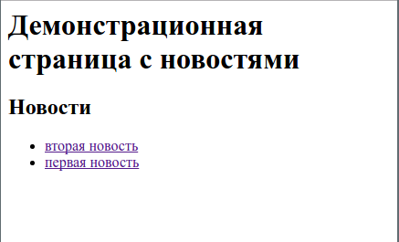

.. _news:

Управление лентами событий (новостями)
======================================

Страницы сайта, созданные на базе некоторого :term:`шаблона <шаблон>`,
могут иметь одну или несколько лент событий; будем называть их **базовыми страницами**.
Лента событий -- это множество страниц заданного типа, связанные с `базовой страницей`.

.. note::

    Под лентой событий можно рассматривать новостную ленту сайта (раздела),
    блог посты, список продуктов торгового сайта и т.п. Разные страницы сайта
    могут иметь независимые друг от друга ленты событий, которые могут быть
    отображены в контексте этих страниц.

Пример новостной ленты для базовой страницы сайта
-------------------------------------------------

На этом простом примере мы продемонстрируем добавление новостной
ленты на некоторую страницу сайта и процесс создания новостей.

Следующие шаги необходимо пройти для реализации новостной ленты:

1. Создание базовой страницы, с которой мы в дальнейшем свяжем новостную ленту.
2. Создание :term:`шаблонов <шаблон>` для страниц ленты событий (новостей).
3. Создание экземпляров страниц ленты событий в контексте базовой страницы (на основе созданных шаблонов).

Создание базовой страницы
*************************

Создадим :term:`шаблон <шаблон>` с именем `docsink_newsdemo` для всех
экземпляров базовых страниц с одинаковой структурой, соответствующей этому шаблону.

.. figure:: img/news_img2.png

    Создание шаблона для базовой страницы

Как мы видим на данном примере, наш шаблон наследуется от сборки `base_content`,
в котором определена возможность задать следующие :term:`атрибуты <атрибут>`:

* `alias` - Псевдоним страницы -- альтернативный адрес, по которому будет доступна страница.
* `core` - Разметка страницы, которую можно явно задать в интерфейсе редактирования
  содержания страницы.
* `title` - Заголовок страницы.
* `content` - Основной контент страницы, который задается mediawiki разметкой.

Назовем базовую страницу именем `NewsDemo` и заполним все требуемые атрибуты:

    Интерфейс редактирования содержания базовой страницы

Файл `core.httl` является разметкой для базовой страницы и на этом шаге
содержит следующий httl код:

.. code-block:: html

    <html>
    <head>
      <title>${'title'.asm}</title>
    </head>
    <body>
      $!{'content'.asm}
    </body>
    </html>

Создание шаблона для элементов ленты событий
********************************************

Новостная страница является полноценной страницей сайта, и
для нее должен быть определен шаблон. Шаблоны новостных страниц
определяются стандартным способом, как и для любых других страниц сайта.
**Но с одним ограничением:** название шаблона новостной страницы должно
начинаться с имени шаблона базовой страницы до первого знака подчеркивания `\_` (если он присутствует в имени шаблона базовой страницы).
Как показано на скриншоте ниже, название шаблона новостных страниц: `docksink_news_simple`.
В то же время, название шаблона  базовой страницы: `docsink_newsdemo`.
У имен этих двух шаблонов общий префикс: `docsink_`, который позволяет
ηCMS связать новостные страницы с базовой страницей. Дополнительно
для шаблона новостной страницы должен быть проставлен пункт `Шаблон`
в значение `Новость`.

    Шаблон новостной страницы для `docksink_newsdemo`

Создание эклемпляров страниц ленты событий
******************************************

В разделе `Ленты` необходимо указать базовую страницу,
для которой в дальнейшем сделаем ленту событий (список новостей).

    Выбор базовой страницы для ленты

После нажатия кнопки выбора базовой страницы для ленты откроется
диалог для последних базовых страниц, с лентами которых работал
текущий пользователь. Сейчас этот список пуст:

 Последние базовые страницы, с которыми работал пользователь

Нажимаем на `+` и выбираем базовую страницу `NewsDemo`:

    Внесение `NewDemo` в список базовых страниц, нажимаем `Да`

    Текущий список базовых страниц пользователя

Создание новости для выбранной базовой страницы
***********************************************

Правой кнопкой мыши активируем контекстное меню и нажимаем `Создать`, как показано на
скриншоте ниже:

Заполняем название новости

.. image:: img/news_img10.png

Выбираем новость и устанавливаем шаблон для новостной страницы:

.. image:: img/news_img11.png

.. image:: img/news_img12.png

Далее заполняем содержимое новости и проставляем статус публикации:

.. image:: img/news_img13.png

Модификация базовой страницы для отображения списка новостей
************************************************************

Перейдем в раздел редактирования контента базовой страницы
и модифицируем разметку страницы для вывода списка связанных новостей:

В появившимся окне редактирования модифицируем
разметку для вывода списка новостей.

Получение списка новостей::

    #foreach(Asm n in asmNavChilds("news.page"))

Генерация ссылки на новость::

    <li><a href="$!{n.link}">${n.hname}</a></li>

.. code-block:: html

    <html>
    <head>
      <title>${'title'.asm}</title>
    </head>
    <body>

      $!{'content'.asm}

      <h2>Новости</h2>
      <ul>
      #foreach(Asm n in asmNavChilds("news.page"))
        <li><a href="$!{n.link}">${n.hname}</a></li>
      #end
      </ul>
    </body>
    </html>

В результате получаем страницу с новостями:

