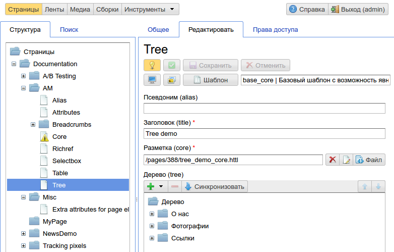
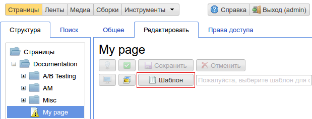
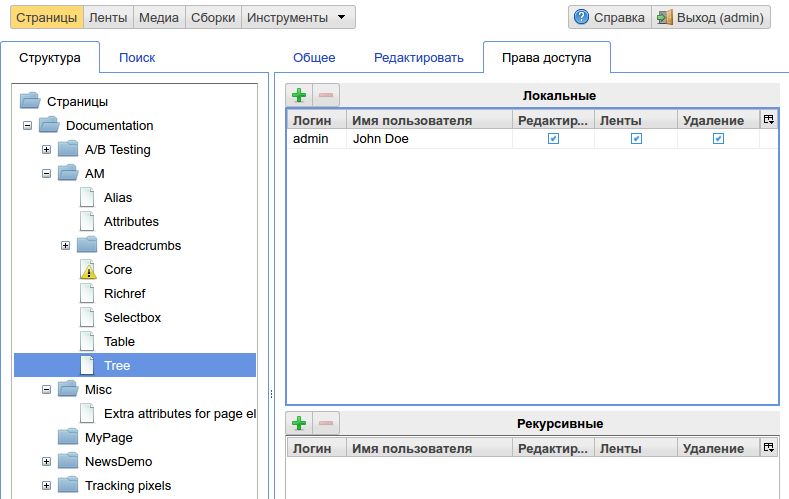
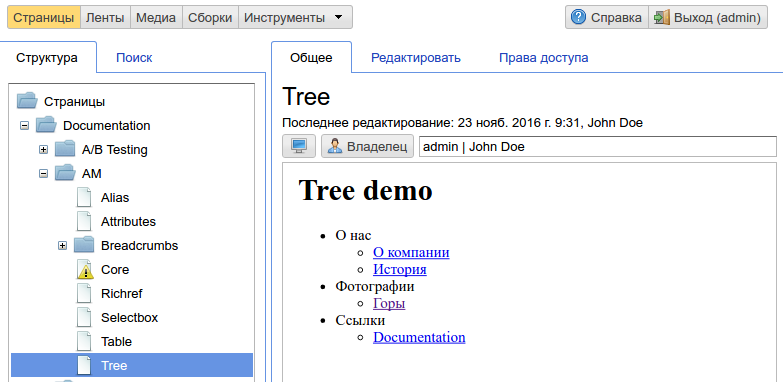

.. _pmgr:

Управление содержимым страницы
==============================

Данный интерфейс является основным для редактирования
контента страниц ηCMS не в визуальном режиме. Доступ
к этому интерфейсу имеют все зарегистрированные пользователи ηCMS.

Пользователи с правами доступа `admin` или `admin.structure`
могут редактировать любую страницу ηCMS.

    Общий вид интерфейса управления содержимым страницы

Слева представлено дерево навигации по всем страницам ηCMS с возможностью поиска по страницам.
Справа: таб-панели предварительного просмотра контента страниц, редактирования контента и прав доступа к страницам.

Панель редактирования контента страницы (Редактировать)
-------------------------------------------------------

Каждая страница в ηCMS должна иметь :term:`шаблон`, его можно назначить в
панели редактирования по кнопке `Шаблон`:

Далее, пользователь может выбрать доступный шаблон страницы,
в соответствии с его правами доступа:

.. figure:: img/pmgr_img7.png

После выбора шаблона :term:`сборка` текущей страницы наследуется от сборки шаблона, и атрибуты,
определенные в шаблоне, становятся доступными для редактирования в контексте этой страницы.

.. note::

    В некоторых случаях в качестве шаблона для страницы удобно указать уже
    существующую страницу, т.е. страница может являться шаблоном для другой страницы.
    Для выбора страницы в качестве шаблона воспользуйтесь вкладками `Структура` и `Поиск`
    в диалоге выбора шаблона.

Содержимое панели `Редактировать` отображается в соответствии
с присутствующими на странице :term:`атрибутами <атрибут>`
и их настройками. На приведенном ниже скриншоте в странице имеются следующие
редактируемые атрибуты: :ref:`псевдоним (alias) <am_alias>`, :ref:`заголовок (title) <am_string>`,
:ref:`дерево (tree) <am_tree>`.

    Панель редактирования контента страницы

Панель управления правами доступа к странице (Права доступа)
------------------------------------------------------------

По умолчанию владелец страницы и администратор ηCMS
может редактировать(изменять), удалять и :ref:`управлять лентами (новостями) <news>`
связанными со страницей.
На этой вкладке можно делегировать другим пользователям ηCMS права на:

* редактирование
* удаление
* управление лентами

    Панель управления правами доступа к странице

При этом, права можно назначить как на конкретную страницу, так и `рекурсивные права`
на все дочерние страницы - в том случае, если страница является контейнером (папкой).
Рекурсивные права доступа могут
быть переопределены/дополнены дочерними страницами.

Панель Общее
------------

В этот разделе можно увидеть страницу в режиме предпросмотра, а также
текущий статус страницы:

* Опубликована ли страница,
* Является ли страница :term:`главной <главная страница>`

    Панель `Общее` для выбранной страницы.

.. image:: img/pmgr_img4.png
    :align: left

Предпросмотр страницы в новом окне/вкладке браузера.

.. image:: img/pmgr_img5.png
    :align: left

Кнопка смены владельца страницы. Владельца страницы
может поменять только текущий владелец или администратор.

.. _pmgr_hotkeys:

Горячие клавиши (hot keys)
--------------------------

Активный элемент UI - это текущий, имеющий фокус элемент.

========================== ==================== ========================================
 Активный элемент UI        Комбинация клавиш               Действие
========================== ==================== ========================================
Дерево страниц              `Delete`             Удаление страницы
Дерево страниц              `Alt+Insert`         Создание новой страницы
Дерево страниц              `F2`                 Изменение имени/типа страницы
Дерево страниц              `F6`                 Перенести страницу в другой каталог
========================== ==================== ========================================

